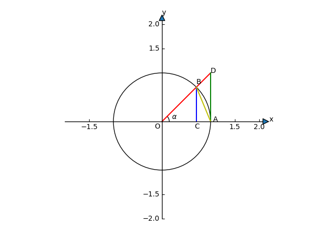

[TOC]

# 第二章 极限

## 第1节 数列的极限

### 一、数列极限的定义

`数列`：设有定义在自然数集N上的函数$U_n = f(n)$，称为整标函数，把函数值$u_n$依照自然数$n$的顺序排列出来的无穷数串：$u_1, u_2, u_3, ..., u_n, ...$称为数列（序列），简记为$\{u_n\}$。第$n$项$u_n$称为==一般项==。
$$
\{u_n\}:\ u_1, u_2, u_3, ... , u_n, ...
$$
例如：
$$
\{\frac{n}{n + 1}\}: \ \frac{1}{2}, \frac{2}{3}, \frac{3}{4}, ... , \frac{n}{n + 1}, ...
$$

$$
\{\frac{1}{2^n}\}: \ \frac{1}{2}, \frac{1}{2^2}, \frac{1}{2^3}, ... , \frac{1}{2^n}, ...
$$

$$
\{\frac{1 + (-1)^n}{2}\}: \ 0, 1, 0, ... , \frac{1 + (-1)^n}{2}, ...
$$

$$
\{\frac{2n + (-1)^{n-1}}{n}\}: \ 3, \frac{3}{2}, \frac{7}{3}, ... , \frac{2n + (-1)^{n-1}}{n}, ...
$$

设 $U_n = \frac{2n + (-1)^{n-1}}{n}$, 在数学上如何描述当$n \to \infty$时，${u_n}$的变化趋势如何？

那么，一般来说，对于两个常数：$a, b$，描述$a, b$两数的接近程度时用$|a - b|$。

讨论：$u_n = \frac{2n + (-1)^{n-1}}{n} = 2 + \frac{(-1)^{n-1}}{n}, u_n - 2 = \frac{(-1)^{n-1}}{n}, |u_n - 2| = \frac{1}{n}$。当$n$越大，$\frac{1}{n}$越小，$u_n$与2越接近。给定一个很小的正数$\frac{1}{100}$，则由$|u_n - 2| = \frac{1}{n} < \frac{1}{100}$，只要$n > 100$，$|u_n - 2| < \frac{1}{100}$。即：
$$
|u_n - 2| < \frac{1}{100} \Leftrightarrow 2 - \frac{1}{100} < u_n < 2 + \frac{1}{100} \Leftrightarrow (2 - \frac{1}{100}, 2 + \frac{1}{100}) = N(2, \frac{1}{100})
$$
亦即当$n > 100$时，$|u_n - 2| < \frac{1}{100}$说明$u_{101}, u_{102}, u_{103}, ...$都落在$N(2, \frac{1}{100})$邻域内。当给定很小的正数如$\frac{1}{1000}$，同理可推出当$n > 1000$时，$|u_n - 2| < \frac{1}{1000}$，即$u_{1001}, u_{1002}, u_{1003}, ...$都落在$N(2, \frac{1}{1000})$邻域内。

几何观点：无论给定多么小的正数$\epsilon > 0$，总存在正整数$N$，使得当$n > N$时的一切$u_n$满足$|u_n - 2| < \epsilon$。从几何上看，给定邻域$N(2, \epsilon)$，无论$\epsilon$多么小，总存在$N$，使得当$n > N$时，$u_{N+1}, u_{N+2}, u_{N+3}, ...$都落在$N(2, \epsilon)$邻域内。

`数列极限的定义`：已知数列$\{u_n\}$和常数$A$，如果对任意给定的==正数$\epsilon$==，都存在正整数$N$，使得对于$n > N$的一切$u_n$，不等式$|u_n - A| < \epsilon$恒成立，则称当$n \to +\infty$时，$\{u_n\}$以$A$为极限，或$\{u_n\}$==收敛于$A$==，记为$\lim_{n \to \infty}{u_n} = A$或$u_n \to A \ (n \to +\infty)$。如果$\{u_n\}$无极限，则称$\{u_n\}$==发散==$(n \to +\infty)$。

说明：

1. 定义中的$\epsilon$是任意给定的，只有任意给定$\epsilon > 0$，不等式$|u_n - A| < \epsilon$才能表达$u_n$与$A$无限接近；
2. 定义中存在的$N$与$\epsilon$有关，记为$N(\epsilon)$，随着$\epsilon$的给定而选定$N$，且不唯一；
3. 定义只描述了$n \to +\infty$时，$u_n \to A$，并==没有提供==求$A$的方法，==但可以==利用定义证明某常数$A$是否为某数列${u_n}$的极限；
4. 几何意义：任意给定邻域$N(A, \epsilon)$，则必存在$N$，使$u_{N+1}, u_{N+2}, ...$落在$N(A, \epsilon)$内。

例1、证明$\lim_{n \to \infty}{\frac{2n + (-1)^{n-1}}{n}} = 2$。

证：$u_n = \frac{2n + (-1)^{n - 1}}{n} = 2 + \frac{(-1)^{n - 1}}{n}$ ，$|u_n - 2| = |\frac{(-1)^{n - 1}}{n}| = \frac{1}{n}$，对于任意给定$\epsilon > 0$，为了使$|u_n - 2| < \epsilon$，只须$\frac{1}{n} < \epsilon$就可以了。或者说$n > \frac{1}{\epsilon}$就可以了。所以对于任意给定的$\epsilon > 0$，取正整数$N = [\frac{1}{\epsilon}]$，则当$n > N$时，恒有不等式$|u_n - 2| = |\frac{2n + (-1)^{n-1}}{n} - 2| = \frac{1}{n} < \epsilon$。按照数列极限的定义，可知$\lim_{n \to \infty}{\frac{2n + (-1)^{n - 1}}{n}} = 2$。

例2、证明当$n \to \infty$时，$\frac{(n - 1)(2n - 1)}{6n^2} \to \frac{1}{3}$。

证：$u_n = \frac{(n - 1)(2n -1)}{6n^2} = \frac{2n^2 - 3n + 1}{6n^2} = \frac{1}{3} - \frac{1}{2n} + \frac{1}{6n^2}$，$|u_n - \frac{1}{3}| = |-\frac{1}{2n} + \frac{1}{6n^2}| = |\frac{1}{2n} - \frac{1}{6n^2}| = \frac{1}{2n}|1 - \frac{1}{3n}| < \frac{1}{2n}$，对任意给定的$\epsilon > 0$，由$\frac{1}{2n} < \epsilon$，可得$n > \frac{1}{2\epsilon}$，即取$N = [\frac{1}{2\epsilon}]$，当$n > N$时，恒有$|u_n - \frac{1}{3}| < \frac{1}{2n} < \epsilon$。按照数列极限的定义，由$\lim_{n \to \infty}{\frac{(n - 1)(2n - 1)}{6n^2}} = \frac{1}{3}$。

==注意==：利用数列极限定义验证$lim_{n \to \infty}{u_n} = A$，关键步骤是指明定义中$N$确实存在，$N$是不唯一的。比如已知：$|u_n - A| < \varphi(n)$，那么由$\varphi(n) < \epsilon$，求出$N$，这样当$n > N$时， $\varphi(n) < \epsilon$，从而$|u_n - A| < \varphi(n) < \epsilon$。

例3、证明$\lim_{n \to \infty}{\frac{(-1)^n}{(n + 1)^2}} = 0$。

证：$|u_n - 0| = |\frac{(-1)^n}{(n + 1)^2}  - 0| = \frac{1}{(n + 1)^2} < \frac{1}{n^2} \leq \frac{1}{n}$，令$\varphi(n) = \frac{1}{n}$，对于==任意==给定$\epsilon > 0$，只要$\varphi(n) = \frac{1}{n} < \epsilon$，即$n > \frac{1}{\epsilon}$时， $|u_n - 0| < \frac{1}{n} < \epsilon$，所以对于任意给定的$\epsilon > 0$，取正整数$N = [\frac{1}{\epsilon}]$，则当$n > N$时，恒有不等式$|\frac{(-1)^n}{(n + 1)^2} - 0| < \epsilon$。按极限的定义，$\lim_{n \to \infty}{\frac{(-1)^n}{(n + 1)^2}} = 0$。

### 二、收敛数列的两个性质

收敛数列的两个性质：

1. 唯一性
2. 有界性（==先给出有界数列的定义，再证明收敛数列的有界性==）

==定理1==：如果一数列的极限==存在==，则==极限值是唯一==的。

证：使用==反证法==。假若数列$\{u_n\}$收敛且极限不唯一，即同时有：$\lim_{n \to \infty}{u_n} = a$，$\lim_{n \to \infty}{u_n} = b$，且$a < b$。

由$\lim_{n \to \infty}{u_n}$存在，根据定义，对于任意给定的$\epsilon = \frac{b - a}{4} > 0$，因为$\lim_{n \to \infty}{u_n} = a$，必存在正整数$N_1$，使得当$n > N_1$时，恒有$|u_n - a| < \frac{b - a}{4}$；又因为$\lim_{n \to \infty}{u_n} = b$，必存在正整数$N_2$，使得当$n > N_2$时，恒有$|u_n - b| < \frac{b - a}{4}$。取$N = \max(N_1, N_2)$，则当$n > N$时，上面两个不等式同时成立。则$b - a = b - u_n + u_n - a \leq |b - u_n| + |u_n - a| < \frac{b - a}{4} + \frac{b - a}{4} = \frac{b - a}{2}$，而$b - a \lt \frac{b - a} {2}$是不可能的，即$\lim_{n \to \infty}{u_n}$是唯一的。

例1、证明数列$\{u_n\} = {(-1)^n\frac{n}{n + 1}}$是发散的。

证：分析：$\{u_n\}:-\frac{1}{2}, \frac{2}{3}, -\frac{3}{4}, ...$，当$n$取奇数$2m -1(m \in N)$，得数列$-\frac{1}{2}, -\frac{3}{4}, -\frac{5}{6}, ..., -\frac{2m - 1}{2m}, ...$，数列$\{u_{2m - 1}\}$从$-\frac{1}{2}$开始==单调减==；当$n$取偶数$2m(m \in N)$，得数列$\frac{2}{3}, \frac{4}{5}, \frac{6}{7}, ..., \frac{2m}{2m + 1}, ...$，数列$\{u_{2m}\}$从$\frac{2}{3}$开始==单调增==。==$u_2 - u_1 = \frac{2}{3} - (-\frac{1}{2}) = \frac{7}{6} > 1$==。

使用==反证法==。假若$u_n \to A \ (n \to \infty)$，（$A$是唯一的）。由极限的定义：给定正数$\epsilon = \frac{1}{2} > 0$，必存在正整数$N$，当$n > N$时，恒有$|u_n - A| < \frac{1}{2} \Leftrightarrow A - \frac{1}{2} < u_n < A + \frac{1}{2}$，即$u_n \in (A - \frac{1}{2}, A + \frac{1}{2}), (n > N)$，亦即$u_{N + 1}, u_{N + 2}, u_{N + 3}, ... \in (A - \frac{1}{2}, A + \frac{1}{2})$，区间$(A - \frac{1}{2}, A + \frac{1}{2})$的长度为1，$u_{N + 1}, u_{N + 2}, u_{N + 3}, ... $落在长度为1的区间$(A - \frac{1}{2}, A + \frac{1}{2})$内是不可能的，所以数列$\{u_n\} = {(-1)^n\frac{n}{n + 1}}$是发散的。

==有界数列==的定义：对于数列$\{u_n\}$，如果存在一个正数$M$，使得对于一切$u_n$，都有$|u_n| \leq M$，则称$\{u_n\}$有界。

==定理2==：如果数列$\{u_n\}$收敛，则$\{u_n\}$一定是有界的。

证：因为数列$\{u_n\}$收敛，设$\lim_{n \to \infty}{u_n} = A$，有极限的定义，对于给定正数$\epsilon = 1$，必存在正整数$N$，使得当$n > N$时，恒有$|u_n - A| < 1 \Leftrightarrow A - 1 < u_n < A + 1$。而$|u_n| = |u_n - A + A| \leq |u_n - A| + |A| < 1 + |A| \ (n > N)$，现取$M = \max(|u_1|, |u_2|, |u_3|, ..., |u_N|, 1 + |A|)$，于是$|u_n| \leq M \ (n = 1, 2, 3, ...)$，所以$\{u_n\}$是有界的。

## 第2节 函数的极限

讨论：$x$为连续自变量时，函数$y = f(x)$的极限：

1. 自变量$x$==任意地==接近于定值$x_0$或$x$趋向于$x_0$（记为$(x \to x_0)$）时对应的函数值$f(x)$的变化趋势；
2. 自变量$x$的==绝对值==$|x|$无限增大（记为$(x \to \infty)$）时对应的函数值$f(x)$的变化趋势。

### 一、自变量$x$趋向于定值$x_0$时$f(x)$的极限

设函数$f(x)$在$x_0$点的某邻域内有定义（==在$x_0$点$f(x)$可以无定义==），当$x$任意地趋近于$x_0$时，即$x \to x_0$时，对应函数值$f(x)$是否无限接近于常数$A$？

分析：在$x \to x_0$的过程中，对应的函数值$f(x)$无限接近于常数$A$$\Leftrightarrow$在$x \to x_0$的过程中，$|f(x) - A|$能==任意的==小$\Leftrightarrow$在$x \to x_0$的过程中，对于任意给定的正数$\epsilon > 0, |f(x) - A| < \epsilon$。

在$x \to x_0$的过程中，只有充分接近$x_0$的那些$x$才能使$|f(x) - A| < \epsilon$。“充分接近$x_0$的$x$”即存在一个很小的正数$\delta > 0, 0 < |x - x_0| < \delta$描述了充分接近$x_0$的$x$。

==定义==：设有函数$f(x)$在$x_0$的某一去心邻域内有定义，$A$为一常数。如果对于任意给定的$\epsilon > 0$，都存在一个正数$\delta > 0$，使适合不等式$0 < |x - x_0| < \delta$的一切$x$所对应的函数值$f(x)$都满足$|f(x) - A| < \epsilon$。则称当$x \to x_0$时，$f(x)$以$A$为极限，记为$\lim_{x \to x_0}{f(x)} = A$或$f(x) \to A \ (x \to x_0)$。

==几何意义==：对常数$A, \epsilon > 0$，作图：在$xoy$平面上作直线$y = A + \epsilon, y = A - \epsilon$，对$\delta > 0$，得邻域$N(\hat{x_0}, \delta)$，当$x \in N(\hat{x_0}, \delta) \ (x \neq x_0)$时，由定义可知，点$M(x, f(x))$一定在$y = A + \epsilon$与$y = A - \epsilon$之间的区域内。

下面将用==极限的定义==来证明一些函数极限的等式。

例1、证明$\lim_{x \to x_0}{C} = C$（$C$为常数）。

证：已知$f(x) \equiv C$，$x_0$为定值，$A = C$。$|f(x) - A| = |C - C| \equiv 0$，因此，对任意给定的$\epsilon > 0$，都有任意一个正数$\delta > 0$，凡是适合$0 < |x - x_0| < \delta$的一切$x$，都使$|f(x) - A| = 0 < \epsilon$，按照极限的定义，$\lim_{x \to x_0}{C} = C$。

例2、证明$\lim_{x \to x_0}{x} = x_0$。

证：已知$f(x) = x, A = x_0$。$|f(x) - A| = |x - x_0|$，因此对于任意给定的$\epsilon > 0$，取$\delta = \epsilon$，当$0 < |x - x_0| < \delta = \epsilon$时，都能使$|f(x) - A| = |x - x_0| < \epsilon$，按照极限的定义，$\lim_{x \to x_0}{x} = x_0$。

例3、证明$\lim_{x \to 1}{(3x - 5)} = -2$。

证：已知$f(x) = 3x - 5, x_0 = 1, A = -2$。$|f(x) - A| = |(3x - 5) - (-2)| = |3x - 3| = 3|x - 1|$，对于任意给定的正数$\epsilon > 0$，为了使$|f(x) - A| < \epsilon$，也就是$3|x - 1| < \epsilon$，即$|x - 1| < \frac{\epsilon}{3}$。因此对于任意给定的$\epsilon > 0$，取$\delta = \frac{\epsilon}{3} > 0$，则适合不等式$0 < |x - 1| < \delta$的一切$x$，都能使$|f(x) - A| = 3|x - 1| < 3 * \frac{\epsilon}{3}= \epsilon$，按照极限的定义，有$\lim_{x \to 1}(3x - 5) = 2$。

例4、证明$\lim_{x \to 1}\frac{1}{1 + \sqrt{x}} = \frac{1}{2}$。

证：已知$f(x) = \frac{1}{1 + \sqrt{x}}, x_0 = 1, A = \frac{1}{2}$。$|f(x) - A| = |\frac{1}{1 + \sqrt{x}} - \frac{1}{2}| = |\frac{1 - \sqrt{x}}{2(1 + \sqrt x)}| = |\frac{(1 - \sqrt{x})(1 + \sqrt{x})}{2(1 + \sqrt{x})^2}| = \frac{|x - 1|}{2(1 + \sqrt{x})^2} < \frac{|x - 1|}{2} < \epsilon$，则当$|x - 1| < 2\epsilon$时，就有$|f(x) - A| < \epsilon$。因此，对任意给定的$\epsilon > 0$，取$\delta = 2\epsilon$，则适合不等式$0 < |x - 1| < \delta$的一切$x$，都能使得$|f(x) - A| = |\frac{1}{1 + \sqrt{x}} - \frac{1}{2}| < \epsilon$，按照极限的定义，有$\lim_{x \to 1}\frac{1}{1 + \sqrt{x}} = \frac{1}{2}$。

==补充==：当$x$从$x_0$的左侧趋于$x_0 \ (x < x_0)$，记为$x \to x_0^-$，或$x \to x_0-0$；当$x$从$x_0$的右侧趋于$x_0 \ (x > x_0)$，记为$x \to x_0^+$，或$x \to x_0+0$。

==左极限==：对于任意给定$\epsilon > 0$，都存在$\delta > 0$，凡适合不等式$x_0 - \delta < x < x_0$的一切$x$，对应的函数值$f(x)$都满足$|f(x) - A| < \epsilon$，则称$A$为$f(x)$的左极限，记为：
$$
f(x_0-0) = A \ \Longleftrightarrow \left\{\begin{array}{cc} \lim_{x \to x_0^-}f(x) &= A \\ \lim_{x \to x_0-0}f(x) &= A \end{array}\right\}
$$
==右极限==：把极限的定义中的$0 < |x - x_0| < \delta$改为$x_0 < x < x_0 + \delta$即可得到右极限的定义。
$$
f(x_0+0) = A \ \Longleftrightarrow \left\{\begin{array}{cc} \lim_{x \to x_0^+}f(x) &= A \\ \lim_{x \to x_0+0}f(x) &= A \end{array}\right\}
$$
==$\lim_{x \to x_0}f(x) = A \Leftrightarrow f(x_0-0), f(x_0+0)$都存在且极限值都等于$A$。==（由定义即可得证）

### 二、自变量$x$趋向无穷大（记为$x \to \infty$）函数$f(x)$的极限

当$n \to \infty$时数列$U_n = f(n)$的极限，可以看作是函数$f(x)$在$x \to \infty$时极限的特殊情形。仿照数列极限的定义，给出$f(x)$在$x \to \infty$时极限的定义。

==定义==：设一函数$f(x)$在$|x|$充分大时有定义，$A$为常数，如果对于任意给定的$\epsilon > 0$，都存在正数$N$，使得凡是适合不等式$|x| > N$的一切$x$所对应的函数值$f(x)$都满足$|f(x) - A| < \epsilon$，则称$x \to \infty$时， $f(x)$以$A$为极限，记为$\lim_{x \to \infty}f(x) = A, f(x) \to A \ (x \to \infty)$。

如果只考虑$x > 0$，且无限增大（记为$x \to +\infty$）的情况，上面的定义中把$|x| > N$改为$x > N$就得到了$\lim_{x \to +\infty}f(x) = A$的定义；如果只考虑$x < 0$，而$|x|$无限增大（记为$x \to -\infty$）的情况，上面的定义中把$|x| > N$改为$x < -N$就得到了$\lim_{x \to -\infty}f(x) = A$的定义。

==$\lim_{x \to \infty}f(x) = A \Longleftrightarrow \lim_{x \to +\infty}f(x), \lim_{x \to -\infty}f(x)$都存在且都等于$A$。==

例1、证明$\lim_{x \to \infty}\frac{1}{1 + x^2} = 0$。

解：$f(x) = \frac{1}{1 + x^2}, A = 0, |f(x) - A| = |\frac{1}{1 + x^2} - 0| = \frac{1}{1 + x^2} < \frac{1}{x^2} < \epsilon$，对于任意给定的$\epsilon > 0$，为了使得$|f(x) - A| < \epsilon$，只需$\frac{1}{x^2} < \epsilon$，即$x^2 > \frac{1}{\epsilon}, |x| > \frac{1}{\sqrt{\epsilon}}$，因此对于任意给定的$\epsilon > 0$，取$N = \frac{1}{\sqrt{\epsilon}}$，凡是适合$|x| > N$的一切$x$，对应的函数值$f(x)$都满足$|f(x) - A| = |\frac{1}{1 + x^2} - 0| < \epsilon$。按定义，有$\lim_{x \to \infty}\frac{1}{1 + x^2} = 0$。

### 三、无穷小量与无穷大量

1、无穷小（量）：如果：$\lim_{x \to x_0}f(x) = 0$或$\lim_{x \to \infty}f(x) = 0$，则称$x \to x_0$时（或$x \to \infty$时），==$f(x)$==是无穷小（量）。

2、无穷大（量）：如果当$x \to x_0$（或$x \to \infty$）时对应的函数值$f(x)$的绝对值$|f(x)|$无限增大，则称当$x \to x_0$（或$x \to \infty$）时==$f(x)$==是无穷大（量）。

若对于任意给定的正数$M > 0$，无论$M$多么大，总存在正数$\delta$，凡是适合$0 < |x - x_0| < \delta$的一切$x$，对应函数值满足$|f(x)| > M$，称当$x \to x_0$时，$f(x)$是无穷大。记为$\lim_{x \to x_0}f(x) = \infty$。

==注意==：

1. 不能把无穷大与一个很大的常数混为一谈；
2. 无穷大一定是无界函数，无界函数不一定是无穷大。

证明2：设$\lim_{x \to x_0}f(x) = \infty$，（或$\lim_{x \to \infty}f(x) = \infty$），即$x \to x_0$（或$x \to \infty$）时$f(x)$是无穷大，对于任意给定的$M > 0$（无论多么大），一定存在$\delta > 0$（存在$N > 0$），使得$|f(x)| > M, \forall_x \in N(\hat{x_0}, \delta)$,（$|x| > N$）。在$N(\hat{x_0}, \delta)$内，（$|x| > N$ ），$f(x)$无界。

证明2第二部分的反例：

例如：证明：$f(x) = x \cdot \sin x$在$(0, +\infty)$内是无界函数，当$x \to \infty$时，$f(x)$不是无穷大。

先证：$f(x) = x \cdot \sin x$在$(0, +\infty)$内是无界函数，对任何正数$M > 0$（无论多么大），现取足够大的正整数$n$，使$2n\pi+\frac{\pi}{2} > M = x_n$，$f(x_n) = x_n \cdot \sin(x_n) = (2n\pi+\frac{\pi}{2})\sin(2n\pi+\frac{\pi}{2}) = (2n\pi+\frac{\pi}{2}) \cdot 1 > M$。可见$f(x)$在$(0, +\infty)$内是无界的。

再证：$x \to +\infty$时，$f(x) = x \sin x$不是无穷大。给定正数$M = 1$，则无论多么大的正数$N$，当$n > N$，$x_n = n\pi > N, f(x_n) = x_n \sin(x_n) = n\pi \sin(n\pi) = 0 < M$，$\therefore f(x)$不是无穷大。

3、无穷小与无穷大的关系

==定理==：假若当$x \to x_0$（或$x \to \infty$）$f(x)$是无穷大，则$\frac{1}{f(x)}$是无穷小；如果当$x \to x_0$（或$x \to \infty$）$f(x)$是无穷小，且$f(x) \neq 0$，则$\frac{1}{f(x)}$是无穷大。

证：只证$x \to x_0$的情形。

设$x \to x_0$时$f(x)$是无穷大，即$\lim_{x \to x_0}f(x) = \infty$，任意给定$\epsilon > 0$，因为$\lim_{x \to x_0}f(x) = \infty$，对于正数$M = \frac{1}{\epsilon}$，一定存在正数$\delta > 0$，使适合不等式$0 < |x - x_0| < \delta$的一切$x$所对应的$f(x)$，满足$|f(x)| > M = \frac{1}{\epsilon}, \therefore |\frac{1}{f(x)}| < \epsilon$，即$\lim_{x \to x_0}\frac{1}{f(x)} = 0$，即当$x \to x_0$时，$\frac{1}{f(x)}$是无穷小。

设当$x \to x_0$时，$f(x)$是无穷小，且$f(x) \neq 0$，任给正数$M > 0$，无论多么大，因为$\lim_{x \to x_0}f(x) = 0$，对于$\epsilon = \frac{1}{M} > 0$，一定存在$\delta > 0$，使适合$0 < |x - x_0| < \delta$的一切$x$所对应的$f(x)$，满足$|f(x)| < \epsilon = \frac{1}{M}$，即$|\frac{1}{f(x)}| > M$，即当$x \to x_0$时，$\frac{1}{f(x)}$是无穷大。

四、海涅定理

连续自变量$x$的函数$f(x)$的极限$\lim_{x \to x_0}f(x)$（或$\lim_{x \to \infty}f(x)$）存在$\Longleftrightarrow$对于任选的数列$\{x_n|x_n \to x_0\}$且$x_n \neq x_0$（或$x_n \to \infty$）其对应的数列$\{f(x_n)\}$有同一极限。即：

$x_n \to x_0, \{f(x_n)\} \to A$

$x_n^{\prime} \to x_0, \{f(x_n^{\prime})\} \to B$

若$A \neq B$，则$f(x)$极限不存在。

例如：证明：当$x \to 0$时，$f(x) = \sin \frac{1}{x}$极限不存在。

证：取$x_n = \frac{1}{n \pi}$，$\lim_{n \to \infty} x_n = \lim_{n \to \infty} \frac{1}{n \pi} = 0 \ (x_0 = 0), f(x_n) = \sin \frac{1}{n \pi} = \sin(n \pi) = 0, \{f(x_n)\} = \{0\}, \lim_{n \to \infty} f(x_n) = 0$；取$x_n^{\prime} = \frac{1}{2n \pi + \frac{\pi}{2}} \to 0 \ (x_0 = 0), f(x_n^{\prime}) = \sin(2n \pi + \frac{\pi}{2}) = 1, \{f(x_n^{\prime})\} = \{1\}, \lim_{n \to \infty}f(x_n^{\prime}) = 1$。因为$\lim_{n \to \infty}f(x_n) \neq \lim_{n \to \infty}f(x_n^{\prime})$，所以$\lim_{x \to 0}f(x)$的极限不存在。

## 第3节 函数极限的性质和极限的运算

一、极限值与函数值的关系

1. （==极限值的唯一性==）如果$\lim_{x \to x_0}f(x)$或（$\lim_{x \to \infty}f(x)$）存在，则其极限值是唯一的。

   证：设$\lim_{x \to x_0}f(x)$存在且不唯一（==反证法==）。

   即$\lim_{x \to x_0}f(x) = A, \lim_{x \to x_0}f(x) = B$，且$A \lt B$。记$r = B - A > 0$，对于给定正数$\epsilon = \frac{B - A}{4} > 0$，$\because \lim_{x \to x_0}f(x) = A$，由极限的定义，对于$\epsilon = \frac{B - A}{4}$，一定存在$\delta_1 > 0$，使适合不等式$0 < |x - x_0| < \delta_1$的一切$x$所对应的$f(x)$恒有$|f(x) - A| < \frac{B - A}{4}$。由$\lim_{x \to x_0}f(x) = B$，对于$\epsilon = \frac{B - A}{4}$，一定存在$\delta_2 > 0$，使适合不等式$0 < |x - x_0| < \delta_2$的一切$x$所对应的$f(x)$恒有$|f(x) - B| < \frac{B - A}{4}$。取$\delta = \min\{\delta_1, \delta_2\}$，则凡是适合不等式$0 < |x - x_0| < \delta$的一切$x$，使不等式$|f(x) - A| < \frac{B - A}{4}$和$|f(x) - B| < \frac{B - A}{4}$同时成立，从而有$B - A = |B - f(x) + f(x) - A| \le |B - f(x)| + |f(x) - A| < \frac{B - A}{4} + \frac{B - A}{4} = \frac{B - A}{2}$，而$B - A < \frac{B - A}{2}$不可能成立。$\therefore \lim_{x \to x_0}f(x) = A$是唯一的。

   

2. （==极限值与函数值的同号性==）

   1. 设$\lim_{x \to x_0}f(x) = A$，且$A > 0$（或$A < 0$），则必存在$N(\hat{x_0})$，使得$\forall_{x} \in N(\hat{x_0})$都有$f(x) > 0$（或$f(x) < 0$）。

      证：$A > 0$，由$\lim_{x \to x_0}f(x) = A$，根据定义，对于这样的正数$\epsilon$，$0 < \epsilon \le A$，一定存在$\delta > 0$，使得适合不等式$0 < |x - x_0| < \delta$（即$x \in N(\hat{x_0}, \delta)$），恒有$|f(x) - A| < \epsilon$，$|f(x) - A| < \epsilon \Longleftrightarrow A - \epsilon < f(x) < A + \epsilon$，$\because 0 < \epsilon \le A$，$\therefore A - \epsilon \ge 0$，即$0 \le A - \epsilon < f(x)$，其中$x \in N(\hat{x_0}, \delta)$。

   2. 设$\lim_{x \to x_0}f(x) = A$，且$N(\hat{x_0})$内$f(x) \ge 0$，则$A \ge 0$。

      证：反证法：假若$A < 0$，又有$\lim_{x \to x_0}f(x) = A$，由已证明的结论1，一定存在$x_0$的某个邻域$N(\hat{x_0})$，使得$f(x) < 0$，这与$f(x) \ge 0$的假设矛盾，所以结论2成立。
      
      
      
      例1、设$f(x)$在$x_0$点的某邻域$N(\hat{x_0})$内有定义，且$\lim_{x \to x_0}\frac{f(x) - f(x_0)}{(x - x_0)^2} = -1$，则必存在某邻域$N(x_0, \delta)$，使得：(A) $f(x) > f(x_0)$		(B)$f(x) < f(x_0)$		(C)$f(x) = f(x_0)$		(D)不能判断$f(x)$与$f(x_0)$的大小
      
      解：令$F(x) = \frac{f(x) - f(x_0)}{(x - x_0)^2}$，有$\lim_{x \to x_0}\frac{f(x) - f(x_0)}{(x - x_0)^2} = -1 < 0$，由前面所证结论1，可知存在$N(x_0, \delta)$，使得$F(x) < 0$，$x \in N(x_0, \delta)$。由$F(x) = \frac{f(x) - f(x_0)}{(x - x_0)^2} < 0, (x - x_0)^2 > 0$，$\therefore f(x) - f(x_0) < 0, f(x) < f(x_0)$，故应选B。
      
      

3. （==有界性==）如果当$x \to x_0$（或$x \to \infty$）时$f(x) \to A$（常数），则一定存在$x_0$的某邻域$N(\hat{x_0})$（或存在$N > 0, |x| > N$）$f(x)$是有界的。

   证：已知$\lim_{x \to x_0}f(x) = A$，由定义，对给定的$\epsilon = 1$，一定存在$\delta > 0$使得适合不等式$0 < |x - x_0| < \delta$（$x \in N(\hat{x_0}, \delta)$）的一切$x$所定对应的函数值$f(x)$恒有$|f(x) - A| < 1$，即$A - 1 < f(x) < A + 1$。即函数$f(x)$在$N(\hat{x_0}, \delta)$内既有上界，也有下界$\Longleftrightarrow$$f(x)$在$N(\hat{x_0}, \delta)$内有界。

二、函数极限与无穷小的关系

==定理==：$\lim_{x \to x_0}f(x) = A$（或$\lim_{x \to \infty}f(x) = A$）（A为常数）$\Longleftrightarrow$$f(x) = A + \alpha(x)$，且$\lim_{x \to x_0}\alpha(x) = 0$（或$\lim_{x \to \infty}\alpha(x) = 0$）。

证："$\Longrightarrow$"，设$\lim_{x \to x_0}f(x) = A$，根据函数极限的定义，对于任意给定$\epsilon > 0$，一定存在$\delta > 0$，使得适合不等式$0 < |x - x_0| < \delta$的一切$x$所对应的函数值恒有$|f(x) - A| < \epsilon$，令$\alpha(x) = f(x) - A$，就有$|\alpha(x)| < \epsilon$，从而有$f(x) = A + \alpha(x), \lim_{x \to x_0}\alpha(x) = 0$。

"$\Longleftarrow$"，设$f(x) = A + \alpha(x)$，$\lim_{x \to x_0}\alpha(x) = 0$，根据极限定义，对于任意给定的$\epsilon > 0$，一定存在$\delta > 0$，使得凡是适合不等式$0 < |x - x_0| < \delta$的一切$x$所对应的$\alpha(x)$恒有$|\alpha(x)| < \epsilon$。由$f(x) = A + \alpha(x) \Longrightarrow \alpha(x) = f(x) - A$，由$|\alpha(x)| < \epsilon \Longrightarrow |f(x) - A| < \epsilon$，故$\lim_{x \to x_0}f(x) = A$。  

三、无穷小的性质

1. ==有限个无穷小的代数和仍是无穷小==。

   证：只证两个无穷小的情形。即设有$\lim_{x \to x_0}\alpha(x) = 0$，$\lim_{x \to x_0}\beta(x) = 0$，证$\lim_{x \to x_0}[\alpha(x) + \beta(x)] = 0$。由极限的定义，对于任意给定的$\epsilon > 0$，对于$\frac{\epsilon}{2} > 0$，一定存在$\delta_1$，使凡是适合不等式$0 < |x - x_0| < \delta_1$的一切$x$，所对应的$\alpha(x)$恒有$|\alpha(x)| < \frac{\epsilon}{2}$；对于$\frac{\epsilon}{2} > 0$，一定存在$\delta_2$，使凡是适合不等式$0 < |x - x_0| < \delta_2$的一切$x$，所对应的$\beta(x)$恒有$|\beta(x)| < \frac{\epsilon}{2}$。取$\delta = \min\{\delta_1, \delta_2\} > 0$，当$0 < |x - x_0| < \delta$时，这些$x$所对应的$\alpha(x), \beta(x)$同时满足$|\alpha(x)| < \frac{\epsilon}{2}$，$|\beta(x)| < \frac{\epsilon}{2}$，从而有$|\alpha(x) + \beta(x)| \le |\alpha(x)| + |\beta(x)| < \epsilon$，所以$\lim_{x \to x_0}[\alpha(x) + \beta(x)] = 0$。即当$x \to x_0$时，$\alpha(x) + \beta(x)$是无穷小。

2. ==有界函数与无穷小的乘积仍是无穷小==

   证：设$f(x)$在$N(\hat{x_0}, \delta_1)(\delta_1 > 0)$内有界，即存在$M > 0, \delta_1 > 0$，使得$|f(x)| \le M, x \in N(\hat{x_0}, \delta_1)$，又设$\lim_{x \to x_0}\alpha(x) = 0$（当$x \to x_0$时$\alpha(x)$是无穷小）。要证当$x \to x_0$时，$f(x)\alpha(x)$是无穷小，即证$\lim_{x \to x_0}[f(x)\alpha(x)] = 0$。根据极限的定义，任给$\epsilon > 0$，对于$\frac{\epsilon}{M} > 0$，一定存在$\delta_2 > 0$，使得凡是适合$0 < |x - x_0| < \delta_2$的一切$x$所对应的$\alpha(x)$恒有$|\alpha(x)| < \frac{\epsilon}{M}$，取$\delta = \min\{\delta_1, \delta_2\} > 0$，凡是适合$0 < |x - x_0| < \delta$的一切$x$都会使得$|f(x)| \le M$，$|\alpha(x)| < \frac{\epsilon}{M}$同时成立。而$|f(x)\alpha(x)| = |f(x)||\alpha(x)| < M \cdot \frac{\epsilon}{M} = \epsilon$，即$\lim_{x \to x_0}[f(x)\alpha(x)] = 0$。

对于一个常数$C$，$f(x) \equiv C$为有界函数。对于$\lim_{x \to x_0}r(x) = 0$，在$N(\hat{x_0})$内，$r(x)$是有界函数，所以有：

1. 常数与无穷小的乘积仍是无穷小
2. 两个无穷小的乘积仍是无穷小（有限个无穷小的乘积仍是无穷小）

3. ==设$\lim_{x \to x_0}f(x) = A \neq 0$（或$\lim_{x \to \infty}f(x) = A \neq 0$），$\lim_{x \to x_0}\alpha(x) = 0$或（$\lim_{x \to x_0}\alpha(x) = 0$），则$\lim_{x \to x_0}\frac{\alpha(x)}{f(x)} = 0$（或$\lim_{x \to \infty}\frac{\alpha(x)}{f(x)} = 0$）==

   证：$\frac{\alpha(x)}{f(x)} = \alpha(x) \cdot \frac{1}{f(x)}$，要证$\lim_{x \to x_0}\frac{\alpha(x)}{f(x)} = 0$，只须证明$\frac{1}{f(x)}$是有界函数，再利用性质2，就可以得到性质3的结论。因为$\lim_{x \to x_0}f(x) = A \neq 0$，由极限的定义，对任意给定的$\epsilon = \frac{|A|}{2} > 0$，一定存在$\delta > 0$，使适合$0 < |x - x_0| < \delta$的一切$x$所对应的$f(x)$恒有$|f(x) - A| < \frac{|A|}{2}$，由于$|A| - |f(x)| \le |f(x) - A| < \frac{|A|}{2}$，由$|A| - |f(x)| < \frac{|A|}{2}$，$|A| - \frac{|A|}{2} < |f(x)|$，$0 < \frac{|A|}{2} < |f(x)|$，所以$|\frac{1}{f(x)}| < \frac{2}{|A|}$，故$\frac{1}{f(x)}$在$N(\hat{x_0}, \delta)$内有界。

   

四、极限的四则运算公式

注意：以下公式中，自变量同是$x \to x_0$（或同是$x \to \infty$），设$\lim f(x) = A, \lim g(x) = B$，则有：

1. $\lim [f(x) \pm g(x)] = A \pm B = \lim f(x) \pm \lim g(x)$

2. $\lim [f(x)g(x)] = AB = \lim f(x) \cdot \lim g(x)$。若$C$为常数，则$\lim [Cf(x)] = CA = C \cdot \lim f(x)$；$\lim [f(x)]^n$（$n$为正整数）$= \lim [f(x) \cdot f(x) \cdots f(x)] = A^n = [\lim f(x)]^n$。

3. 若$B \neq 0, \lim [\frac{f(x)}{g(x)}] = \frac{A}{B} = \frac{\lim f(x)}{\lim g(x)}$。

   证明：只证2和3。

   证2：由函数极限与无穷小的关系，有：$\lim f(x) = A \Longleftrightarrow f(x) = A + \alpha(x), \lim \alpha(x) = 0$，$\lim g(x) = B \Longleftrightarrow g(x) = B + \beta(x), \lim \beta(x) = 0$，$f(x)g(x) = [A + \alpha(x)][B + \beta(x)] = AB + [A\beta(x) + B\alpha(x) + \alpha(x)\beta(x)] = A \cdot B + r(x), (r(x) = [A\beta(x) + B\alpha(x) + \alpha(x)\beta(x)])$，由无穷小的性质知$r(x)$是无穷小，所以$f(x)g(x) = A \cdot B + r(x), \lim r(x) = 0$，所以$\lim [f(x)g(x)] = AB = \lim f(x) \cdot \lim g(x)$。

   证3：$\frac{f(x)}{g(x)} - \frac{A}{B} = \frac{A + \alpha(x)}{B + \beta(x)} - \frac{A}{B} = \frac{B\alpha(x) - A\beta(x)}{B[B + \beta(x)]}$，$\frac{f(x)}{g(x)} = \frac{A}{B} + r(x), r(x) = \frac{B\alpha(x) - A\beta(x)}{B[B + \beta(x)]}$。因为$B\alpha(x),A\beta(X)$是无穷小，所以$\lim [B\alpha(x) - A\beta(x)] = 0$。而$\lim B[B + \beta(x)] = \lim [B^2 + B\beta(x)] = B^2 \neq 0$，由无穷小的性质3可知$\lim r(x) = 0$，因此3成立。

4. 设$f(x) \ge g(x)$，而$\lim f(x) = A, \lim g(x) = B$，则必有$A \ge B$。

   证：令$F(x) = f(x) - g(x) \ge 0$， $\lim F(x) = \lim [f(x) - g(x)] = \lim f(x) - \lim g(x) = A - B$，根据函数值与极限值的同号性定理，可知$\lim F(x) = A - B \ge 0 \Longrightarrow A \ge B$。
   
   

例1、求$\lim_{x \to -1}\frac{2x^2 + x - 4}{3x^2 + 2}$。

解：$\lim_{x \to -1}(3x^2 + 2) = \lim_{x \to -1}3x^2 + \lim_{x \to -1}2 = 3\lim_{x \to -1}x^2 + 2 = 3[\lim_{x \to -1}x]^2 + 2 = 3 + 2 = 5 \neq 0$，$\lim_{x \to -1}(2x^2 + x - 4) = \lim_{x \to -1}2x^2 + \lim_{x \to -1}x - \lim_{x \to -1}4 = 2[\lim_{x \to -1}x]^2 - 1 - 4 = 2 \cdot (-1)^2 - 5 = -3$,故原式$=\frac{\lim_{x \to -1}(2x^2 + x - 4)}{\lim_{x \to -1}(3x^2 + 2)} = \frac{-3}{5}$。

一般地有$R(x) = \frac{a_0x^n + a_1x^{n-1} + \cdots + a_{n-1}x + a_n}{b_0x^m + b_1x^{m-1} + \cdots + b_{m-1}x + b_m}$，其中$\lim_{x \to x_0}(b_0x^m + b_1x^{m-1} + \cdots + b_{m-1}x + b_m) = \lim_{x \to x_0}\sum_{j=0}^m b_jx^{m-j} = \sum_{j=0}^m[\lim_{x \to x_0}b_jx^{m-j}] = \sum_{j=0}^m b_j x_0^{m-j}$，$\lim_{x \to x_0}(a_0x^n + a_1x^{n-1} + \cdots + a_{n-1}x + a_n) = \lim_{x \to x_0}\sum_{i=0}^n a_ix^{n-i} = \sum_{i=0}^n[\lim_{x \to x_0}a_ix^{n-i}] = \sum_{i=0}^n a_i x_0^{n-i}$。若分母极限$\sum_{j=0}^m b_j x_0^{m-j} \neq 0$，则$\lim_{x \to x_0}R(x) = \frac{\sum_{i=0}^n a_i x_0^{n-i}}{\sum_{j=0}^m b_j x_0^{m-j}} = R(x_0)$。

例2、求$\lim_{x \to 2}\frac{x^2 - 3x + 2}{x^2 - 5x + 6}$。

解：$\lim_{x \to 2}(x^2 - 5x + 6) = 4 - 10 + 6 = 0$，==不能用极限四则运算公式==。正确的解法：原式$=\lim_{x \to 2}\frac{(x - 1)(x - 2)}{(x - 2)(x - 3)} = \lim_{x \to 2}\frac{(x - 1)}{(x - 3)} = \frac{1}{-1} = -1$。

例3、求$\lim_{x \to 1}\frac{x^2 + 1}{x - 1}$。

解：$\lim_{x \to 1}(x^2 + 1) = (\lim_{x \to 1}x)^2 + 1 = 2 \neq 0$，$\lim_{x \to 1}(x - 1) = \lim_{x \to 1}x - 1 = 1 - 1 = 0$，因为$\lim_{x \to 1}\frac{x - 1}{x^2 + 1} = \frac{\lim_{x \to 1}(x - 1)}{\lim_{x \to 1}(x^2 + 1)} = \frac{0}{2} = 0$，所以当$x \to 1$时$\frac{1}{\frac{x^2 + 1}{x - 1}}$是无穷小，由无穷小与无穷大的关系知，$\lim_{x \to 1}\frac{x^2 + 1}{x - 1} = \infty$。

例4、求$\lim_{x \to 1}[\frac{1}{x - 1} - \frac{2}{x^2 - 1}]$。

解：当$x \to 1$时，$\frac{1}{x-1} \to \infty, \frac{2}{x^2 - 1} \to \infty$，不能直接用极限四则运算公式。正确的解法：$\lim_{x \to 1}[\frac{1}{x - 1} - \frac{2}{x^2 - 1}] = \lim_{x \to 1}\frac{x + 1 - 2}{x^2 - 1} = \lim_{x \to 1}\frac{x - 1}{x^2 - 1} = \lim_{x \to 1}\frac{x - 1}{(x+1)(x-1)} = \lim_{x \to 1}\frac{1}{x + 1} = \frac{1}{2}$。

例5、求$\lim_{x \to \infty}\frac{2x^2 + 5x + 1}{x^2 - 4x - 8}$。

解：分子、分母同时除以$x^2$，得：

原式$=\lim_{x \to \infty}\frac{2 + \frac{5}{x} + \frac{1}{x^2}}{1 - \frac{4}{x} - \frac{8}{x^2}} = \frac{\lim_{x \to \infty}2 + 5 \lim_{x \to \infty}\frac{1}{x} + (\lim_{x \to \infty}\frac{1}{x})^2}{\lim_{x \to \infty}1 - 4 \lim_{x \to \infty}\frac{1}{x} - 8 (\lim_{x \to \infty}\frac{1}{x})^2} = \frac{2 + 0 + 0}{1 - 0 - 0} = 2$。

## 第4节 极限存在准则与两个重要极限

一、准则1：==夹挤准则== -- 若在$N(x_0, \delta_0),(\delta_0 > 0)$内有$F(x) \le f(x) \le G(x)$成立，而且$\lim_{x \to x_0 \\ x \to \infty }F(x) = \lim_{x \to x_0 \\ x \to \infty}G(x) = A$，则$\lim_{x \to x_0 \\ x \to \infty}f(x) = A$。

证明：因为$\lim_{x \to x_0}F(x) = A$，对任给的$\epsilon > 0, \exists \delta_1 > 0$，使适合不等式$0 < |x - x_0| < \delta_1$的一切$x$所对应的$F(x)$恒有$|F(x) - A| < \epsilon$；再由$\lim_{x \to x_0}G(x) = A$，对上述的$\epsilon > 0, \exists \delta_2 > 0$，使适合不等式$0 < |x - x_0| < \delta_2$的一切$x$所对应的$G(x)$恒有$|G(x) - A| < \epsilon$。现取$\delta = \min \{\delta_0, \delta_1, \delta_2\}$，则适合不等式$0 < |x - x_0| < \delta$的一切$x$所对应的$F(x), f(x), G(x)$满足$F(x) \le f(x) \le G(x)$，其中$|F(x) - A| < \epsilon \Longleftrightarrow A - \epsilon < F(x) < A + \epsilon$，$|G(x) - A| < \epsilon \Longleftrightarrow A - \epsilon < G(x) < A + \epsilon$，则$A - \epsilon < F(x) \le f(x) \le G(x) < A + \epsilon \Longleftrightarrow |f(x) - A| < \epsilon$，根据极限的定义：$\lim_{x \to x_0}f(x) = A$。

例1、证明$\lim_{\alpha \to 0}\sin \alpha = 0, \lim_{\alpha \to 0}\cos \alpha = 1$。

解：作单位圆（圆心在原点）：

先证：$\lim_{\alpha \to 0}\sin\alpha = 0$。若$0 < \alpha < \frac{\pi}{2}$，圆心角$\alpha$对应的圆弧$\overset{\frown}{AD} = 1 \cdot \alpha = \alpha$，$AB = \sin\alpha$（在直角三角形$AOB$中）。因为$0 < AB < \overset{\frown}{AD} \Longleftrightarrow 0 < \sin\alpha < \alpha$，又因为$\lim_{\alpha \to 0^+}0 = 0, \lim_{\alpha \to 0^+}\alpha = 0$，根据准则1，知$\lim_{\alpha \to 0^+}\sin\alpha = 0$。若$-\frac{\pi}{2} < \alpha < 0$，令$t = -\alpha$，当$\alpha \to 0^-$时，$t \to 0^+$，$\lim_{\alpha \to 0^-}\sin\alpha = \lim_{t \to 0^+}\sin(-t) = -\lim_{t \to 0^+}\sin(t) = 0$，即$\lim_{\alpha \to 0^+}\sin\alpha = \lim_{\alpha \to 0^-}\sin\alpha = 0 \Longleftrightarrow \lim_{\alpha \to 0}\sin\alpha = 0$。

再证：$\lim_{\alpha \to 0}\cos\alpha = 1$。在直角三角形$AOB$中，$OA - AB < OB < 1 \Longleftrightarrow 1 - AB < OB < 1$。因为$AB = \sin\alpha, OB = \cos\alpha$，所以$1 - \sin\alpha < \cos\alpha < 1$，而$\lim_{\alpha \to 0}(1 - \sin\alpha) = 1 - \lim_{\alpha \to 0}\sin\alpha = 1 - 0 = 1, \lim_{\alpha \to 0}1 = 1$，由准则1可知$\lim_{\alpha \to 0}\cos\alpha = 1$。

==重要极限之一==：$\lim_{\alpha \to 0}\frac{\sin\alpha}{\alpha} = 1$。

证：作单位圆（圆心在原点）：

在单位圆内，若$0 < \alpha < \frac{\pi}{2}$，$BC = \sin\alpha, \overset{\frown}{AB} = 1 \cdot \alpha = \alpha, AD = \tan\alpha$，有不等式$\triangle AOB$的面积$<$圆扇形$AOB$的面积$<\triangle AOD$的面积，即$\frac{1}{2} AO \cdot BC < \frac{1}{2} AO \cdot \overset{\frown}{AB} < \frac{1}{2} AO \cdot AD$，即$BC < \overset{\frown}{AB} < AD$，所以$\sin\alpha < \alpha < \tan\alpha$，因为$0 < \alpha < \frac{\pi}{2}$，所以$\sin\alpha > 0$，不等式同除$\sin\alpha$，得$1 < \frac{\alpha}{\sin\alpha} < \frac{1}{\cos\alpha}$，即$\cos\alpha < \frac{\sin\alpha}{\alpha} < 1$；若$-\frac{\pi}{2} < \alpha < 0$，令$t = -\alpha, \cos\alpha = \cos(-t) = \cos t, \frac{\sin\alpha}{\alpha} = \frac{\sin(-t)}{-t} = \frac{-\sin t}{-t} = \frac{\sin t}{t}$，所以上述不等式对$\alpha > 0, \alpha < 0$都正确。因为$\lim_{\alpha \to 0}1 = 1, \lim_{\alpha \to 0}\cos\alpha = 1$，根据准则1，得到$\lim_{\alpha \to 0}\frac{\sin\alpha}{\alpha} = 1$。

例2、求$\lim_{x \to 0}\frac{\sin(\alpha x)}{\sin(\beta x)} (\alpha \neq 0, \beta \neq 0)$。

解：原式$= \lim_{x \to 0}[\frac{\frac{\sin(\alpha x)}{\alpha x}}{\frac{\sin(\beta x)}{\beta x}} \cdot \frac{\alpha x}{\beta x}] = \frac{\lim_{x \to 0}\frac{\sin(\alpha x)}{\alpha x}}{\lim_{x \to 0}\frac{\sin(\beta x)}{\beta x}} \cdot \frac{\alpha}{\beta} = \frac{1}{1} \cdot \frac{\alpha}{\beta} = \frac{\alpha}{\beta}$。

例3、求$\lim_{x \to 0}\frac{\tan 2x}{x}$。

解：原式$= \lim_{x \to 0}\frac{\frac{sin(2x)}{cos(2x)}}{x} = \lim_{x \to 0}[\frac{\sin(2x)}{x} \cdot \frac{1}{\cos(2x)}] = 2\lim_{x \to 0}\frac{\sin(2x)}{2x} \cdot \lim_{x \to 0}\frac{1}{\cos(2x)} = 2 \cdot 1 \cdot 1 = 2$。

例4、$\lim_{x \to 0}\frac{\tan x - \sin x}{x^3}$。

解：原式$= \lim_{x \to 0}\frac{\frac{\sin x}{\cos x} - \sin x}{x^3} = \lim_{x \to 0}[\frac{\sin x}{x} \cdot \frac{1 - \cos x}{x^2 \cdot \cos x}] \\ = \lim_{x \to 0}\frac{\sin x}{x} \cdot \lim_{x \to 0}[\frac{2\sin^2(\frac{x}{2})}{x^2} \cdot \frac{1}{\cos x}] \\ = \lim_{x \to 0}\frac{\sin x}{x} \cdot \frac{1}{2}\lim_{x \to 0}[\frac{\sin(\frac{x}{2})}{\frac{x}{2}}]^2 \cdot \lim_{x \to 0}\frac{1}{\cos x} = 1 \cdot \frac{1}{2} \cdot 1^2 \cdot 1 = \frac{1}{2}$。

二、准则2：==单调有界准则== 

==定义==：如果数列$\{u_n\}$满足$u_1 \le u_2 \le u_3 \le \cdots \le u_n \le \cdots$，则称$\{u_n\}$为单调增数列；若满足$u_1 \ge u_2 \ge u_3 \ge \cdots \ge u_n \ge \cdots$，则称$\{u_n\}$为单调减数列。

==极限存在的单调有界准则==：若单调数列$\{u_n\}$是有界的，则$\lim_{n \to \infty}u_n$存在。

==重要极限之二==：$\lim_{x \to \infty}(1 + \frac{1}{x})^x = e$。

先证：$x = n (n \in N), u_n = (1 + \frac{1}{n})^n$单调增且有界。设$a > b > 0, a \in R, b \in R$，则$a^{n+1} - b^{n+1} = (a - b)(a^n + a^{n-1}b + a^{n-2}b^2 + \cdots + b^n) < (a - b)(a^n + a^n + a^n + \cdots + a^n) = (a - b)(n + 1)a^n$或$a^n[(n + 1)b - na] < b^{n + 1}$。取$a = 1 + \frac{1}{n}, b = 1 + \frac{1}{n + 1}, (a > b > 0)$，代入上面不等式得$(1 + \frac{1}{n})^n[(n + 1)(1 + \frac{1}{n + 1}) - n(1 + \frac{1}{n})] < (1 + \frac{1}{n + 1})^{n + 1}$，化简得$(1 + \frac{1}{n})^n < (1 + \frac{1}{n + 1})^{n + 1}$，即$u_n < u_{n + 1} (n = 1, 2, 3, \cdots)$，故数列$\{u_n\}$是单调增数列。再设$a = 1 + \frac{1}{2n}, b = 1$，满足$a > b > 0$，代入上面不等式$(1 + \frac{1}{2n})^n[(n + 1) \cdot 1 - n(1 + \frac{1}{2n})] < 1^{n + 1}$，化简得$(1 + \frac{1}{2n})^n < 2$，不等式两边同时平方，$(1 + \frac{1}{2n})^{2n} < 4, u_{2n} < 4, U_{2n - 1} < u_{2n} < 4$，即$u_n < 4, (n = 1, 2, 3, \cdots)$，所有数列$\{u_n\}$有界。因为$\{u_n\}$单调增且有界，根据准则2，有$\lim_{n \to \infty}(1 + \frac{1}{n})^n = e$（==只证明了极限存在==）。

当$x$为连续自变量时，$\forall_x > 0$，谈论$x \to +\infty$时的情形，对任意$x > 0$，存在$n, n \in N$，使得$n \le x \le n + 1 \Longrightarrow \frac{1}{n} \ge \frac{1}{x} \ge \frac{1}{n + 1}$，因为$1 + \frac{1}{n} \ge 1 + \frac{1}{x} \ge 1 + \frac{1}{n + 1}$，所以$(1 + \frac{1}{n})^{n + 1} \ge (1 + \frac{1}{x})^x \ge (1 + \frac{1}{n + 1})^n$，其中$\lim_{n \to \infty}(1 + \frac{1}{n})^{n + 1} = \lim_{n \to \infty}(1 + \frac{1}{n})^n \cdot \lim_{n \to \infty}(1 + \frac{1}{n}) = e \cdot 1 = e$，$\lim_{n \to \infty}(1 + \frac{1}{n + 1})^ n = \frac{\lim_{n \to \infty}(1 + \frac{1}{n + 1})^{n + 1}}{\lim_{n \to \infty}(1 + \frac{1}{n + 1})} = \frac{e}{1} = e$，当$n \to \infty$时，必有$x \to +\infty$，由准则1得$\lim_{x \to +\infty}(1 + \frac{1}{x})^x = e$。$\forall_x < 0$，令$x = -(t + 1)$，当$x \to -\infty$时，$t \to +\infty$，$\lim_{x \to -\infty}(1 + \frac{1}{x})^x = \lim_{t \to +\infty}(1 - \frac{1}{t + 1})^{-(t + 1)} = \lim_{t \to +\infty}(\frac{t}{t + 1})^{-(t + 1)} \\ = \lim_{t \to +\infty}(1 + \frac{1}{t})^{t + 1} = \lim_{t \to +\infty}(1 + \frac{1}{t})^t \cdot \lim_{t \to +\infty}(1 + t) = e \cdot 1 = e$

，所以$\lim_{x \to \infty}(1 + \frac{1}{x})^x = e$。

==重要极限之二的另一种形式==：$\lim_{x \to 0}(1 + x)^{\frac{1}{x}} = e$。

例5、求$\lim_{x \to \infty}(1 - \frac{2}{x})^x$。

解：把原式子与重要极限比较，令$x = -2t$，当$x \to \infty$时$t \to \infty$，原式$= \lim_{t \to \infty}(1 - \frac{2}{(-2t)})^{(-2t)} = \lim_{t \to \infty}(1 + \frac{1}{t})^{(-2t)} = \frac{1}{[\lim_{t \to \infty}(1 + \frac{1}{t})]^2} = \frac{1}{e^2}$。

例6、求$\lim_{x \to 1}x^{(\frac{1}{1 - x})}$。

解：原式$ = \lim_{x \to 1}(1 + (x - 1))^{-\frac{1}{x - 1}}$，令$t = (x - 1)$，$\lim_{t \to 0}(1 + t)^{-\frac{1}{t}} = \frac{1}{\lim_{t \to 0}(1 + t)^{\frac{1}{t}}} = \frac{1}{e}$。

例7、设$a > 0, u_1 = \sqrt{a}, u_2 = \sqrt{a + \sqrt{a}}, \cdots , u_n = \sqrt{a + u_{n - 1}}, \cdots$，

（1）证明$\lim_{n \to \infty}u_n$存在；

（2）求$\lim_{n \to \infty}u_n$。

证（1）：先证$\{u_n\}$单调增。用数学归纳法，$u_1 = \sqrt{a} < \sqrt{a + \sqrt{a}} = u_2$，假设$u_{n - 1} < u_n$，则有$u_{n + 1} - u_n = \sqrt{a + u_n} - \sqrt{a + u_{n - 1}} = \frac{u_n - u_{n - 1}}{\sqrt{a + u_n} + \sqrt{a + u_{n - 1}}}$，由归纳假设$u_n - u_{n - 1} > 0$，所以$u_{n + 1} - u_n > 0, u_{n + 1} > u_n$，数列$\{u_n\}$单调增。再证$\{u_n\}$有界。$u_1 = \sqrt{a} < 1 + \sqrt{a}$，假设$u_{n - 1} < 1 + \sqrt{a}$，$u_n = \sqrt{a + u_{n - 1}} < \sqrt{a + 1 + \sqrt{a}} < \sqrt{a + 1 + 2\sqrt{a}} = \sqrt{(1 + \sqrt{a})^2} = 1 + \sqrt{a}$，所以$\{u_n\}$有界，由准则2可知$\lim_{n \to \infty}u_n$存在。

（2）：已知$u_n = \sqrt{a + u_{n - 1}}, (u_n)^2 - u_{n - 1} - a = 0$，上式两边同时取极限（$n \to \infty$），得$A^2 - A -a = 0$（令$\lim_{n \to \infty}u_n = A$），由二次方程求根公式得$A = \frac{1 \pm \sqrt{1 + 4a}}{2}$，因为$u_n > 0$，根据数列值与极限值的同号性定理，由$A \ge 0$，所以$A = \frac{1}{2} + \frac{\sqrt{1 + 4a}}{2}$。

## 第5节 无穷小量的比较

当$x \to x_0$（或$x \to \infty$）时$\alpha(x) \to 0$，则称当$x \to x_0$（或$x \to \infty$）时$\alpha(x)$是无穷小。例如：当$x \to 0$时，$\alpha(x) = x, \beta(x) = 3x^2, r(x) = \sin x$都是无穷小，$\alpha(x), \beta(x), r(x)$都趋于0。由$\lim_{x \to 0}\frac{\beta(x)}{\alpha(x)} = \lim_{x \to 0}\frac{3x^2}{x} = \lim_{x \to 0}3x = 0$（$\beta(x)$比$\alpha(x)$趋于0的速度更快）；$\lim_{x \to 0}\frac{\alpha(x)}{\beta(x)} = \infty$（$\alpha(x)$比$\beta(x)$趋于0的速度慢一些）；$\lim_{x \to 0}\frac{r(x)}{\alpha(x)} = 1$（$r(x)$与$\alpha(x)$趋于0的速度相仿）。

数学概念：讨论的$\alpha, \beta$都是同一个自变量作同一变化过程中的无穷小，且$\alpha$与$\beta$之比也是同一个变化过程中的极限。

==定义==：设$\alpha, \beta$是两个无穷小，如果$\lim \frac{\beta}{\alpha} = 0$，就说$\beta$是比$\alpha$高阶的无穷小，记为$\beta = O(a)$；如果$\lim \frac{\beta}{\alpha} = \infty$，就说$\beta$是比$\alpha$低阶的无穷小；如果$\lim \frac{\beta}{\alpha} = C \neq 0$，就说$\beta$与$\alpha$是同阶无穷小。==特例==：若$C = 1$，就说$\beta$与$\alpha$是等价无穷小，记为$\alpha \sim \beta$。

例如：当$x \to 0, x, x^2, \frac{1}{2}x^2, 1 - \cos x, \tan x$都是无穷小，$\lim_{x \to 0}\frac{1 - \cos x}{x^2} = \lim_{x \to 0}\frac{2\sin^2\frac{x}{2}}{x^2} = \lim_{x \to 0}\frac{1}{2}(\frac{\sin \frac{x}{2}}{\frac{x}{2}})^2 = \frac{1}{2} \cdot 1^2 = \frac{1}{2}$，所以当$x \to 0$时，$1 - \cos x$与$x^2$是同阶无穷小。显然$\lim_{x \to 0}\frac{1 - \cos x}{\frac{1}{2}x^2} = 1$，当$x \to 0$时，$1 - \cos x \sim \frac{1}{2}x^2$。$\lim_{x \to 0}\frac{\tan x}{x}  = \lim_{x \to 0}(\frac{\sin x}{x}) \cdot \lim_{x \to 0}\frac{1}{\cos x} = 1 \cdot 1 = 1$，当$x \to 0$时，$\tan x \sim x$。

==等价无穷小代换定理==：设$\alpha \sim \alpha^\prime, \beta \sim \beta^\prime$，且$\lim \frac{\beta^\prime}{\alpha^\prime}$存在，则$\lim \frac{\beta}{\alpha}$存在，且$\lim \frac{\beta}{\alpha} = \lim \frac{\beta^\prime}{\alpha^\prime}$。

证：因为$\alpha \sim \alpha^\prime \Longrightarrow \lim \frac{\alpha^\prime}{\alpha} = 1$，$\beta \sim \beta^\prime \Longrightarrow \lim \frac{\beta}{\beta^\prime} = 1$，所以$\lim \frac{\beta}{\alpha} = \lim (\frac{\beta}{\beta^\prime} \cdot \frac{\beta^\prime}{\alpha^\prime} \cdot \frac{\alpha^\prime}{\alpha}) = \lim \frac{\beta}{\beta^\prime} \cdot \lim \frac{\beta^\prime}{\alpha^\prime} \cdot \lim \frac{\alpha^\prime}{\alpha} = 1 \cdot \lim \frac{\beta^\prime}{\alpha^\prime} \cdot 1 = \lim \frac{\beta^\prime}{\alpha^\prime}$。

例1、求$\lim_{x \to 0}\frac{\sin^2 x}{x^2 + x^3}$。

解：原式$ = \lim_{x \to 0}\frac{\sin^2 x}{x^2(1 + x)} = \lim_{x \to 0}\frac{\sin^2 x}{x^2} \cdot \lim_{x \to 0}\frac{1}{1 + x} = \lim_{x \to 0}\frac{x^2}{x^2} \cdot 1 = 1$。

例2、求$\lim_{x \to 0}\frac{1 - \cos x}{\tan^2(2x)}$。

解：原式$ = \lim_{x \to 0}\frac{\frac{1}{2}x^2}{(2x)^2} = \frac{1}{8}$。

例3、求$\lim_{x \to 0}\frac{\tan x - \sin x}{x^3}$。

解：原式$ = \lim_{x \to 0}\frac{\frac{\sin x}{\cos x} - \sin x}{x^3} = \lim_{x \to 0}(\frac{\sin x}{x} \cdot \frac{1 - \cos x}{x^2 \cdot \cos x}) = \lim_{x \to 0}\frac{\sin x}{x} \cdot \lim_{x \to 0}\frac{1 - \cos x}{x^2} \cdot \lim_{x \to 0}\frac{1}{\cos x} = 1 \cdot \frac{1}{2} \cdot 1 = \frac{1}{2}$。

==当$u \to 0$时，有$\sin u \sim u, \tan u \sim u, \arcsin u \sim u, \arctan u \sim u, \ln(1 + u) \sim u, e^u - 1 \sim u, 1 - \cos u \sim \frac{1}{2}u^2, \sqrt{1 + u} - 1 \sim \frac{1}{2}u$， $x - \sin x \sim \frac{1}{6}x^3, x-\arctan x \sim \frac{1}{3}x^3, x - \tan x \sim -\frac{1}{3}x^3$==。

## 第6节 连续函数

### 一、函数连续性的定义

变量$u$的增量（或改变量）$\Delta u$：设变量$u$由初始值$u_1$变化到$u_2$，则称$u_2 - u_1$为变量$u$在$u_1$处的增量（改变量），记为$\Delta u = u_2 - u_1$。

函数$y = f(x)$的增量$\Delta y$：设函数$y = f(x)$在$N(x_0)$内有定义，自变量$x$从$x_0$变化到$x_0 + \Delta x \in N(x_0)$，函数$y = f(x)$相应地从$f(x_0)$变化到$f(x_0 + \Delta x)$，因此$y = f(x)$在$x_0$点处的增量$\Delta y = f(x_0 + \Delta x) - f(x_0)$。

函数$y = f(x)$在一点处$x_0$连续的==定义==：设$y = f(x)$在$N(x_0)$内有定义，$x \in N(x_0)$，如果当$\Delta x \to 0$时，对应的函数的增量$\Delta y = f(x_0 + \Delta x) - f(x_0) \to 0$，则称$y = f(x)$在$x_0$点连续，即：$\lim_{\Delta x \to 0}\Delta y = 0$，称$y = f(x)$在$x_0$点连续。

由$\Delta x = x - x_0 \Longrightarrow x = x_0 + \Delta x$，则当$\Delta x \to 0$时有$x \to x_0$，$\Delta y = f(x_0 + \Delta x) - f(x_0) = f(x) - f(x_0) \Longrightarrow f(x) = f(x_0) + \Delta y$，由$\lim_{\Delta x \to 0}\Delta y = 0 \Longrightarrow \lim_{x \to x_0}f(x) = f(x_0)$。

设$y = f(x)$在$N(x_0)$内有定义，$x \in N(x_0)$，如果$\lim_{x \to x_0}f(x) = f(x_0)$，则称$y = f(x)$在$x_0$点处连续。如果$y = f(x)$在$(a, b)$内每一点处都连续，则称$y = f(x)$在开区间$(a, b)$内连续，记为$f(x) \in C(a, b)$，$(a, b)$称为$y = f(x)$的==连续区间==。

==左连续、右连续==：如果$\lim_{x \to x_0^-}f(x) = f(x_0)$，则称$y = f(x)$在点$x_0$左连续；如果$\lim_{x \to x_0^+}f(x) = f(x_0)$，则称$y = f(x)$在点$x_0$右连续；

如果$y = f(x)$在$(a, b)$内连续，且在点$a$处右连续，在点$b$处左连续，则称$y = f(x)$在$[a, b]$上连续，记为$f(x) \in C[a, b]$。

例1、证明$y = \sqrt{x}$在$(0 +\infty)$内处处连续。

证：$\forall_x \in (0, +\infty)$，设有增量$\Delta x, x + \Delta x \in (0, +\infty)$，$|\Delta y| = |\sqrt{(x + \Delta x)} - \sqrt{x}| = \frac{|\Delta x|}{\sqrt{(x + \Delta x)} + \sqrt{x}} < \frac{|\Delta x|}{\sqrt{x}}$，即$0 \le |\Delta y| \le \frac{|\Delta x|}{\sqrt{x}}$，$\lim_{\Delta x \to 0}\frac{|\Delta x|}{\sqrt{x}} = 0$，由夹挤准则，得$\lim_{\Delta x \to 0}|\Delta y| = 0 \Longrightarrow \lim_{\Delta x \to 0}\Delta y = 0$，所以函数$y = \sqrt{x}$在$(0, +\infty)$内连续。

### 二、函数的间断点

==间断点==：若一函数$y = f(x)$在$x_0$点不连续，则称==$x_0$==为$y = f(x)$的间断点。

函数$y = f(x)$在$x_0$点处连续$\Longleftrightarrow \lim_{x \to x_0}f(x) = f(x_0)$。要求：（1）$f(x)$在$x_0$点有定义；（2）$\lim_{x \to x_0}f(x)$存在，即$\lim_{x \to x_0^-}, \lim_{x \to x_0^+}$均存在；（3）$\lim_{x \to x_0}f(x) = f(x_0)$，当三个条件之一不满足时，$f(x)$在$x_0$点间断。

间断点可分为==两类==：

==第一类间断点==：若$f(x_0 - 0), f(x_0 + 0)$都存在，但$f(x_0 - 0) \neq f(x_0 + 0)$，或$f(x_0 - 0) = f(x_0 + 0) \neq f(x_0)$（或$f(x)$在$x_0$点无定义），称==$x_0$==是$f(x)$的第一类间断点。

例1、设函数：
$$
y = f(x) = \left\{\begin{array}{cc} &x + 1 &x < 1 \\ &x^2 &x \ge 1 \end{array}\right\}
$$
解：$f(1 - 0) = \lim_{x \to 1^-}(x + 1) = 2, f(1 + 0) = \lim_{x \to 1^+}x^2 = 1 \Longrightarrow \lim_{x \to 1}f(x)$不存在，所以$x = 1$是$y = f(x)$的第一类间断点。

例2、$g(x) = \frac{x^2 -1}{x - 1}$

解：$\lim_{x \to 1}g(x) = \lim_{x \to 1}\frac{x^2 - 1}{x - 1} = \lim_{x \to 1}(x + 1) = 2$，即$g(1 - 0) = g(1 + 0) = 2$，因为$g(x)$在$x = 1$点无定义，所以$x = 1$是$g(x)$的第一类间断点。

例3、设函数：
$$
\phi(x) = \left\{\begin{array}{cc} &x \cdot \sin x &x \neq 0 \\ &1 &x = 0 \end{array}\right\}
$$
解：$\lim_{x \to 0}\phi(x) = \lim_{x \to 0}x \cdot \lim_{x \to 0}\sin x = 0 \cdot 0 = 0$，即$\lim_{x \to 0^-}\phi(x) = \lim_{x \to x^+}\phi(x) = 0 \neq \phi(0) = 1$，所以$x = 0$是函数$\phi(x)$的第一类间断点。

对$g(x)$补充定义：$g(x) = 2$，$g(x)$在$x = 1$点连续；对$\phi(x)$改变定义，$\phi(0) = 0$，$\phi(x)$在$x = 0$点连续。

在第一类间断点中，把$f(x_0 + 0) = f(x_0 - 0)$的间断点称为==可去间断点==。

==第二类间断点==：不是第一类间断点，就统称为第二类间断点。即$f(x_0 - 0)$与$f(x_0 + 0)$至少有一个不存在。

例4、$f(x) = \frac{1}{x - 1}, \lim_{x \to 1}f(x) = \infty$，所以$x = 1$是第二类间断点；$g(x) = \sin (\frac{1}{x})$，$\lim_{x \to 0}\sin (\frac{1}{x})$不存在（由海涅定理证明），$x = 0$是第二类间断点。

### 三、初等函数的连续性

1. 连续函数的和、积、商的连续性

   1. 有限个在某点连续的函数的代数和仍是在该点连续的函数；
   2. 有限个在某点连续的函数的乘积仍是在该点连续的函数；
   3. 两个在某点连续的函数的商仍然是在该点连续的函数，只要分母在该点处的函数值不为零。

   只证明第3点：设$f(x), g(x)$在$x_0$点处连续，则有$\lim_{x \to x_0}f(x) = f(x_0), \lim_{x \to x_0}g(x) = g(x_0) \neq 0, \lim_{x \to x_0}\frac{f(x)}{g(x)} = \frac{\lim_{x \to x_0}f(x)}{\lim_{x \to x_0}g(x)} = \frac{f(x_0)}{g(x_0)}, (g(x_0) \neq 0)$，故函数$\frac{f(x)}{g(x)}$在$x_0$点连续。

例1、证明：$y = \sin x, y = \cos x$在$(-\infty, +\infty)$上处处连续；$y = \tan x, y = \cot x$在其定义域内连续。

解：先证$y = \sin x$连续：$\forall_x \in (-\infty, +\infty)$，$x$有增量$\Delta x$，则$\Delta y = \sin(x + \Delta x) - \sin(x) = 2 \sin (\frac{\Delta x}{2}) \cos(x + \frac{\Delta x}{2})$，$|\Delta y| = 2|\sin(\frac{\Delta x}{2})||\cos(x + \frac{\Delta x}{2})| \le 2|\sin(\frac{\Delta x}{2})| \le 2 \cdot \frac{|\Delta x|}{2} = |\Delta x|,(|\sin \alpha| < |\alpha|)$，得$0 < |\Delta y| \le |\Delta x|$，因为$\lim_{\Delta x \to 0}|\Delta x| = 0$，由夹挤准则得$\lim_{\Delta x \to 0}|\Delta y| = 0 \Longrightarrow \lim_{\Delta x \to 0}\Delta y = 0$。由$x$的任意性，可知$y = \sin x$在$(-\infty, +\infty)$内处处连续。

对于$y = \cos x$，$x$有增量$\Delta x$，则$|\Delta y| = |\cos(x + \Delta x) - \cos(x)| = |-2 \sin (\frac{\Delta x}{2}) \sin(x + \frac{\Delta x}{2})| = 2 |\sin(\frac{\Delta x}{2})||\sin(x + \frac{\Delta x}{2})| \le 2 \cdot \frac{|\Delta x|}{2} \cdot 1 = |\Delta x|$，得$0 < |\Delta y| \le |\Delta x|$，因为$\lim_{\Delta x \to 0}|\Delta x| = 0$，由夹挤准则得$\lim_{\Delta x \to 0}|\Delta y| = 0 \Longrightarrow \lim_{\Delta x \to 0}\Delta y = 0$。由$x$的任意性，可知$y = \cos x$在$(-\infty, +\infty)$内处处连续。

因为$y = \tan x = \frac{\sin x}{\cos x}, y = \cot x = \frac{\cos x}{\sin x}$，利用连续函数商的连续性可知$\tan x, \cot x$在定义域内连续。

2. 反函数与复合函数的连续性

   1. 如果函数$y = f(x)$在区间$I_x$上单调增加（减少）且连续，则其反函数$x = \phi(y)$也在对应区间$I_y = \{y|y = f(x), x \in I_x\}$上单调增加（减少）且连续（不要求证明）。

      例如：$y = \sin x$在$[-\frac{\pi}{2}, \frac{\pi}{2}]$上单调增且连续，因此其反函数$y = \arcsin x$在$[-1, 1]$上也是单调增且连续；$y = \cos x$在$[0, \pi]$上单调递减且连续，因此其反函数$y = \arccos x$在$[-1, 1]$上也是单调减且连续；$y = \tan x$在$[-\frac{\pi}{2}, \frac{\pi}{2}]$内单调增且连续，因此其反函数$y = \arctan x$在$(-\infty, +\infty)$内单调增且连续；$y = \cot x$在$(0, \pi)$内单调减且连续，其反函数$y = arccot x$在$(-\infty, +\infty)$内单调减且连续。

   2. 设当$x \to x_0$时，$u = \phi(x)$的极限存在，且$\lim_{x \to x_0}\phi(x) = a$，而$y = f(u)$在对应点$u = a$点处连续，则当$x \to x_0$时，复合函数$f[\phi(x)]$的极限存在，且$\lim_{x \to x_0}f[\phi(x)] = f(a)$。

      证：$y = f(u)$在$u = a$点处连续，$\forall_\epsilon > 0$，存在$\eta > 0$，使得适合不等式$0 < |u - a| < \eta$（$u-a$在$(0, \eta)$之间）的一切$u$所对应的$f(u)$恒有$|f(u) - f(a)| < \epsilon$，又因为$\lim_{x \to x_0}\phi(x) = a$，对于上述正数$\eta > 0$，存在$\delta > 0$，使得适合不等式$0 < |x - x_0| < \delta$的一切$x$所对应的$\phi(x)$恒有$|\phi(x) - a| < \eta$（$\phi(x)-a$也在(0, \eta)之间，所以可以用$\phi(x)$代替上述的$u$，而$u$正好等于$\phi(x)$），综合上面的结果，对$\epsilon > 0, \exists_\delta > 0$，使得适合不等式$0 < |x - x_0| < \delta$的一切$x$所对应的$f(u)$恒有$|f(u) - f(a)| < \epsilon \Longrightarrow |f[\phi(x)] - f(a)| < \epsilon$，由极限的定义，有$\lim_{x \to x_0}f[\phi(x)] = f(a) = f[\lim_{x \to x_0}\phi(x)]$。==交换记号现象==：“$\lim_{x \to x_0}$”与“$f$”。

      例如：求$\lim_{x \to 0}\frac{\ln(1 + x)}{x}$。

      解：原式$ = \lim_{x \to 0}\frac{1}{x} \cdot \ln(1 + x) = \lim_{x \to 0}\ln(1 + x)^{\frac{1}{x}}$。复合函数：$y = f(u) = \ln u, u = (1 + x)^{\frac{1}{x}}, f[\phi(x)] = \ln(1 + x)^{\frac{1}{x}}$。因为$\lim_{x \to 0}\phi(x) = \lim_{x \to 0}(1 + x)^{\frac{1}{x}} = e$，而$y = f(u)$在$u = e$点连续（先借用结论，后续证明），所以$\lim_{x \to 0}f[\phi(x)] = \lim_{x \to 0}\ln(1 + x)^{\frac{1}{x}} = \ln \lim_{x \to 0}(1 + x)^{\frac{1}{x}} = \ln e = 1$。同时由结论可知当$x \to 0$时，$\ln(1 + x) \sim x$。

   3. 复合函数的连续性：设$u = \phi(x)$在$x_0$点处连续，$\phi(x_0) = u_0$，而$y = f(u)$在$u_0$处连续，则复合函数$f[\phi(x)]$在$x_0$点处连续。

      证：因为$u = \phi(x)$在$x_0$点处连续，按照定义，有$\lim_{x \to x_0}u = \lim_{x \to x_0}\phi(x) = \phi(x_0) = u_0$，在复合函数的极限中，令$a = \phi(x_0) = u_0$，可推出：$\lim_{x \to x_0}f[\phi(x)] = f[\lim_{x \to x_0}\phi(x)] = f(a) = f[\phi(x_0)]$，所以$f[\phi(x)]$在$x_0$点处连续。

   **小结**：==复合函数极限：里有极限，外连续；复合函数连续性：里连续，外连续。==

3. 初等函数的连续性

   首先说明基本初等函数的连续性：已知三角函数、反三角函数在定义域内是连续的。

   指数函数$y = a^x (a > 0, a \neq 1)$在定义域$(-\infty, +\infty)$单调，值域$(0, +\infty)$。为了证明$y = a^x$是连续函数，先证明$\lim_{x \to 0}a^x = 1$。

   证：假设$a > 1$，对$\forall_\epsilon > 0$，为了使得$|a^x - 1| < \epsilon \Longleftrightarrow 1 - \epsilon < a^x < 1 + \epsilon \Longleftrightarrow ln(1 - \epsilon) < x\ln a < \ln(1 + \epsilon) \Longleftrightarrow \frac{\ln(1 - \epsilon)}{\ln a} < x < \frac{\ln(1 + \epsilon)}{\ln a}$。不妨设$0 < \epsilon < 1 \Longrightarrow 0 < 1 - \epsilon^2 < 1 \Longrightarrow 0 < (1 + \epsilon)(1 - \epsilon) < 1$，所以$\ln(1 - \epsilon) + \ln(1 + \epsilon) < 0, \ln(1 - \epsilon) < -\ln(1 + \epsilon)$，对于任意给定的$0 < \epsilon < 1$，取$\delta = \frac{\ln(1 + \epsilon)}{\ln a} > 0$，则当$|x| < \delta$时有$-\delta < x < \delta \Longleftrightarrow -\frac{\ln(1 + \epsilon)}{\ln a} < x < \frac{\ln(1 + \epsilon)}{\ln a}$，则有$\frac{\ln(1 - \epsilon)}{\ln a} < -\frac{\ln(1 + \epsilon)}{\ln a} < x < \frac{\ln(1 + \epsilon)}{\ln a}$，即$\frac{\ln(1 - \epsilon)}{\ln a} < x < \frac{\ln(1 + \epsilon)}{\ln a} \Longrightarrow |a^x - 1| < \epsilon$，所以$\lim_{x \to 0}a^x = 1$。

   假设$a > 1$，证$a^x$在$(-\infty, +\infty)$内连续。

   证：$\forall_x \in (-\infty, +\infty)$，设$x$有增量$\Delta x$，$a^x$对应的增量$\Delta y = a^{x + \Delta x} - a^x = a^x(a^{\Delta x} - 1)$。$\lim_{\Delta x \to 0}\Delta y = \lim_{\Delta \to 0}a^x(a^{\Delta x} - 1) = a^x\lim_{\Delta x \to 0}(a^{\Delta x} - 1) = a^x(1 -1) = 0$，根据连续性定义，$y = a^x$在$x$点处连续。

   当$a < 1$时，令$b = \frac{1}{a} > 1$，$a^x = \frac{1}{b^x}$，$b^x$在$(-\infty, +\infty)$内连续，$b^x \neq 0$，由连续函数商的连续性，可知$y = a^x = \frac{1}{b^x}$在$(-\infty, +\infty)$内连续。

   对数函数的连续性：$y = \log_a x (a = 1, a > 0)$可看作是$y = a^x$的反函数，利用反函数的连续性，可知$y = \log_a x$在$(0, +\infty)$是连续的。

   幂函数：$y = x^a$，无论$a$为任何实常数，当$x > 0$时，幂函数有定义，$y = x^a$的定义域为$(0, +\infty)$。由$y = x^a$取对数得$\log_a y = a \log_a x \Longrightarrow y = a^{a \log_a x}$，得复合函数$y = a^u, u = a \log_a x$，由复合函数得连续性，可知$y = x^a$在$(0, +\infty)$连续。

==综上所述，基本初等函数在定义域内是连续的，再根据连续函数的和、积、商所构成的函数的连续性以及复合函数的连续性可知，初等函数在其定义域内处处连续。==

### 四、连续函数在闭区间上的性质

函数在区间$I$上的最大最小值定义：设函数$f(x)$在区间$I$上有定义，如果$x_0 \in I$，使得$\forall_x \in I, f(x) \le f(x_0)$（或$f(x) \ge f(x_0)$），则称$f(x_0)$是$f(x)$在区间$I$上的最大值（最小值），记为：$\max_{x \in I}f(x) = f(x_0)$（$\min_{x \in I}f(x) = f(x_0)$）。

1. 最大最小值定理：闭区间上的连续函数在该区间上一定有最大值和最小值，即若$f(x)$在$[a, b]$上连续（或称$f(x) \in C[a, b]$），必存在$\xi, \eta \in [a, b]$，使得$\min_{x \in [a, b]}f(x) = f(\xi), \max_{x \in [a, b]}f(x) = f(\eta)$，即$f(\xi) \le f(x) \le f(\eta), x \in [a, b]$。==注意==：“闭区间”、“连续”必不可少。例如：

   $y = \frac{1}{x}$在$(0, 1)$内连续，无最大值也无最小值；再如：
   $$
   f(x) = \left\{\begin{array}{cc} &-x &-1 \le x \lt 0 \\ &1 &x = 0 \\ &x &0 \lt x \le 1 \end{array}\right\}
   $$
   则$f(x)$在$[-1, 1]$上，$x = 0$点不连续，$f(x)$在$[-1, 1]$内无最小值。

2. 有界性定理：闭区间上连续的函数在该区间上一定有界。

   证：设$f(x)$在闭区间$[a, b]$上连续，由最大最小值定理，一定存在最大值$M$和最小值$m$，使得$m \le f(x) \le M, x \in [a, b]$，即$f(x)$在$[a, b]$上既有上界也有下界，即$f(x)$在$[a, b]$上有界。

3. 零值点定理（使得函数$f(x)$的函数值等于零的点$x_0$即$f(x_0) = 0$，称$x_0$为$f(x)$的零值点）。设$f(x)$在$[a, b]$上连续且$f(a)$与$f(b)$异号（$f(a) \cdot f(b) < 0$），则至少存在一点$\xi$，使得$f(\xi) = 0$。

4. 介值定理：设$f(x) \in C[a, b]$，且$f(a) = A, f(b) = B$，且$A \neq B$，对于$C$介于$A, B$之间，则至少存在一点$\xi$使得$f(\xi) = C$。

   推论：设$f(x) \in C[a, b]$，令$m = \min_{x \in [a, b]}f(x) < \max_{x \in [a, b]f(x) = M}$，而数$u$满足$m < u < M$，则至少存在一点$\xi$使得$f(\xi) = u$。

   例子：设$f(x) \in C(a, b), x_i \in (a, b), (i = 1, 2, 3, \cdots , n)$，证：至少存在一点$\xi \in (a, b)$使得$f(\xi) = \frac{f(x_1) + f(x_2) + \cdots + f(x_n)}{n}$。

   证：令$c = \min \{x_1, x_2, \cdots , x_n\}, d= \max \{x_1, x_2, \cdots , x_n\}$，则$[c, d] \subset (a, b)$，且$f(x) \in C[c, d]$，由最大值最小值定理，一定存在$m = \min_{x \in [c, d]}f(x), M = \max_{x \in [c, d]}f(x)$，从而有：
   $$
   m \le f(x_1) \le M \\ m \le f(x_2) \le M \\ \vdots \\ m \le f(x_n) \le M
   $$
   将$n$各不等式相加得$nm \le f(x_1) + f(x_2) + \cdots + f(x_n) \le nM \Longleftrightarrow m \le \frac{f(x_1) + f(x_2) + \cdots + f(x_n)}{n} \le M$，由介值定理得推论，可知结论成立。

