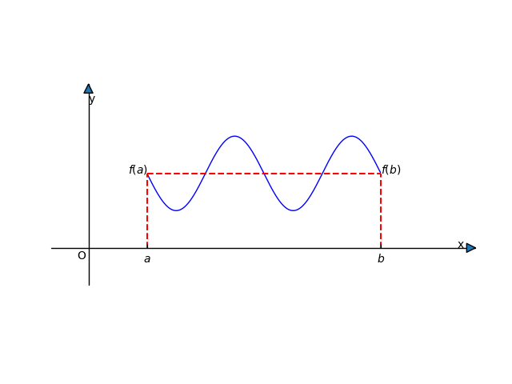
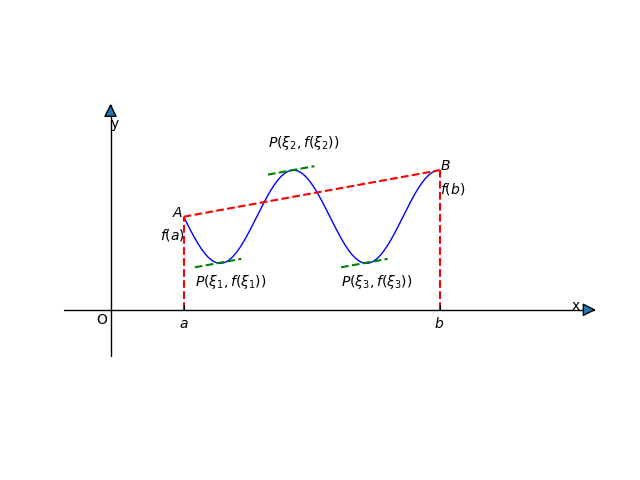

[toc]

# 第四章 微分中值定理、导数的应用

利用$y = f(x)$的导数（$y = f^\prime(x)$，$y = f^{\prime\prime}(x)$）来研究函数曲线的性态：==单调性==、求函数的==极值==，==最值==，==凹凸性==，==拐点==，作函数的图形等。

理论基础——==微分中值定理==

## 第1节 微分中值定理

### 一、Rolle定理

==Rolle定理==：若$f(x) \in C[a, b], f(x) \in D(a, b)$，且$f(a) = f(b)$，则==至少==存在一点$\xi \in (a, b)$，使得$f^\prime(\xi) = 0$。

证：因为$f(x) \in C[a, b]$，所以$f(x)$在$[a, b]$必取得最大值$M$，最小值$m$。讨论：

1. 若$M = m$，则$m \le f(x) \le M \Longrightarrow f(x) = f(a) = f(b) = $常数，故$f^\prime(x) \equiv 0, \forall_x \in (a, b)$，于是$\forall_\xi \in (a, b)$，均有$f^\prime(\xi) = 0$。

2. 若$m \lt M$，这时$m, M$至少有一个点在$(a, b)$内部取得，不妨设$M \neq f(a) = f(b)$，即==至少==存在一点$\xi \in (a, b)$，使得$f(\xi) = M$，对于任何增量$\Delta x$，$f(\xi + \Delta x) - f(\xi) \le 0$，因为$f(x) \in D(a, b)$，所以$f^\prime(\xi)$一定存在。当$\Delta x < 0$时，$\frac{\Delta y}{\Delta x} = \frac{f(\xi + \Delta x) - f(\xi)}{\Delta x} \ge 0$，当$\Delta x > 0$时，$\frac{\Delta y}{\Delta x} = \frac{f(\xi + \Delta x) - f(\xi)}{\Delta x} \le 0$。$\lim_{\Delta \to 0^+}\frac{\Delta y}{\Delta x} \le 0, \lim_{\Delta \to 0^-}\frac{\Delta y}{\Delta x} \ge 0$。因为$f^\prime(\xi)$存在，所以$f_-^\prime(\xi) = f_+^\prime(\xi) \Longrightarrow f^\prime(\xi) = 0$。

   

==注意条件，否则定理的结论可能不成立==：

1. $f(x) \in C[a, b]$；
2. $f(x) \in D(a, b)$；
3. $f(a) = f(b)$

例如：设$f(x) = x(x - 1)(x - 2)$，不求导数，说明$f^\prime(x) = 0$有几个实根？

解：$f(x) = x(x - 1)(x - 2)$在$(-\infty, +\infty)$内连续且可导，$f(0) = 0, f(1) = 0$，$f(x)$在$[0, 1]$上满足罗尔定理条件，则至少存在一点$\xi_1 \in (0, 1)$，使得$f^\prime(\xi_1) = 0$，同理$f(x)$在$[1, 2]$区间上也满足罗尔定理条件，至少存在一点$\xi_2 \in (1, 2)$，使得$f^\prime(\xi_2) = 0$，又因为$f^\prime(x)$是二次函数，$f^\prime(x) = 0$至多有两个实根，现在有$f(\xi_1) = 0, f(\xi_2) = 0$，所以$\xi_1 \in (0, 1), \xi_2 \in (1, 2)$是$f^\prime(x)$的两个实根。

### 二、LaGrange定理

==LaGrange定理==：设$f(x) \in C[a, b], f(x) \in D(a, b)$，则至少存在一点$\xi \in (a, b)$，使得$f^\prime(\xi) = \frac{f(b) - f(a)}{b - a}$。

分析：令$k = \frac{f(b) - f(a)}{b - a}$，表示弦$AB$的斜率。结论：曲线上至少存在一定$P(\xi, f(\xi))$使得过$P$点的切线平行于弦$AB$。要证：$f^\prime(\xi) = \frac{f(b) - f(a)}{b - a} = k$，即证$f^\prime(\xi) - k = 0 \Longleftrightarrow [f(x) - kx]^\prime|_{x = \xi} = 0$，这是罗尔定理的条件。

证：通过构造函数$f(x) - kx$，利用罗尔定理证明至少存在一点$\xi \in (a, b)$，使得$f^\prime(\xi) - k = 0$。作辅助函数$\phi(x) = f(x) - kx, k = \frac{f(b) - f(a)}{b - a}$，显然$\phi(x) \in C[a, b], \phi(x) \in D(a, b)$。$\phi(a) = f(a) - \frac{f(b) - f(a)}{b - a} \cdot a = \frac{bf(a) - af(b)}{b - a}, \phi(b) = f(b) - \frac{f(b) - f(a)}{b - a} \cdot b = \frac{bf(a) - af(b)}{b - a}$，所以$\phi(a) = \phi(b)$，所以$\phi(x)$满足Rolle定理条件，由Rolle定理，至少存在一点$\xi \in (a, b)$，使得$\phi^\prime(\xi) = 0$，$\phi^\prime(x) = [f(x) - kx]^\prime = f^\prime(x) - k, \phi^\prime(\xi) = f^\prime(\xi) - k = 0$，即$f^\prime(\xi) = \frac{f(b) - f(a)}{b - a}$，故LaGrange定理成立。

==LaGrange定理的其它形式==：

1. $f(b) - f(a) = f^\prime(\xi)(b - a), \xi \in (a, b)$；

2. $f(x)$在$[a, b]$区间内满足LaGrange定理条件，$\forall_x \in [a, b]$，且$x$有增量$\Delta x, (x + \Delta x) \in [a, b]$（$\Delta x > 0$或$\Delta x < 0$），则$f(x)$ 在$[x, x + \Delta x], (\Delta x > 0)$或在$[x + \Delta x, x], (\Delta x < 0)$满足Lagrange定理条件，则有$f(x + \Delta x) - f(x) = f^\prime(\xi)\Delta x$，其中$\xi$介于$x$与$x + \Delta x$之间。

3. 由2，因为$\xi$介于$x$与$x + \Delta x$之间，必有$0 < \theta < 1$，使得$\xi = x + \theta\Delta x$，所以$f(x + \Delta x) - f(x) = f^\prime(x + \theta\Delta x)\Delta x$（==有限增量公式==）。

   例子：

   （1）若$f^\prime(x) \equiv 0, a < x < b$，则$f(x) \equiv$常数。

   证：$\forall_{x_1, x_2} \in (a, b)$，设$x_1 < x_2$，则$f(x)$在$[x_1, x_2]$上满足LaGrange定理条件，从而有$f(x_2) - f(x_1) = f^\prime(\xi)(x_2 - x_1)$。因为$f^\prime(x) \equiv 0, a < x < b$，由于$\xi \in (a, b)$，所以$f^\prime(\xi) = 0$，即$f(x_2) = f(x_1)$，由于$x_1, x_2$的任意性，所以$f(x) \equiv f(x_1)$（常数）。

   ==结论==：$f^\prime(x) \equiv 0, x \in I \Longrightarrow f(x) \equiv C, x \in I$。

   （2）若$f^\prime(x) = g^\prime(x), \forall_x \in (a, b)$，则$f(x) - g(x) = $常数（$x \in (a, b)$）。==（1）、（2）在不定积分里用到==。分析：$f^\prime(x) = g^\prime(x) \Longleftrightarrow f^\prime(x) - g^\prime(x) = 0 \Longleftrightarrow [f(x) - g(x)]^\prime = 0 \Longleftrightarrow f(x) - g(x) = $常数。

   （3）若$f^\prime(x) = k \neq 0, x \in (a, b)$，则$f(x) = kx + C, \forall_x \in (a, b)$（$k, C$为常数）。

利用LaGrange定理证明函数不等式或数字不等式：

​	例1、证明：当$x > 1$时，$e^x > ex$。

​	证：设$f(x) = e^x, x \in (1, +\infty)$，$f(x)$在$[1, x], (x > 1)$满足LaGrange定理条件，从而有$f(x) - f(1) = f^\prime(\xi)(x - 1), \xi \in (1, x)$，即$e^x - e = f^\prime(\xi)(x - 1)$，因为$e^x$是单调增函数，且$1 < \xi$，所以有$e^1 < e^\xi$，又因为$x - 1 > 0$，所以$e^x - e = f^\prime(x)(x - 1) > e(x - 1), e^x -e > ex - e$，即$e^x > ex, x > 1$。

​	例2、证明：对任意实数$a, b$，都有$|\arctan a - \arctan b| \le |a - b|$。

​	证：把$\arctan a, \arctan b$看作是$\arctan x$在$x = a, x = b$处的函数值。选定$f(x) = \arctan x$，则$f(x)$在区间$[a, b]$或$[b, a]$满足LaGrange定理条件，从而有$\arctan a - \arctan b = f^\prime(\xi)(a - b) = \frac{1}{1 + \xi^2}(a - b)$，因为$\frac{1}{1 + \xi^2} \le 1$，所以 $|\arctan a - \arctan b| = \frac{1}{1 + \xi^2}|a - b| \le |a - b|$。

​	例3、设$f(x) \in D^2[1, 2], f(1) = f(2) = 0, F(x) = (x - 1)^2f(x)$。证明：至少存在一点$\xi \in (1, 2)$，使$F^{\prime\prime}(\xi) = 0$。

​	证：$F(x) = (x - 1)^2f(x) \in C[1, 2], F(x) \in D[1, 2], F(1) = 0, F(2) = 0$，则$F(x)$在$[1, 2]$上满足Rolle定理条件，从而至少存在一点$\xi_1$，使得$F^\prime(\xi_1) = 0$，其中$1 < \xi_1 < 2$。因为$F^\prime(x) = 2(x - 1)f(x) + (x - 1)^2f^\prime(x)$，$F^\prime(1) = 2(1 - 1)f(1) + (1 - 1)^2f^\prime(1) = 0$，从而有$F^\prime(x)$在$[1, \xi_1] \subset [1, 2]$满足Rolle定理条件，从而有$\xi_2 \in (1, \xi_2) \subset (1, 2)$，使$F^{\prime\prime}(\xi_2) = 0$。

### 三、Cauchy定理

==Cauchy定理==：设$f(x), g(x) \in C[a, b]$，且$f(x), g(x) \in D(a, b)$，且$g^\prime(x) \neq 0$，则至少存在一点$\xi \in (a, b)$使$\frac{f(b) - f(a)}{g(b) - g(a)} = \frac{f^\prime(\xi)}{g^\prime(\xi)}$。

证明分析：令$k = \frac{f(b) - f(a)}{g(b) - g(a)}$，要证的结论：$\frac{f^\prime(\xi)}{g^\prime(\xi)} = k \Longrightarrow f^\prime(\xi) = kg^\prime(\xi) \Longrightarrow f^\prime(\xi) - kg^\prime(\xi) = 0 \Longrightarrow [f^\prime(x) - kg^\prime(x)]|_{x = \xi} = 0 \Longrightarrow [f(x) - kg(x)]^\prime|_{x = \xi} = 0$ 。这正是罗尔定理的结论。

证明：作辅助函数$\phi(x) = f(x) - kg(x)$，因为$g^\prime(x) \neq 0$，可推知$g(b) - g(a) \neq 0$（反证法，假若$g(b) - g(a) = 0$，又因为$g(x)$满足Rolle定理条件，有$f^\prime(\xi) = 0, \xi \in (a, b)$，而$b - a \neq 0$，这与$g^\prime(x) \neq 0$的假设矛盾。）由$f(x), g(x) \in C[a, b], f(x), g(x) \in D(a, b) \Longrightarrow \phi(x) = f(x) - kg(x) \in C[a, b], \phi(x) \in D(a, b)$。$\phi(a) = f(a) - \frac{f(b) - f(a)}{g(b) - g(a)} \cdot g(a) = \frac{f(a)g(b) - f(b)g(a)}{g(b) - g(a)}, \phi(b) = f(b) - \frac{f(b) - f(a)}{g(b) - g(a)} \cdot g(b) = \frac{f(a)g(b) - f(b)g(a)}{g(b) - g(a)}$，所以$\phi(a) = \phi(b)$，所以$\phi(x) = f(x) - kg(x)$满足Rolle定理条件，从而有至少存在一点$\xi \in (a, b)$，使得$\phi^\prime(\xi) = 0$。因为$\phi^\prime(x) = f^\prime(x) - kg^\prime(x)$，所以$\phi^\prime(\xi) = f^\prime(\xi) - kg^\prime(\xi) = 0$。因为$g^\prime(\xi) \neq 0$，所以$\frac{f^\prime(\xi)}{g^\prime(\xi)} = \frac{f(b) - f(a)}{g(b) - g(a)}$。

### 四、Taylor定理

==Tayloar定理==：设$f(x) \in C[a, b], f(x) \in D^{n + 1}(a, b)$，若$x_0 \in (a, b)$，则至少存在一点$\xi \in (a, b), \forall_x \in (a, b)$，有$f(x) = f(x_0) + f^\prime(x_0)(x - x_0) + \frac{f^{\prime\prime}(x_0)}{2!}(x - x_0)^2 + \cdots + \frac{f^{(n)}(\xi)}{n!}(x - x_0)^n + R_n(x)$，其中$R_n(x) = \frac{f^{(n + 1)}(\xi)}{(n + 1)!}(x - x_0)^{(n + 1)}$（$\xi$介于$x_0$与$x$之间）。==备注：$f(x) \in D^{n + 1}(a, b)$不一定要全部展到$n$阶，最终的$\xi$与$n$有关，看如下证明。==

证明：为了方便起见，不妨设$P_n(x) = f(x_0) + f^\prime(x_0)(x - x_0) + \frac{f^{\prime\prime}(x_0)}{2!}(x - x_0)^2 + \cdots + \frac{f^{(n)}(\xi)}{n!}(x - x_0)^n$，因为$f(x) = P_n(x) + R_n(x)$，所以$R_n(x) = f(x) - P_n(x)$，令$q(x) = (x - x_0)^{n + 1}$，因为$R_n(x) = \frac{f^{(n + 1)}(\xi)}{(n + 1)!}(x - x_0)^{n + 1}$，要证：$R_n(x) = \frac{f^{(n + 1)}(\xi)}{(n + 1)!} \cdot q(x) \Longrightarrow \frac{R_n(x)}{q(x)} = \frac{f^{(n + 1)}(\xi)}{(n + 1)!}$ 。

先列出几个函数的导数（==后面应用Cauchy定理的时候用到==）：

$P_n^{(i)}(x_0) = f^{(i)}(x_0), (i = 0, 1, 2, \cdots , n)$（==小于$i$的项求导完之后等于零，大于$i$的项由于带有$(x - x_0) = (x_0 - x_0) = 0$也直接消去==）

进而可以得到$R_n^{(i)}(x_0) = f^{(i)}(x_0) - P_n^{(i)}(x_0) = 0, (i = 0, 1, 2, \cdots , n)$，对于函数$q(x)$，容易得到$q^{(i)}(x_0) = 0, (i = 0, 1, 2, \cdots , n)$。

对两个函数：$R_n(x), q(x)$，在$[x_0, x]$或$[x, x_0]$上应用Cauchy定理（==技巧：分子分母同时减去零==）：

$\frac{R_n(x)}{q(x)} = \frac{R_n(x) - R_n(x_0)}{q(x) - q(x_0)} = \frac{R_n^\prime(\xi_1)}{q^\prime(\xi_1)}$，其中$\xi_1$介于$x$与$x_0$之间。再对两个函数$R_n^\prime(x), q^\prime(x)$在$[x_0, \xi_1]$或$[\xi_1, x_0]$应用柯西定理：$\frac{R_n^\prime(\xi_1)}{q^\prime(\xi_1)} = \frac{R_n^\prime(\xi_1) - R_n^\prime(x_0)}{q^\prime(\xi_1) - q^\prime(x_0)} = \frac{R_n^{\prime\prime}(\xi_2)}{q^{\prime\prime}(\xi_2)}$，其中$\xi_2$介于$\xi_1$与$x_0$之间。

照此方法做下去，经过$n + 1$次应用柯西定理，得到：

$\frac{R_n(x)}{q(x)} = \frac{R_n^\prime(\xi_1)}{q^\prime(\xi_1)} = \frac{R_n^{\prime\prime}(\xi_2)}{q^{\prime\prime}(\xi_2)} = \cdots = \frac{R_n^{(n + 1)}(\xi)}{q^{(n + 1)}(\xi)}$，其中$\xi$介于$x_0$与$\xi_n$之间，即$\xi$介于$x$与$x_0$之间。（==注意到$\xi_n$离$x_0$越来越近==）。

==前方高能==：

因为$P_n^{(n + 1)}(x) = 0$，所以$R_n^{(n + 1)}(x) = f^{(n + 1)}(x) - P_n^{(n + 1)}(x) = f^{(n + 1)}(x)$，所以$R_n^{(n + 1)}(\xi) = f^{(n + 1)}(\xi)$；因为$q(x) = (x - x_0)^{(n + 1)}$，所以$q^{(n + 1)}(x) = (n + 1)!$，所以$q^{(n + 1)}(\xi) = (n + 1)!$，于是$\frac{R_n(x)}{q(x)} = \frac{f^{(n + 1)}(\xi)}{(n + 1)!}$，所以$R_n(x) = \frac{f^{(n + 1)}(\xi)}{(n + 1)!} \cdot q(x) = \frac{f^{(n + 1)}(\xi)}{(n + 1)!} \cdot (x - x_0)^{(n + 1)}$。

==公式==：$f(x) = f(x_0) + \sum_{k = 1}^n\frac{f^{(k)}(x_0)}{k!}(x - x_0)^k + R_n(x)$，其中$R_n(x) = \frac{f^{n + 1}(\xi)}{(n + 1)!}(x - x_0)^{n + 1}$（$\xi$介于$x_0$与$x$之间），称为==$f(x)$在$x_0$点的n阶泰勒公式==。（==$\xi$与$n$有关==）

当$x_0 = 0$时，$f(x) = f(0) + \sum_{k = 1}^n\frac{f^{(k)}(0)}{k!}x^k + R_n(x)$，其中$R_n(x) = \frac{f^{n + 1}(\xi)}{(n + 1)!}x^{n + 1}$（$\xi$介于$0$与$x$之间）。此公式称为==$f(x)$的$n$阶麦克劳林公式，$R_n(x)$称为$n$阶的Taylor余项==。

$R_n(x)$有以下两种形式：

1. ==LaGrange形式==：$R_n(x) = \frac{f^{(n + 1)}(\xi)}{(n + 1)!}(x - x_0)^{n + 1}$，（$\xi$介于$x_0$与$x$之间）；

2. ==Peano形式==：由于$f(x) \in D^{n + 1}(a, b), \forall_{x_0} \in (a, b)$在$N(x_0, \delta)$内$f(x)$有直至$n + 1$阶导数，从而$R_n(x) = f(x) - \sum_{k = 1}^n\frac{f^{(k)}(x_0)}{k!}(x - x_0)^k - f(x_0)$，利用下一节求极限的罗比塔法则，可以推出：$\lim_{x \to x_0}\frac{R_n(x)}{(x - x_0)^n} = 0$，即当$x \to x_0$时，$R_n(x) = O((x - x_0)^n)$，==称为Taylor公式$n$阶余项的Peano形式==。

   对于麦克劳林公式：$f(x) = f(0) + \sum_{k = 1}^n\frac{f^{(k)}(0)}{k!}x^k + O(x^n)$。

例1、求$f(x) = e^x$的$n$阶麦克劳林公式。

解：$\because f(x) = f^\prime(x) = f^{\prime\prime}(x) = \cdots = f^{(n + 1)}(x) = e^x, f(0) = f^\prime(0) = f^{\prime\prime}(0) = \cdots = f^{(n)}(0) = 1$。$f(x) = f(0) + f^\prime(0)x + \frac{f^{\prime\prime}(0)}{2!}x^2 + \cdots + \frac{f^{(n)}(0)}{n!}x^n + \frac{f^{(n + 1)}(\xi)}{(n + 1)!}x^{n + 1}$，$\therefore e^x = 1 + x + \frac{1}{2!}x^2 + \cdots + \frac{1}{n!}x^n + \frac{e^\xi}{(n + 1)!}x^{n + 1}$，其中$\xi$介于$0$与$x$之间，取$e^x \approx 1 + x + \frac{1}{2!}x^2 + \cdots + \frac{1}{n!}x^n$，误差$|R_n(x)| = |\frac{e^\xi}{(n + 1)!}x^{n + 1}|$，因为$\xi$介于$0$与$x$之间，所以$|\xi| < |x|, |e^\xi| \le e^{|\xi|} < e^{|x|}$，所以$|R_n(x)| \le \frac{e^{|x|}}{(n + 1)!}|x|^{n + 1}$。当$x = 1$时，$e \approx 1 + 1 + \frac{1}{2!} + \frac{1}{3!} + \cdots + \frac{1}{n!}, |R_n| \le \frac{e}{(n + 1)!}$，若取$n = 7$，则$e \approx 1 + 1 + \frac{1}{2!} + \frac{1}{3!} + \cdots + \frac{1}{7!}$，误差：$|R_7| \le \frac{e}{(7 + 1)!} < \frac{3}{8!} < 10^{-4}$。$e \approx 2.7183$。

例2、求$f(x) = \sin(x)$的$2m$阶麦克劳林公式。

解：$f^{(n)}(x) = (\sin x)^{(n)} = \sin(x + \frac{n\pi}{2})$。$f(0) = \sin 0 = 0, f^\prime(0) = \sin\frac{\pi}{2} = 1, f^{\prime\prime}(0) = \sin\pi = 0, f^{\prime\prime\prime}(0) = \sin\frac{3\pi}{2} = -1, f^{(2m)}(0) = 0, f^{(2m - 1)}(0) = (-1)^{m - 1}$。$\sin x = f(0) + f^\prime(0)x + \frac{f^{\prime\prime}(0)}{2!}x^2 + \frac{f^{\prime\prime\prime}(0)}{3!}x^3 + \frac{f^{{(4)}}(0)}{4!}x^4 + \cdots + \frac{f^{(2m - 1)}(0)}{(2m - 1)!}x^{2m-1} + \frac{f^{(2m)}(0)}{(2m)!}x^{2m} + R_{2m}(x)$。$\sin x = x - \frac{1}{3!}x^3 + \frac{1}{5!}x^5 + \cdots + (-1)^{m - 1}\frac{1}{(2m - 1)!}x^{2m - 1} + \frac{\sin(\xi + \frac{2m + 1}{2}\pi)}{(2m + 1)!}x^{2m + 1}$，$\xi$在$0$与$x$之间。

如果取$m = 1$，有$\sin x \approx x$，误差$|R_2(x)| = |\frac{1}{3!}\sin(\xi + \frac{3\pi}{2})x^3| \le \frac{1}{3!}|x|^3$。

同理：$m = 2$或$m = 3$，有$\sin x \approx x - \frac{1}{3!}x^3, |R_4(x)| \le \frac{1}{5!}|x|^5$，$\sin x \approx x - \frac{1}{3!}x^3 + \frac{1}{5!}x^5, |R_6(x)| \le \frac{1}{7!}|x|^7$。

## 第2节 洛必达法则

如果当$x \to x_0, (x \to \infty)$时，$f(x) \to 0, \phi(x) \to 0$，则称$\lim_{x \to x_0 \\ x \to \infty}\frac{f(x)}{g(x)}$为==“$\frac{0}{0}$”型未定式==。

如果当$x \to x_0, (x \to \infty)$时，$f(x) \to \infty, \phi(x) \to \infty$，则称$\lim_{x \to x_0 \\ x \to \infty}\frac{f(x)}{\phi(x)}$为==“$\frac{\infty}{\infty}$”型未定式==。

### 一、“$\frac{0}{0}$”型未定式

==准则1==：（1）设$f(x), \phi(x)$在$N(x_0, \delta)$内有定义，且$\lim_{x \to x_0}f(x) = 0, \lim_{x \to x_0}\phi(x) = 0$；（2）$f(x), \phi(x)$在$N(\hat{x_0}, \delta)$内可导，且$\phi^\prime(x) \neq 0$；（3）$\lim_{x \to x_0}\frac{f^\prime(x)}{\phi^\prime(x)}$存在（或为$\infty$），则$\lim_{x \to x_0}\frac{f(x)}{\phi(x)}$存在（或为$\infty$），且$\lim_{x \to x_0}\frac{f(x)}{g(x)} = \lim_{x \to x_0}\frac{f^\prime(x)}{\phi^\prime(x)}$。

证：由假设（1），$\lim_{x \to x_0}f(x) = 0, \lim_{x \to x_0}\phi(x) = 0$。补充定义$f(x_0) = 0, \phi(x_0) = 0$，则$f(x), \phi(x)$在$x_0$点连续。$\forall_x \in N(x_0, \delta), x \neq x_0$，则$f(x), \phi(x)$在$[x_0, x]$（或$[x, x_0]$）连续，在$(x_0, x)$（或$(x, x_0)$）内可导，$\phi^\prime(x) \neq 0$，由Cauchy定理：$\frac{f(x)}{\phi(x)} = \frac{f(x) - 0}{\phi(x) - 0} = \frac{f(x) - f(x_0)}{g(x) - \phi(x_0)} = \frac{f^\prime(\xi)}{\phi^\prime(\xi)}$，$\xi$在$x_0$与$x$之间。那么当$x \to x_0$时，$\xi \to x_0$，$\lim_{x \to x_0}\frac{f(x)}{\phi(x)} = \lim_{x \to x_0}{\frac{f^\prime(\xi)}{\phi^\prime(\xi)}} = \lim_{\xi \to x_0}\frac{f^\prime(\xi)}{\phi^\prime(\xi)}$。由假设（3）$\lim_{x \to x_0}\frac{f^\prime(x)}{\phi^\prime(x)}$存在（或为$\infty$），所以$\lim_{\xi \to x_0}\frac{f^\prime(\xi)}{\phi^\prime(\xi)} = \lim_{x \to x_0}\frac{f(x)}{\phi(x)} = \lim_{x \to x_0}\frac{f^\prime(x)}{\phi^\prime(x)}$（或为$\infty$）。

如果$\lim_{x \to x_0}\frac{f^\prime(x)}{\phi^\prime(x)}$又是“$\frac{0}{0}$”，且$f^\prime(x), \phi^\prime(x)$满足准则1条件，就可以连续使用准则1，即：$\lim_{x \to x_0}\frac{f(x)}{\phi(x)} \overset{"\frac{0}{0}"}{=} \lim_{x \to x_0}\frac{f^\prime(x)}{\phi^\prime(x)} \overset{"\frac{0}{0}"}{=} \frac{f^{\prime\prime}(x)}{\phi^{\prime\prime}(x)}$

例1、求$\lim_{x \to 1}\frac{x^3 - 3x + 2}{x^3 - x^2 - x + 1}$。

解：$\lim_{x \to 1}(x^3 - 3x + 2) = 0, \lim_{x \to 1}(x^3 - x^2 - x + 1) = 0$。$\lim_{x \to 1}\frac{x^3 - 3x + 2}{x^3 - x^2 -x + 1} \overset{"\frac{0}{0}"}{=} \lim_{x \to 1}\frac{3x^2 - 3}{3x^2 - 2x - 1} \overset{"\frac{0}{0}"}{=} \lim_{x \to 1}\frac{6x}{6x - 2} = \frac{6}{4} = \frac{3}{2}$。

例2、求$\lim_{x \to 0}\frac{x - \sin x}{x\sin x^2}$。

解：原式$\overset{"\frac{0}{0}"}{=} \lim_{x \to 0}\frac{x - \sin x}{x \cdot x^2} = \overset{"\frac{0}{0}"}{=} \lim_{x \to 0}\frac{1 - \cos x}{3x^2} = \overset{"\frac{0}{0}"}{=} \lim_{x \to 0}\frac{\sin x}{6x} = \frac{1}{6}$。

==注意==：在准则1中，条件（3）$\lim_{x \to x_0}\frac{f^\prime(x)}{\phi^\prime(x)}$存在（或为$\infty$），则$\lim_{x \to x_0}\frac{f(x)}{\phi(x)}$存在（或为$\infty$），且$\lim_{x \to x_0}\frac{f(x)}{g(x)} = \lim_{x \to x_0}\frac{f^\prime(x)}{\phi^\prime(x)}$。由$\lim_{x \to x_0}\frac{f^\prime(x)}{\phi^\prime(x)}$不存在，==不能==推出$\lim_{x \to x_0}\frac{f(x)}{\phi(x)}$

不存在。

例3、求$\lim_{x \to 0}\frac{x^2\sin\frac{1}{x}}{\sin x} \overset{"\frac{0}{0}"}{=} \lim_{x \to 0}\frac{2x\sin\frac{1}{x} - \cos\frac{1}{x}}{\cos x}$。因为当$x \to 0$时，$\cos\frac{1}{x}$极限不存在，所以$\lim_{x \to 0}\frac{2x\sin\frac{1}{x} - \cos\frac{1}{x}}{\cos x}$不存在，但是原式$=\lim_{x \to 0}\frac{x^2\sin\frac{1}{x}}{x} = \lim_{x \to 0}x\sin\frac{1}{x} = 0$。

==推论1==：设（1）$f(x), \phi(x)$在$|x| > N > 0$时有定义，且$\lim_{x \to \infty}f(x) = 0, \lim_{x \to \infty}\phi(x) = 0$；（2）当$|x| > N$时$f^\prime(x), \phi^\prime(x)$存在，且$\phi^\prime(x) \neq 0$；（3）$\lim_{x \to \infty}\frac{f^\prime(x)}{\phi^\prime(x)}$存在（或为$\infty$），则$\lim_{x \to \infty}\frac{f(x)}{\phi(x)}$存在，且$\lim_{x \to \infty}\frac{f(x)}{\phi(x)} = \lim_{x \to \infty}\frac{f^\prime(x)}{\phi^\prime(x)}$（或为$\infty$）。

证：作变换$x = \frac{1}{t}$，当$x \to \infty, t \to 0$，把$\lim_{x \to \infty}\frac{f(x)}{\phi(x)}$化为$t \to 0$的极限，$\lim_{x \to \infty}\frac{f(x)}{\phi(x)} = \lim_{t \to 0}\frac{f(\frac{1}{t})}{\phi(\frac{1}{t})} = \lim_{t \to 0}\frac{f^\prime(\frac{1}{t})(-\frac{1}{t^2})}{\phi^\prime(\frac{1}{t})(-\frac{1}{t^2})} = \lim_{t \to 0}\frac{f^\prime(\frac{1}{t})}{\phi^\prime(\frac{1}{t})} = \lim_{x \to \infty}\frac{f^\prime(x)}{\phi^\prime(x)}$。

例4、求$\lim_{x \to +\infty}\frac{\frac{\pi}{2} - \arctan x}{\ln(1 + \frac{1}{x})}$。

解：原式$= \lim_{x \to +\infty}\frac{-\frac{1}{1 + x^2}}{\frac{1}{1 + \frac{1}{x}}(-\frac{1}{x^2})} = \lim_{x \to +\infty}\frac{x + x^2}{1 + x^2} = \lim_{x \to +\infty}\frac{\frac{1}{x} + 1}{\frac{1}{x^2} + 1} = 1$。

### 二、"$\frac{\infty}{\infty}$"型未定式

==准则2==：设（1）$f(x), \phi(x)$在$N(\hat{x_0}, \delta)$内有定义，且$\lim_{x \to x_0}f(x) = \infty, \lim_{x \to x_0}\phi(x) = \infty$；（2）$f(x), \phi(x)$在$N(\hat{x_0}, \delta)$内可导，$\phi^\prime(x) \neq 0$；（3）$\lim_{x \to x_0}\frac{f^\prime(x)}{\phi^\prime(x)}$存在（或为$\infty$）。则$\lim_{x \to x_0}\frac{f(x)}{\phi(x)}$存在（或为$\infty$），且$\lim_{x \to x_0}\frac{f(x)}{\phi(x)} = \lim_{x \to x_0}\frac{f^\prime(x)}{\phi^\prime(x)}$。==（证明超出教学要求）==

推论2：设（1）$f(x), \phi(x)$在$|x| > N > 0$时有定义且$\lim_{x \to \infty}f(x) = \infty, \lim_{x \to \infty}\phi(x) = \infty$；（2）$f(x), \phi(x)$在$|x| > N$时可导，且$\phi^\prime(x) \neq 0$；（3）$\lim_{x \to \infty}\frac{f^\prime(x)}{\phi^\prime(x)}$存在（或为$\infty$），则$\lim_{x \to \infty}\frac{f(x)}{\phi^(x)}$存在（或为$\infty$），且$\lim_{x \to \infty}\frac{f(x)}{\phi(x)} = \lim_{x \to \infty}\frac{f^\prime(x)}{\phi^\prime(x)}$。

例1、求$\lim_{x \to \frac{\pi}{4}^+}{\frac{\ln \sin (x - \frac{\pi}{4})}{\ln (x - \frac{\pi}{4})}}$。

解：容易验证当$x \to \frac{\pi}{4}^+$时，原式是"$\frac{\infty}{\infty}$"未定式。

原式$ = \lim_{x \to \frac{\pi}{4}^+}\frac{[\ln \sin (x - \frac{\pi}{4})]^\prime}{[\ln (x - \frac{\pi}{4})]^\prime} = \lim_{x \to \frac{\pi}{4}^+}\frac{\frac{1}{\sin (x - \frac{\pi}{4})} \cdot \cos (x - \frac{\pi}{4})}{\frac{1}{x - \frac{\pi}{4}}} = \lim_{x \to \frac{\pi}{4}^+}\frac{x - \frac{\pi}{4}}{\sin (x - \frac{\pi}{4})} \cdot \lim_{x \to \frac{\pi}{4}^+}\cos (x - \frac{\pi}{4}) = 1 \cdot 1 = 1$。

例2、求$\lim_{x \to +\infty}\frac{x^n}{e^x}, (n \in N)$。

原式$ = $“$\frac{\infty}{\infty}$”型未定式。原式$ = \lim_{x \to +\infty}\frac{nx^{n - 1}}{e^x} = \lim_{x \to +\infty}\frac{n(n - 1)x^{n - 2}}{e^x} = \cdots = \lim_{x \to +\infty}\frac{n!}{e^x} = 0$。

### 三、其它类型未定式

例如：$\lim f(x) = 0, \lim \phi(x) = \infty$，则$\lim[f(x)\phi(x)]$就是"$0 \cdot \infty$"型未定式，如此类推，还有"$\infty - \infty$"型，"$0^0$"型，"$1^\infty$"型，"$\infty^0$"型未定式，对以上类型未定式求极限的原则：==把未定式化为"$\frac{0}{0}$"型或者"$\frac{\infty}{\infty}$"型，再利用准则1、2或推论1、2来解决==。

例3、求$\lim_{x \to 0^+}x^n \ln x (n > 0)$。

解：原式是"$0 \cdot \infty$"型未定式。原式$ = \lim_{x \to 0^+}\frac{\ln x}{\frac{1}{x^n}} \overset{"\frac{0}{0}"}{=} \lim_{x \to 0^+}\frac{\frac{1}{x}}{-\frac{n}{x^{n + 1}}} = \lim_{x \to 0^+}{-\frac{x^n}{n}} = 0$。

例4、求$\lim_{x \to \frac{\pi}{2}}{\sec x - \tan x}$。

解：原式是"$\infty - \infty$"型未定式。原式$ = \lim_{x \to \frac{\pi}{2}}(\frac{1}{\cos x} - \frac{\sin x}{\cos x}) = \lim_{x\ \to \frac{\pi}{2}}\frac{1 - \sin x}{\cos x} = \overset{"\frac{0}{0}"}{=} \lim_{x \to \frac{\pi}{2}}{\frac{-\cos x}{-\sin x}} = 0$。

例5、求$\lim_{x \to 0^+}(\tan x)^{\sin x}$（幂指函数$\lim_{x \to x_0}[f(x)]^{\phi(x)}$）。

解：原式是"$0^0$"型未定式。设$y = (\tan x)^{\sin x}$，取对数$\ln y = \sin x \ln(\tan x)$，$y = e^{\sin x \ln(\tan x)}$。所以$\lim_{x \to 0^+}{\tan x}^{\sin x} = \lim_{x \to 0^+}e^{\sin x \ln(\tan x)} = e^{\lim_{x \to 0^+}\sin x \ln(\tan x)} \overset{"0 \cdot \infty"}{=} \lim_{x \to 0^+}\frac{\ln(\tan x)}{\frac{1}{\sin x}} \overset{"\frac{\infty}{\infty}"}{=} \lim_{x \to 0^+}\frac{\frac{1}{\tan x} \cdot \sec^2x}{-\frac{1}{\sin^2x \cdot \cos x}} = \lim_{x \to 0^+}\frac{\sin x}{\cos^2x} = 0$。所以$\lim_{x \to 0^+}(\tan x)^{\sin x} = e^{\lim_{x \to 0^+}\sin x \ln(\tan x)} = e^0 = 1$。

## 第3节、函数的增减性与极值（==理论基础是中值定理==）

### 一、函数单调增、减的必要条件与充分条件

1. 函数单调增、减的必要条件

   $y = f(x)$在$(a, b)$内单调增，$\forall_{x_1, x_2} \in (a, b), x_1 < x_2, f(x_1) < f(x_2)$，曲线$y = f(x)$在$(a, b)$内随着$x$的增加而上升，$\forall_x \in (a, b)$，过曲线上点$M(x, f(x))$作切线MT，其倾斜角为$\alpha$，则$0 < \alpha < \frac{\pi}{2}$，斜率$k = \tan\alpha > 0$，即$f^\prime(x) = \tan\alpha > 0$；

2. 类似地，若$y = f(x)$在$(a, b)$内单调减，$\forall_{x_1, x_2} \in (a, b)$，过点$M(x, f(x))$的切线的倾角$\alpha$是钝角，即$f^\prime(x) = \tan \alpha < 0$。

==函数单调增、减的必要条件==：设$f(x) \in C[a, b], f(x) \in D(a, b)$，则当$f(x)$在$[a, b]$上严格单调增（或减）时，在$(a, b)$内必有$f^\prime(x) \ge 0 \ (f^\prime(x) \le 0)$，且在$(a, b)$的任何子区间中等号不恒成立。

证：设$f(x)$在$[a, b]$上严格单调增，$\forall_{x} \in (a, b)$，$x$有增量$\Delta x$，$x + \Delta x \in (a, b)$。

​	当$\Delta x < 0$时，$x + \Delta x < x \Longrightarrow f(x + \Delta x) < f(x) \Longleftrightarrow \frac{f(x + \Delta x) - f(x)}{\Delta x} > 0$；

​	当$\Delta x > 0$时，$x + \Delta x > x \Longrightarrow f(x + \Delta x) > f(x) \Longleftrightarrow \frac{f(x + \Delta x) - f(x)}{\Delta x} > 0$；

则无论$\Delta x > 0$或$\Delta x < 0$，有$\frac{f(x + \Delta x) - f(x)}{\Delta x} > 0$。又因为$f(x) \in D(a, b)$，所以$\lim_{\Delta x \to 0}\frac{f(x + \Delta x) - f(x)}{\Delta x} =f^\prime(x) \ge 0$。上式$f^\prime(x) = 0$在$(a, b)$的任何子区间中不恒成立，假若在$(a, b)$的一个子区间$(c, d) \subset (a, b)$中，$f^\prime(x) \equiv 0 \Longrightarrow f(x) = $常数，这与$f(x)$在$(a, b)$内严格单调增矛盾。

2. 函数单调增、减的充分条件

==函数单调增、减的充分条件==：设$f(x) \in C[a, b], f(x) \in D(a, b), f^\prime(x) \ge 0$（或$f^\prime(x) \le 0$）且$f^\prime(x)$在$(a, b)$任何子区间内不恒为零，则$f(x)$在$[a, b]$上严格单调增（或减）。

解：任取$x_1 < x_2, x_1, x_2 \in [a, b] \Longrightarrow f(x_1) < f(x_2)$。

证：设$f^\prime(x) \ge 0$且$a < x < b$，$f^\prime(x)$在$(a, b)$的任何子区间内不恒为零，$\forall_{x_1, x_2} \in [a, b]$，且$x_1 < x_2$，$f(x)$在$[x_1, x_2]$上满足Lagrange定理条件，从而有$f(x_2) - f(x_1) = f^\prime(\xi)(x_2 - x_1)$，由假设知$f^\prime(\xi) \ge 0, x_2 - x_1 > 0$，所以$f(x_2) - f(x_1) \ge 0$，即$f(x_1) \le f(x_2)$。不等式中等号不成立。假若$x_1 < x_2, f(x_1) = f(x_2)$，$\forall_x \in (x_1, x_2)$，由前面已证明结论，有：$f(x_1) \le f(x) \le (x_2) \Longrightarrow f(x) = f(x_1) = f(x_2)$，所以$f(x) \equiv C, x \in [x_1, x_2] \Longrightarrow f^\prime(x) = 0, x \in [x_1, x_2]$，这与假设矛盾。所以当$x_1 < x_2$时，$f(x_1) < f(x_2)$，即$f(x)$在$[a, b]$上严格单调增。

设$f(x) \in [a, b], f(x) \in D(a, b)$，则$f(x)$在$[a, b]$上严格单调增（减）$\Longleftrightarrow$在$(a, b)$内$f^\prime(x) \ge 0$（$f^\prime(x) \le 0$）且在$(a, b)$内的任何子区间中等号不恒成立。

例1：讨论$y = e^x - x - 1$的单调性。

解：$y^\prime(x) = e^x - 1$，令$y^\prime(x) = 0$，即$e^x - 1 = 0$，解得$x = 0$。$y = e^x - x -1$的定义域为$(-\infty, +\infty)$，点$x = 0$把$(-\infty, +\infty)$分为$(-\infty, 0), [0, +\infty)$。在$(-\infty, 0)$上，$y^\prime = e^x - 1 < 0, y = e^x - x - 1$在$(-\infty, 0)$上严格单调减，在$(0, \infty)$内，$y^\prime = e^x - 1 > 0, y = e^x - x - 1$在$[0, +\infty]$上严格单调增。

例2：求$y = \sqrt[3]{x^2}$的单调区间。

解：$y^\prime(x) = (x^{\frac{2}{3}})^\prime = \frac{2}{3}x^{-\frac{1}{3}}$。当$x = 0$时，导数$y^\prime$不存在。$y = \sqrt[3]{x^2}$的定义域$(-\infty, +\infty)$，$x = 0$把$(-\infty, +\infty)$分为$(-\infty, 0), [0, +\infty)$。在$(-\infty, 0)$内，$y^\prime < 0$，$y = \sqrt[3]{x^2}$在$(-\infty, 0)$内单调减，在$[0, \infty)$内，$y^\prime > 0$，$y = \sqrt[3]{x^2}$在$[0, \infty)$内单调增。

例3：求$y = 2x^3 - 9x^2 + 12x - 3$。

解：函数$y$的定义域$(-\infty, +\infty)$。$y^\prime = 6x^2 - 18x + 12 = 6(x - 1)(x - 2)$。令$y^\prime = 0$，得$x_1 = 1, x_2 = 2$。$x_1 = 1, x_2 = 2$把$(-\infty, +\infty)$分为$(-\infty, 1), (1, 2), (2, +\infty)$，列表讨论：

|     x      | $(-\infty, 1)$ |  1   |   $(1, 2)$   |  2   | $(2, +\infty)$ |
| :--------: | :------------: | :--: | :----------: | :--: | :------------: |
| $y^\prime$ |       +        |  0   |      -       |  0   |       +        |
|    $y$     |   $\uparrow$   |      | $\downarrow$ |      |   $\uparrow$   |

函数$y$的单增区间：$(-\infty, 1], [2, +\infty)$，单减区间：$[1, 2]$。

利用函数的单调性证明不等式：

例4：证明：当$x > 1$时，$2\sqrt{x} > 3 - \frac{1}{x}$。

证：当$x > 1$时，$2\sqrt{x} > 3 - \frac{1}{x} \Longleftrightarrow 2\sqrt{x} + \frac{1}{x} -3 > 0$。令$f(x) = 2\sqrt{x} + \frac{1}{x} - 3, 1 \le x < +\infty$。$f^\prime(x) = \frac{1}{\sqrt{x}} - \frac{1}{x^2} = \frac{1}{x^2}(x\sqrt{x} - 1)$。当$1 \le x < +\infty$，$x\sqrt{x} - 1 > 0, f^\prime(x) > 0$，$f(x) = 2\sqrt{x} + \frac{1}{x} - 3$在$[1, +\infty]$内单调增，而$f(1) = 2\sqrt{1} + 1 - 3 = 0$。$\forall_x \in (1, +\infty), f(x) > f(1) = 0$，所以$f(x) > 0, 2\sqrt{x} + \frac{1}{x} - 3 > 0 \Longrightarrow 2\sqrt{x} > 3 - \frac{1}{x}$。

### 二、函数的极值及求法

==极值的定义==：设$f(x)$在$N(x_0, \delta), (\delta > 0)$内有定义，如果$\forall_x \in N(x_0, \delta), x \neq x_0$，皆有$f(x) < f(x_0)$（或$f(x) > f(x_0)$），则称$f(x_0)$为$f(x)$的极大值（$f(x_0)$为$f(x)$的极小值）。极大值和极小值统称为函数的极值，取得极大值的点$x_0$称为极值点。

1. 极值的必要条件

==极值的必要条件==：设$f(x)$在$x_0$点可导，且$f(x_0)$是$f(x)$的极值，则必有$f^\prime(x) = 0$。

证：设$f(x_0)$是$f(x)$的极大值，根据定义知，存在$N(x_0, \delta)$，使得$\forall_x \in N(x_0, \delta), (x \neq x_0), f(x) < f(x_0)$或$f(x) - f(x_0) < 0$。当$x < x_0$时，有$\frac{f(x) - f(x_0)}{x - x_0} > 0$；当$x > x_0$时，有$\frac{f(x) - f(x_0)}{x - x_0} < 0$；因为$f(x)$在$x_0$点可导，所以$f^\prime_-(x_0), f^\prime_+(x_0)$存在且相等。即$f^\prime_-(x_0) = f^\prime_+(x_0) = f^\prime(x_0)$。因为$\lim_{x \to x_0^-}\frac{f(x) - f(x_0)}{x - x_0} \ge 0, \lim_{x \to x_0^+}\frac{f(x) - f(x_0)}{x - x_0} \le 0$，所以$f^\prime_-(x_0) = f^\prime_+(x_0) = f^\prime(x_0) = 0$。

==驻点==：使得导数$f^\prime(x_0) = 0$的点$x_0$称为$f(x)$的驻点。由极值的必要条件可知：$f(x)$的极值点$x_0$一定是驻点，反之，$f(x)$的驻点不一定是极值点。

求极值点：$y = f(x) \Longrightarrow y^\prime = f^\prime(x)$，令$f^\prime(x) = 0$，解方程得驻点，再判定驻点是不是极值点。

对连续函数来说，导数不存在的点也可能是极值点，例如：$y = |x|$在$(-\infty, +\infty)$连续，$x = 0$是极小值点，但$y = |x|$在$x = 0$不可导。求极值点：找驻点，导数不存在的点，统称为极值的“嫌疑点”。

2. 极值存在的充分条件

==极值存在的第一充分条件==：设$f(x)$在$|x - x_0| \le \delta, (\delta > 0)$上连续，在$N(\hat{x_0}, \delta)$可导。(1) 如果在$(x_0 - \delta, x_0)$内$f^\prime(x) > 0$，而在$(x_0, x_0 + \delta)$内$f^\prime(x_0) < 0$，则$f(x_0)$是$f(x)$的极大值。(2) 如果在$(x_0 - \delta, x_0)$内$f^\prime(x) < 0$，而在$(x_0, x_0 + \delta)$内$f^\prime(x_0) > 0$，则$f(x_0)$是$f(x)$的极小值。(3) 如果在$(x_0 - \delta, x_0)$及$(x_0, x_0 + \delta)$中，$f^\prime(x_0)$不变号（恒为正，或恒为负，或恒为零），则$f(x_0)$不是$f(x)$的极值。

证：只证(1)：因为在$(x_0 - \delta, x_0)$内$f^\prime(x) > 0 \Longrightarrow f(x)$在$[x_0 - \delta, x_0]$上单调增$\Longrightarrow \forall_x \in (x_0 - \delta, x_0)$，即$x_0 - \delta < x < x_0$，则$f(x) < f(x_0)$。因为$\forall_x \in (x_0, x_0 + \delta)$内$f^\prime(x) < 0 \Longrightarrow f(x)$在$[x_0, x_0 + \delta]$上单调减$\Longrightarrow \forall_x \in (x_0, x_0 + \delta)$，即$x_0 < x < x_0 + \delta$，有$f(x_0) > f(x)$，从而有$\forall_x \in (x_0 - \delta, x_0 + \delta), (x \neq x_0)$恒有$f(x) < f(x_0)$，所以$f(x_0)$是$f(x)$的极大值。

例1：求$f(x) = 2 - (x - 1)^\frac{2}{3}$的极值。

解：$f(x)$在定义域$(-\infty, +\infty)$内连续，$f^\prime(x) = -\frac{2}{3\sqrt[3]{x - 1}}$。当$x = 1$时，$f(x)$不可导，即$f^\prime(1)$不存在。对于$x_1 = 1$点，当$x < 1$时，$f^\prime(x) > 0$；当$x > 1$时，$f^\prime(x) < 0 \Longleftrightarrow x_1 = 1$是极大值点，$f(1) = 2$是极大值。

==极值存在的第二充分条件==：设$f(x)$在$N(x_0, \delta)$内连续，而且在$x_0$点有二阶导数，$f^\prime(x_0) = 0, f^{\prime\prime}(x_0) \neq 0$，则：(1) 当$f^{\prime\prime}(x_0) < 0$时，$f(x_0)$是$f(x)$的极大值；(2) 当$f^{\prime\prime}(x_0) > 0$时， $f(x_0)$是$f(x)$的极小值。

证：只证(1)：因为$f^{\prime\prime}(x_0) < 0$，由二阶导数的定义，有$f^{\prime\prime}(x_0) = \lim_{x \to x_0}\frac{f^\prime(x) - f^\prime(x_0)}{x - x_0} = \lim_{x \to x_0}\frac{f^\prime(x) - 0}{x - x_0} < 0$，根据函数值与极限值的同号性定理，必存在$N(\hat{x_0})$，使得$\forall_x \in N(\hat{x_0})$，有$\frac{f^\prime(x)}{x - x_0} < 0$，从而可知，当$x < x_0$时，$x - x_0 < 0, f^\prime(x) > 0$；当$x > x_0$时，$x - x_0 > 0, f^\prime(x) < 0$，再根据第一充分条件(1)，可知$f(x_0)$是函数$f(x)$的极大值。如果$f^\prime(x_0) = 0, f^{\prime\prime}(x_0) = 0 \Longrightarrow f(x_0)$可能是极值，也可能不是极值。例如：$f(x) = x^4, f^{\prime\prime}(x) = 12x^2, f^\prime(0) = 0, f^{\prime\prime}(0) = 0, f(0)$是极小值。同理$f(x) = x^3, f^\prime(0) = 0, f^{\prime\prime}(0) = 0, f(0)$不是极值。

## 第4节 函数的最大、最小值

假设$f(x)$ 在$[a, b]$上连续，除了$(a, b)$内有限个点外，$f(x)$在$(a, b)$内可导，有有限个驻点。讨论$f(x)$在$[a, b]$上的最值，如果$f(x)$在$(a, b)$内一点$x_0$取得最值，由极值的定义可知，$x_0$一定是$f(x)$的极值点$\Longrightarrow$$x_0$一定是驻点，或导数不存在的点，同时$f(x)$的最值有可能在$[a, b]$的端点$a, b$处取得，在此假设前提下，求$f(x)$在闭区间上的最值方法：先求出$f(x)$在$(a, b)$内的驻点，导数不存在的点$x_1, x_2, x_3, \cdots, x_n$，再求出函数值$f(a), f(x_1), f(x_2), \cdots, f(x_n), f(b)$，则$\max_{[a, b]}f(x) = \max\{f(a), f(x_1), f(x_2), \cdots, f(x_n), f(b)\}, \min_{[a, b]}f(x) = \min\{f(a), f(x_1), f(x_2), \cdots, f(x_n), f(b)\}$

。特例：如果$f(x)$在区间$I$（有限、无限、开的、闭的）内可导，且只有一个驻点（即驻点唯一），而且这个驻点又是$f(x)$的极值点，当$f(x)$是极大值时，必有$\max_{x \in I}f(x) = f(x_0)$。当$f(x_0)$是极小值时，有$\min_{x \in I}f(x) = f(x_0)$。

利用函数的最值可以证明不等式。

例3：设$0 \le x \le 1, \alpha > 1$，证明：$\frac{1}{2^{\alpha - 1}} \le x^\alpha + (1 - x)^\alpha \le 1$。

解：令$f(x) = x^\alpha + (1 - x)^\alpha, 0 \le x \le 1$。$f^\prime(x) = \alpha x^{\alpha - 1} - \alpha(1 - x)^{\alpha - 1}$，令$f^\prime(x) = 0$，即$\alpha x^{\alpha - 1} - \alpha(1 - x)^{\alpha - 1} = 0, x^{\alpha - 1} = (1 - x)^{\alpha - 1}, x = \frac{1}{2}$。因为$f(0) = 1, f(\frac{1}{2}) = \frac{1}{2^{\alpha - 1}}, f(1) = 1, \max_{x \in [0, 1]}f(x) = f(1) = 1, \min_{x \in [0, 1]}f(x) = \frac{1}{2^{\alpha - 1}}$，所以$\frac{1}{2^{\alpha - 1}} \le x^\alpha + (1 - x)^\alpha \le 1, (0 \le x \le 1)$。

## 第5节 曲线的凹凸性拐点

==曲线凹凸的定义==：设$y = f(x) \in C[a, b]$，若$\forall_{x_1, x_2} \in (a, b)$，恒有$f(\frac{x_1 + x_2}{2}) < \frac{f(x_1) + f(x_2)}{2}$，称$y = f(x)$曲线在$[a, b]$上是向上凹的，简称为凹弧，称$f(x)$为在$[a, b]$上的凹函数；若$\forall_{x_1, x_2} \in (a, b)$，恒有$f(\frac{x_1 + x_2}{2}) > \frac{f(x_1) + f(x_2)}{2}$，称$y = f(x)$曲线在$[a, b]$上是向上凸的，简称为凸弧，称$f(x)$为在$[a, b]$上的凸函数。

==曲线凹凸性的判别法==：设$f(x) \in C[a, b], f(x) \in D^2(a, b)$，则：(1) 如果在$(a, b)$内$f^{\prime\prime}(x) \ge 0$，在$(a, b)$内的任何子区间中不恒为零，则函数曲线$y = f(x)$在$[a, b]$上为凹弧； (2) 如果在$(a, b)$内$f^{\prime\prime}(x) \le 0$，在$(a, b)$内的任何子区间中不恒为零，则函数曲线$y = f(x)$在$[a, b]$上为凸弧。

证：只证(1)。只需证：$\forall_{x_1, x_2} \in (a, b)$，恒有$f(\frac{x_1 + x_2}{2}) < \frac{f(x_1) + f(x_2)}{2}$，且$x_1 < x_2$。记$x_0 = \frac{x_1 + x_2}{2}, h = x_2 - x_0 = x_0 - x_1 > 0$，根据假设，有$f(x)$在$[x_1, x_0], [x_0, x_2]$上满足Lagrange定理条件，从而有：$f(x_1) - f(x_0) = f^\prime(\xi_1)(x_1 - x_0), x_1 < \xi_1 < x_0$，$f(x_2) - f(x_0) = f^\prime(\xi_2)(x_2 - x_0), x_0 < \xi_2 < x_2$，两式相减得$f(x_1) + f(x_2) - 2f(x_0) = [f^\prime(\xi_2) - f^\prime(\xi_1)]h$，因为$\xi_1 < \xi_2, f^{\prime\prime}(x) \ge 0$，且在$(a, b)$的任何子区间内不恒为零$\Longrightarrow f^\prime(x)$在$[a, b]$上单增$\Longrightarrow f^\prime(\xi_1) < f^\prime(\xi_2)$，即$f^\prime(\xi_2) - f^\prime(\xi_1) > 0$，所以$f(x_1) + f(x_2) > 2f(x_0)$，即$\frac{f(x_1) + f(x_2)}{2} > f(x_0) = f(\frac{x_1 + x_2}{2})$，亦即$y = f(x)$在$[a, b]$上为凹弧。

例1：判断曲线$y = \ln x$的凹凸性。

解：$y = \ln x$在$(0, +\infty)$上是连续的，$y^\prime = \frac{1}{x}, y^{\prime\prime} = -\frac{1}{x^2} < 0, 0 < x < + \infty$，所以函数$y = \ln x$曲线在$(0, +\infty)$中是凸弧。

例2：判断$y = x^3$曲线的凹凸性。

解：$y = x^3$在$(-\infty, +\infty)$中连续，$y^\prime = 3x^2, y^{\prime\prime} = 6x$，令$y^{\prime\prime} = 6x = 0 \Longrightarrow x = 0$，点$x = 0$把$(-\infty, +\infty)$分成$(-\infty, 0], [0, +\infty]$。在$(-\infty, 0]$内，$y^{\prime\prime} = 6x < 0$，因此为凸弧，在$[0, +\infty)$内，$y^{\prime\prime} = 6x > 0$，因此为凹弧。

==拐点==：连续曲线$y = f(x)$上凹凸弧的分界点，称为函数曲线$y = f(x)$的拐点，如果在点$x_0$处，$f^{\prime\prime}(x_0) = 0$且在$x_0$点邻域的左右两侧$f^{\prime\prime}(x)$异号，则点$(x_0, f(x_0))$为拐点。如果在点$x_0$处，$f^{\prime\prime}(x_0)$不存在，在$x_0$点邻域的左右两侧$f^{\prime\prime}(x)$异号，则点$(x_0, f(x_0))$为拐点。

求曲线$y = f(x)$拐点的一般步骤：

(1) 确定$y = f(x)$的连续区间$I$；

(2) 求$f^\prime(x), f^{\prime\prime}(x)$；

(3) 令$f^{\prime\prime}(x) = 0$，求得二阶导数等于0的点，求二阶导数不存在的点，这些点：$x_1, x_2, x_3, \cdots, x_k$；

(4) 对每一个点$x_i (i = 1, 2, \cdots, k)$判定二阶导数在$x_i$的左右两侧是否异号，确定点$(x_i, f(x_i))$是否为拐点。

==拐点的第二判别法==：若$y = f(x)$在$x_0$的某邻域内有三阶导数，且$f^{\prime\prime}(x_0) = 0, f^{\prime\prime\prime}(x_0) \neq 0$，则$(x_0, f(x_0))$是拐点。

## 第6节 函数图像的描绘

### 一、曲线的渐近线

==渐近线的定义==：当曲线$C$上的动点$M$沿着曲线无限远离坐标原点时，动点$M$与某一直线$L$的距离趋向于零，则称直线$L$为曲线$C$的渐近线。

设有曲线$C$：$y = f(x)$，设有直线$L$：$y = kx + b$，直线的倾角$\alpha \neq \frac{\pi}{2}$，曲线$C$上的动点$M(x, f(x))$到直线的距离为$|MN|$，设$L$是$C$的渐近线，按定义，有$\lim_{x \to +\infty}|MN| = 0$。设直线$L$上与点$M$有同一横坐标的点$P(x, kx + b)$。在直角三角形$MNP$中，$|MP| = |\frac{MN}{\cos \alpha}|$。$\lim_{x \to +\infty}|MN| = 0 \Longrightarrow \lim_{x \to +\infty}|MP| = \lim_{x \to +\infty}|\frac{MN}{\cos \alpha}| = 0$（$\cos\alpha$是常数）。$|MP| = |f(x) - (kx + b)| \Longrightarrow \lim_{x \to +\infty}|f(x) - (kx + b)| = 0$，所以$\lim_{x \to +\infty}[f(x) - (kx + b)] = 0 \Longrightarrow \lim_{x \to +\infty}x[\frac{f(x)}{x} - k - \frac{b}{x}] = 0$，其中$\lim_{x \to +\infty}x = +\infty$，必有$\lim_{x \to +\infty}[\frac{f(x)}{x} - k - \frac{b}{x}] = 0 \Longrightarrow \lim_{x \to +\infty}[\frac{f(x)}{x} - k] = 0 \Longrightarrow k = \lim_{x \to +\infty}\frac{f(x)}{x}$。代入$\lim_{x \to +\infty}[f(x) - kx - b] = 0 \Longrightarrow b = \lim_{x \to +\infty}[f(x) - kx]$。

推理过程：若直线$L$：$y = kx + b$是曲线$C$：$y = f(x)$的渐近线$\Longrightarrow k = \lim_{x \to +\infty}\frac{f(x)}{x}, b = \lim_{x \to +\infty}[f(x) - kx]$；反过来，若$k = \lim_{x \to +\infty}\frac{f(x)}{x}, b = \lim_{x \to +\infty}[f(x) - kx], \lim_{x \to +\infty}[f(x) - (kx + b)] = \lim_{x \to +\infty}[f(x) - kx] - b = b - b = 0$，即$\lim_{x \to +\infty}|MP| = 0 \Longrightarrow \lim_{x \to +\infty}|MN| = 0$。所以直线$L$：$y = kx + b$是曲线$C$：$y = f(x)$的渐近线。

当$\lim_{x \to x_0}f(x) = \infty$时，$x = x_0$是$f(x)$的垂直渐近线。

当$\lim_{x \to \infty}f(x) = a$时，$y = a$是$f(x)$的水平渐近线。

## 第7节 曲率

### 一、弧微分

==光滑曲线==：设$f(x) \in C[a, b]$，且$f(x)$具有连续的一阶导数$f^\prime(x)$，则曲线$y = f(x)$为光滑曲线。

有向光滑曲线弧长的度量：在光滑曲线$y = f(x)$上任定一点$M_0$作为度量弧长的基点，规定依$x$增大的方向为曲线的正向，在曲线上取一点$M(x, y)$，以$M_0$为起点，沿着$x$轴正向量出的弧长为正数，沿着$x$反向量出的弧长为负数。这样量出的弧长$s$就是$x$的函数，记$s = s(x), a \le x \le b$。因为曲线的正向与$x$增大的方向一致，所以$s = s(x)$是单调增函数。设$M(x, y)$是光滑曲线的任一点，其邻近一点$M^\prime(x + \Delta x, y + \Delta y)$，弧长的增量$\Delta s = \overset{\frown}{M_0 M^\prime} - \overset{\frown}{M_0 M} = \overset{\frown}{M M^\prime}$，以$|MM^\prime|$表示弦$MM^\prime$的长度，于是有$(\frac{\Delta s}{\Delta x})^2 = (\frac{\overset{\frown}{MM^\prime}}{\Delta x})^2 = (\frac{\overset{\frown}{MM^\prime}}{|MM^\prime|})^2 \cdot (\frac{|MM^\prime|}{\Delta x})^2 = (\frac{\overset{\frown}{MM^\prime}}{|MM^\prime|})^2 \cdot \frac{(\Delta x)^2 + (\Delta y)^2}{(\Delta x)^2} = (\frac{\overset{\frown}{MM^\prime}}{|MM^\prime|})^2 \cdot [1 + \frac{(\Delta y)^2}{(\Delta x)^2}]$。开方得：$\frac{\Delta s}{\Delta x} = \pm \frac{|\overset{\frown}{MM^\prime}|}{|MM^\prime|} \cdot \sqrt{[1 + \frac{(\Delta y)^2}{(\Delta x)^2}]}$，当$\Delta x \to 0$时，点$M^\prime \to M$，$\lim_{M^\prime \to M}\frac{|\overset{\frown}{MM^\prime}|}{|MM^\prime|} = 1$，又因为$\lim_{\Delta x \to 0}\frac{\Delta y}{\Delta x} = y^\prime$，所以$\lim_{\Delta x \to 0}\frac{\Delta s}{\Delta x} = \pm \sqrt{1 + (y^\prime)^2}$。因为$s = s(x)$是单调增函数，所以$\frac{ds}{dx} \ge 0$，根号前应取正号，所以$\frac{ds}{dx} = \sqrt{1 + (y^\prime)^2} \Longrightarrow ds = \sqrt{1 + (y^\prime)^2}dx$ 。其中，$ds$称为弧微分。式子左右两边平方得：$(ds)^2 = [(1 + y^\prime)^2] \cdot (dx)^2 = (dx)^2 + (dy)^2$。

==微分三角形==：

可得到$\frac{dx}{ds} = \cos \alpha, \frac{dy}{ds} = \sin \alpha$。若曲线由参量方程表示：
$$
L:\left\{\begin{array}{ccc} &x &= &\phi(t) \\ &y &= &\psi(t) \end{array}\right.
$$
其中$\phi^\prime(t), \psi^\prime(t)$连续，则$\frac{ds}{dt} = \frac{ds}{dx} \cdot \frac{dx}{dt} = \sqrt{1 + (y^\prime)^2} \cdot \phi^\prime(t) = \sqrt{1 + (\frac{\psi^\prime(t)}{\phi^\prime(t)})^2} \cdot \phi^\prime(t) = \sqrt{[\phi^\prime(t)]^2 + [\psi^\prime(t)]^2}$，所以$ds = \sqrt{[\phi^\prime(t)]^2 + [\psi^\prime(t)]^2}dt$。

### 二、曲率及其计算公式

对直线$L$：直线上各点处的切线就是直线本身，在直线上从一点$A$移动到另一点$B$，切线方向不变。对曲线$C$：在$C$上一点$A$作切线$AT$，$AT$的倾角为$\alpha$，在$L$上另一点$B$，作切线$BT^\prime$，由切线$AT$到切线$BT^\prime$有转角$\Delta \alpha$。曲线的弯曲程度与$\overset{\frown}{AB}$弧长$\Delta s$，切线$AT$到切线$BT^\prime$的转角$\Delta \alpha$有关。切线转角大者弯曲得厉害，即曲线的弯曲程度与切线的转角$\Delta \alpha$成正比，与弧长$\Delta s$成反比。

==曲率的概念==：$\overset{\frown}{M_0M} = S, M = (x, y), M^\prime(x + \Delta x, y + \Delta y), \overset{\frown}{MM^\prime} = \Delta S$。切线$MT$与切线$M^\prime T^\prime$的转角为$\Delta \alpha$。$\overset{\frown}{MM^\prime}$的弯曲程度与$\Delta S, \Delta \alpha$相关，即弯曲程度与$\Delta \alpha$成正比，与$\Delta S$成反比，用比值$|\frac{\Delta \alpha}{\Delta S}|$表示，即单位弧长切线的转角表示$\overset{\frown}{MM^\prime}$的平均弯曲程度，在数学上称$|\frac{\Delta \alpha}{\Delta S}|$为$\overset{\frown}{MM^\prime}$的平均曲率。当$M^\prime$沿着曲线上趋近于点$M$时，$\Delta S \to 0$。若$\lim_{\Delta S \to 0}|\frac{\Delta \alpha}{\Delta S}|$存在，称此极限为曲线上点$M$处的曲率，通常曲率记为$k$，即$k = \lim_{\Delta S \to 0}|\frac{\Delta \alpha}{\Delta S}| = |\frac{d\alpha}{dS}|$ 。

例1、求半径为R的圆周上任一点处的曲率。

圆周上任一点$M$处切线倾角为$\alpha$，点$M$附近一点$M^\prime$的切线的倾角为$\alpha + \Delta \alpha$，由几何关系可知：$MN$与$M^\prime N$的夹角为$\Delta \alpha$，$\overset{\frown}{MM^\prime}$的弧长$\Delta S = \Delta \alpha \cdot R$。$|\frac{\Delta \alpha}{\Delta S}| = |\frac{\Delta \alpha}{\Delta \alpha \cdot R}| = \frac{1}{R}, k = \lim_{\Delta S \to 0}|\frac{\Delta \alpha}{\Delta S}| = \lim_{\Delta S \to 0}\frac{1}{R} = \frac{1}{R}$。

设由光滑曲线：$y = f(x)$，其中$f(x)$具有二阶导数，$f(x)$为连续函数，根据导数的几何意义，$\tan \alpha = y^\prime$，其中$\alpha$是曲线上一点$(x, f(x))$处切线的倾斜角。对上式两边对$x$求导：$\frac{d(\tan \alpha)}{dx} = \frac{d(y^\prime)}{dx} = y^{\prime\prime}, \frac{d(\tan \alpha)}{dx} = \frac{d(\tan \alpha)}{d\alpha} \cdot \frac{d\alpha}{dx} = y^{\prime\prime}$，即$(\sec\alpha)^2 \cdot \frac{d\alpha}{dx} = y^{\prime\prime}$，所以$\frac{d\alpha}{dx} = \frac{y^{\prime\prime}}{(\sec\alpha)^2} = \frac{y^{\prime\prime}}{1 + (\tan\alpha)^2} = \frac{y^{\prime\prime}}{1 + (y^\prime)^2}$，$\frac{dS}{dx} = \sqrt{1 + (y^\prime)^2}$，所以有曲率$k = |\frac{d\alpha}{dS}| = |\frac{d\alpha}{dx}\cdot\frac{dx}{dS}| = |\frac{d\alpha}{dx} \cdot \frac{1}{\frac{dS}{dx}}| = |\frac{y^{\prime\prime}}{1 + y^\prime} \cdot \frac{1}{\sqrt{1 + (y^\prime)^2}}| = |\frac{y^{\prime\prime}}{[1 + (y^\prime)^2]^{\frac{3}{2}}}|$

例2、计算等边双曲线$x \cdot y = 1$在点$M(1, 1)$处的曲率。

解：双曲线的方程$y = \frac{1}{x}, y^\prime = -\frac{1}{x^2}, y^{\prime\prime} = \frac{2}{x^3}$，$y^\prime|_{x=1} = -1, y^{\prime\prime}|_{x=1}=2, k|_{(1, 1)} = \frac{2}{[1 + (-1)^2]^{\frac{3}{2}}} = \frac{\sqrt{2}}{2}$。

例3、抛物线$y = ax^2 + bx + c \ (a \neq 0)$上哪一点处的曲率最大？

解：在$y = ax^2 + bx + c$上任取一点$(x, y)$，有$y^\prime = 2ax + b, y^{\prime\prime} = 2a$，曲线上任一点$(x, y)$处的曲率$k|_{(x, y)} = \frac{|2a|}{[1 + (2ax + b)^2]^{\frac{3}{2}}}$，$k$的分子是常数$2|a|$，当分母最小时，$k$取最大值。显然，当$2ax + b = 0$时，分母取最小值，由$2ax + b = 0 \Longrightarrow x = -\frac{b}{2a}, y|_{x = -\frac{b}{2a}} = \frac{4ac - b^2}{4a}$，抛物线$y = ax^2 + bx + c$在点$M(-\frac{b}{2a}, \frac{4ac - b^2}{4a})$处的曲率最大，点$M$为抛物线的顶点。

