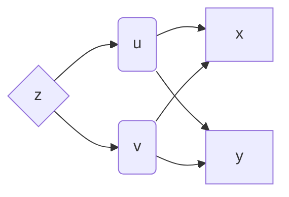
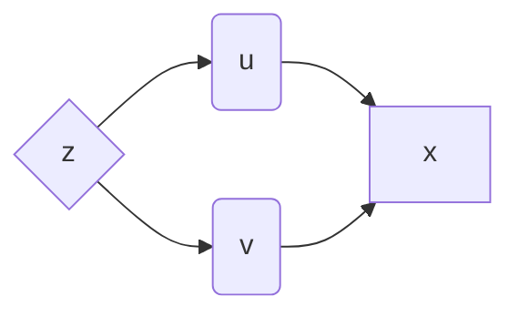
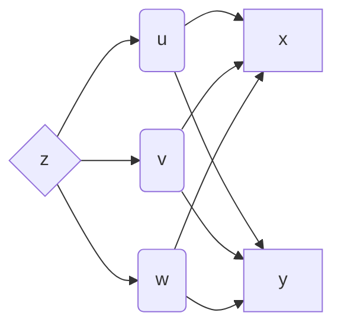
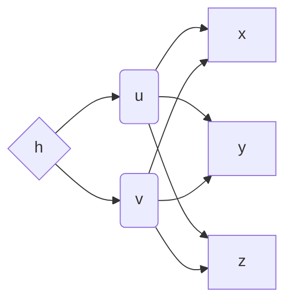
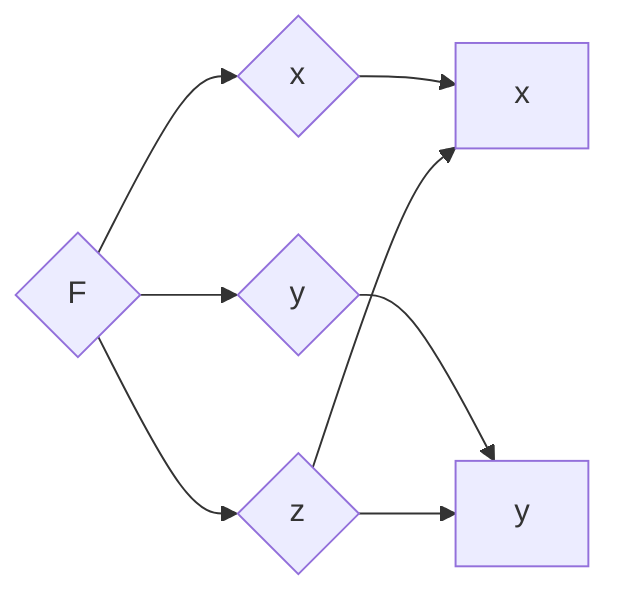
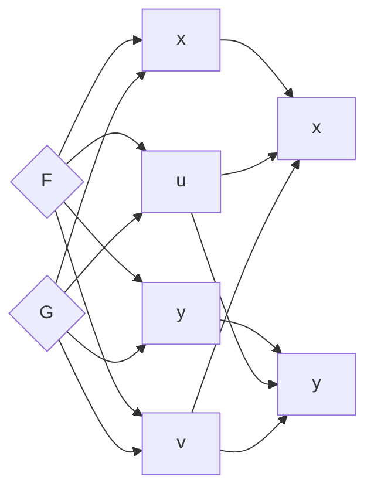

[toc]

# 第八章 多元函数微分学

一个自变量的函数——一元函数，两个或更多个自变量的函数——多元函数

## 第1节 多元函数的概念

一、平面点集的基本知识

二元有序数组$(x, y)$与$xoy$平面上的一个点$P(x, y)$一一对应。

==平面点集==：$xoy$平面上满足某一条件的一切点的集合。例如：点集$D = \{(x, y)|x^2+y^2<1\}, E = \{(x, y)|x>0, y>0\}$。

（1）==邻域==：设$P_0(x_0, y_0)$是平面上一点，$\delta > 0$，点集$\{(x,y)|\sqrt{(x-x_0)^2+(y-y_0)^2}<\delta\}$，称此平面点集为$P_0(x_0, y_0)$的$\delta$邻域，记为$N(P_0, \delta)$，即$N(P_0, \delta) = \{(x,y)|\sqrt{(x-x_0)^2+(y-y_0)^2}<\delta\}$，称$P_0$为$N(P_0, \delta)$的中心，$\delta$为邻域的半径，如果不强调邻域半径$\delta$，记为$N(P_0)$。

（2）==区域==：

==内点==：设$E$是平面点集，而点$P \in E$，如果存在$N(P)$，使得$N(P)$内的一切点都属于$E$，则称点$P$为$E$的一个内点。

==开集==：由纯内点组成的点集称为开集。

==边界点==：设$E$是平面点集，点$P$为平面上的一点，如果点$P$的==任何邻域内==既有点集$E$中的点，也有不属于$E$中的点，则称点$P$为$E$的边界点，点集$E$的边界的的全体称为$E$的边界。

==区域==：设$E$是开集，如果$\forall_{P_1, P_2} \in E$，都能用折线把它们连结起来，而折线上的点都属于$E$，称开集$E$是==连通==的，连通的开集称为开区域（区域）。

==闭区域==：开区域连同其边界一起称为闭区域。

==有界域==：如果存在数$M > 0$，使得区域$E$中的任意点$P(x, y)$，皆有$|x| \le M, |y| \le M$，则称区域$E$为有界域。

（3）==聚点==：设$E$是平面点集，$P$是平面上一点，如果点的==任意邻域==内总有无穷多个点属于$E$，称$P$为$E$的聚点。设$E$是开区域，则$E$中任一点都是内点，所有的内点都是聚点，边界点也是聚点。

（4）==$n$维空间==（$n$是正整数）：

一维空间：在数轴上的一点$P$与一个实数$x$一一对应，实数的全体表示了数轴上的一切点的集合，称为一维空间，记为$R^1$。

二维空间：二元有序数组$(x, y)$与$xoy$平面上一点$P(x, y)$一一对应，二元有序数组$(x, y)$的全体表示了$xoy$平面上一切点的集合，称为二维空间，记为$R^2$。

同理有三维空间$R^3, \cdots$

$n$元有序数组$(x_1, x_2, \cdots, x_n)$的全体称为$n$维空间，记为$R^n$。点$P(x_1, x_2, \cdots, x_n) \in R^n$，$x_i$称为点$P$的第$i$个坐标。设两点$P_1(x_1, x_2, \cdots, x_n),P_2(y_1, y_2, \cdots, y_n) \in R^n$，规定$P_1, P_2$的距离$|P_1P_2| = \sqrt{(y_1-x_1)^2+(y_2-x_2)^2+\cdots+(y_n-x_n)^2}$。当$n = 1$时，$|P_1P_2| = |y_1 - x_1|$；当$n=2$时，$|P_1P_2| = \sqrt{(y_1 - x_1)^2 + (y_2-x_2)^2}$；当$n=3$时，$|P_1P_2| = \sqrt{(y_1 - x_1)^2 + (y_2-x_2)^2+(y_3-x_3)^2}$。

$n$维空间$R^n$中点$P_0(x_1^0, x_2^0, \cdots, x_n^0)$的领域$N(P_0, \delta) = \{P(x_1, x_2, \cdots, x_n) |\  |P_0 P| < \delta, \forall_P \in R^n\}$。同理，可以引进内点，边界点，聚点，区域等的概念。

### 二、多元函数的概念

==定义==：设有平面点集$A$和数集$B$，如果对于$A$中每一点$P(x, y)$，通过规则$f$，都有==唯一的==实数$z \in B$与之对应，则称$f$是点集$A$上的函数，记为：$P(x, y)\overset{f}{\rightarrow}z$，或$z = f(x, y) = f(p)$，也称$z$是$x, y$的函数，$x, y$是自变量，$z$是因变量，称两个自变量的函数为二元函数。函数定义域中的平面点集$A$称为二元函数的定义域，当$(x ,y)$遍取$A$的一切点时，对应的$z$值构成一个实数集$B_f = \{z | z = f(x,y), \forall_{(x, y)} \in A\}$，称为二元函数的值域。

$n$元函数：$u = f(x_1, x_2, \cdots, x_n)$定义域是$R^n$中的点集$A$。

### 三、二元函数的极限

设$z = f(x, y)$定义在平面点集$E$上，$P_0(x_0, y_0)$是$E$的聚点（点$P_0$可以属于$E$也可不属于$E$），$\forall_{P(x, y)} \in E$，讨论当$P(x, y) \to P_0(x_0, y_0)$（==任意方式趋近==），对应的函数值$z = f(x, y)$是否无限地趋近于一常数$A$？

当$P(x, y) \to P_0(x_0, y_0)$时，$z = f(x, y) \to A$，称$A$为$f(x, y)$的极限（当$x \to x_0, y \to y_0$，距离$|PP_0| = \sqrt{(x-x_0)^2+(y-y_0)^2} \to 0$）。

用$\epsilon-\delta$语言来描述二元函数的极限：

==定义==：设有$z = f(x, y)$定义在平面点集$E$上，点$P_0(x_0, y_0)$是$E$的一个聚点，$A$是一个常数。如果对$\forall_\epsilon > 0$，都存在$\delta > 0$，使适合不等式$0 < |PP_0| = \sqrt{(x-x_0)^2+(y-y_0)^2} < \delta$的一切点$P(x, y)$对应的函数值$f(x, y)$都满足$|f(x, y) - A| < \epsilon$，则称$A$是$f(x, y)$当$x \to x_0, y \to y_0$时的极限，记为$\lim_{x \to x_0 \\ y \to y_0}f(x, y) = A$（==二重极限==），或$f(x, y) \to A$（$\rho = |PP_0| \to 0$）。

==注意==：定义中点$P \to P_0$按照任意方式进行。

例1：设：
$$
f(x, y) = \left\{\begin{array}{ccc}&\frac{xy}{x^2+y^2}, &x^2+y^2\neq 0 \\ &0, &x^2+y^2 = 0\end{array}\right.
$$
讨论$P(x, y) \to O(0, 0)$时，函数的极限。

解：当$P(x, y)$沿着$x$轴趋近于$O$点时：$\lim_{x \to 0 \\ y=0}f(x, y) = \lim_{x \to 0 \\ y=0}\frac{xy}{x^2+y^2} = \lim_{x \to 0 \\ y=0}\frac{0}{x^2+0^2} = 0$

当$P(x, y)$沿着$y$轴趋近于$O$点时：$\lim_{x=0 \\ y \to 0}f(x, y) = \lim_{x=0 \\ y \to 0}\frac{xy}{x^2+y^2} = \lim_{x=0 \\ y \to 0}\frac{0}{0^2+y^2} = 0$。

当$P(x, y)$沿着过原点的直线$y = kx$趋于$O$点时，$\lim_{x \to 0 \\ y = kx \to 0}f(x, y) = \lim_{x \to 0 \\ y = kx \to 0}\frac{xy}{x^2+y^2} = \lim_{x \to 0 \\ y = kx \to 0}\frac{x(kx)}{x^2 + (kx)^2} = \frac{k}{1+k^2}$，即极限值随着直线斜率$k$而变化，故此极限不存在。

设$n$维空间$R^n$中的点集$E$，函数$u = f(x_1, x_2, \cdots, x_n) = f(P), P(x_1, x_2, \cdots, x_n) \in E$。

==定义==：设$n$元函数$f(P)$定义在点集$E$上，$P_0$是点集$E$的聚点，$A$是常数，如果对任意给定的$\epsilon > 0$，都存在$\delta > 0$，使得适合不等式$0 < |PP_0| < \delta$的一切点$P \in E$，对应的函数值$f(P)$都满足不等式$|f(P) - A| < \epsilon$，则称当动点$P \to P_0$时，函数$f(P)$以$A$为极限，记为$\lim_{P \to P_0}f(P) = A$（$n$重极限）。

  

### 四、二元函数极限的四则运算法则

设$\lim_{x \to x_0 \\ y \to y_0}f(x, y) = A, \lim_{x \to x_0 \\ y \to y_0}g(x, y) = B$，则有：

（1）$\lim_{x \to x_0 \\ y \to y_0}[f(x, y) \pm g(x, y)] = \lim_{x \to x_0 \\ y \to y_0}f(x, y) \pm \lim_{x \to x_0 \\ y \to y_0}g(x, y) = A \pm B$

（2）$\lim_{x \to x_0 \\ y \to y_0}[f(x, y) \cdot g(x, y)] = \lim_{x \to x_0 \\ y \to y_0}f(x, y) \cdot \lim_{x \to x_0 \\ y \to y_0}g(x, y) = A \cdot B$

（3）$\lim_{x \to x_0 \\ y \to y_0}\frac{f(x, y)}{g(x, y)} = \frac{\lim_{x \to x_0 \\ y \to y_0}f(x, y)}{\lim_{x \to x_0 \\ y \to y_0}g(x, y)} = \frac{A}{B}$，其中$B \neq 0$。

例1：求$\lim_{x \to 0 \\ y \to 0}(x^2+y^2)\sin\frac{1}{x^2+y^2}$。

解：$\because \lim_{x \to 0 \\ y \to 0}(x^2+y^2) = \lim_{x \to 0 \\ y \to 0}x^2 + \lim_{x \to 0 \\ y \to 0}y^2 = 0$，所以当$x \to 0, y \to 0$时，$x^2+y^2$是无穷小，而$\sin\frac{1}{x^2+y^2}$是有界函数，$\therefore \lim_{x \to 0 \\ y \to 0}(x^2+y^2)\sin\frac{1}{x^2+y^2} = 0$。

==注意==：在一元函数中，$\lim_{x \to x_0}f(x)$存在$\Longleftrightarrow$$\lim_{x \to x_0^-}f(x) = \lim_{x \to x_0^+}f(x)$；对于二元函数来说，即使当动点$P(x, y)$沿着任何一条过$P_0(x_0, y_0)$的直线趋近于$P_0$点时$f(x)$有同一极限，但是二重极限$\lim_{x \to x_0 \\ y \to y_0}f(x, y)$不一定存在。

 例2：设：
$$
f(x, y) = \left\{\begin{array}{ccc}&\frac{x^2y}{x^4+y^2}, &x^2+y^2\neq 0 \\ &0, &x^2+y^2 = 0\end{array}\right.
$$
讨论当$P(x, y) \to O(0, 0)$时，$f(x, y)$的极限。

解：作过原点的一条直线$y = kx$。$\lim_{x \to 0 \\ y = kx \to 0}f(x, y) = \lim_{x \to 0 \\ y = kx \to 0}\frac{x^2y}{x^4+y^2} = \lim_{x \to 0 \\ y = kx \to 0}\frac{x^2(kx)}{x^4+(kx)^2} = \lim_{x \to 0 \\ y = kx \to 0}\frac{kx}{x^2+k^2} = 0$

作过原点的一条抛物线$y = kx^2$。

$\lim_{x \to 0 \\ y = kx^2 \to 0}f(x, y) = \lim_{x \to 0 \\ y = kx^2 \to 0}\frac{x^2y}{x^4+y^2} = \lim_{x \to 0 \\ y = kx^2 \to 0}\frac{x^2(kx^2)}{x^4+(kx^2)^2} = \lim_{x \to 0 \\ y = kx^2 \to 0}\frac{k}{1+k^2} = \frac{k}{1+k^2}$，极限值随着$k$的变化而变化，所以$\lim_{x \to 0 \\ y \to 0}f(x, y)$不存在。

### 五、二元函数的连续性

==定义==：设$z = f(x, y)$定义在平面点集$E$上，$P_0(x_0, y_0)$是$E$的聚点，且$P_0(x_0, y_0)$是$E$中的点。如果$\lim_{x \to x_0 \\ y \to y_0}f(x, y) = f(x_0, y_0)$ ，则称$f(x, y)$在$P_0$点处连续。若$f(x, y)$在$P_0$点不连续，则称$P_0$为$f(x, y)$的间断点。设$f(x, y)$定义在区域$D$上，如果$f(x, y)$在$D$上的每一点$P(x, y)$处都连续，则称$f(x, y)$在区域$D$上连续，记为$C(D)$。

由极限的四则运算法则、函数连续性的定义、二元连续函数的和、差、积、商（分母不为零）也都是连续函数。

==二元复合函数的连续性==：设$u = \phi(x, y), v = \psi(x, y)$在同一点$P_0(x_0, y_0)$连续，且$u_0 = \phi(x_0, y_0), v_0 = \psi(x_0, y_0)$，又有$f(u, v)$在点$(u_0, v_0)$连续，则复合函数$z = f[\phi(x, y), \psi(x, y)]$在$P_0(x_0, y_0)$点连续。

==二元初等函数==：由常数及$x, y$的基本初等函数经过有限次的四则运算和有限次的复合步骤所构成的函数，并且能用$x, y$的一个数学式子表达。二元初等函数在其定义区域内是连续的。

### 六、有界闭区域$D$上，连续多元函数的性质

（1）==最大值最小值存在性定理==：设$f(P)$在有界闭区域$D$上连续，则$f(P)$在$D$上必取得最大值和最小值，即存在点$P_1, P_2 \in D$，使得$f(P_1) \le f(P) \le f(P_2)$，即$f(P_1) = \min_{P \in D}f(P), f(P_2) = \max_{P \in D}f(P)$。

（2）==介值定理==：设$f(P)$在有界闭区域$D$上连续，$m = \min_{P \in D}f(P), M = \max_{P \in D}f(P)$，而数$\mu: m < \mu < M$，则一定存在一点$P_0 \in D$，使得$f(P_0) = \mu$。

## 第2节 偏导数

### 一、偏导数的概念

==二元函数$z = f(x, y)$的偏导数==：如果只让自变量$x$变化，而另一个自变量$y$固定不变，研究$z = f(x, y)$对$x$的变化率。

==偏导数的定义==：二元函数$z = f(x, y)$在点$P_0(x_0, y_0)$的某邻域$N(P_0, \delta)$有定义，当自变量$y$固定为$y_0$，而自变量$x$在$x_0$点有增量$\Delta x$，$(x+\Delta x, y_0) \in N(P_0, \delta)$，函数$z$对应的增量$\Delta_x z = f(x_0 + \Delta x, y_0) - f(x_0, y_0)$，称为$z = f(x, y)$对$x$的偏增量，如果极限$\lim_{\Delta x \to 0}\frac{\Delta_x z}{\Delta x}$存在，则称此极限为$z = f(x, y)$在点$P_0(x_0, y_0)$点对$x$的偏导数，记为：$\frac{\partial z}{\partial x}|_{x = x_0 \\ y = y_0}, z_x^\prime|_{x = x_0 \\ y = y_0}, \frac{\partial f}{\partial x}|_{x = x_0 \\ y = y_0}, f_x^\prime(x_0, y_0)$。即$f_x^\prime(x_0, y_0) =\lim_{\Delta x \to 0}\frac{f(x_0 + \Delta x, y_0) - f(x_0, y_0)}{\Delta x}$。类似地，有 $f_y^\prime(x_0, y_0) =\lim_{\Delta y \to 0}\frac{f(x_0, y_0 + \Delta y) - f(x_0, y_0)}{\Delta y}$。若$z = f(x, y)$在区域$D$上每一点处偏导数$\frac{\partial z}{\partial x}, \frac{\partial z}{\partial y}$都存在，则$\frac{\partial z}{\partial x}, \frac{\partial z}{\partial y}$是区域$D$上的函数，称为偏导函数，可表示为$\frac{\partial z}{\partial x} = f_x^\prime(x, y), \frac{\partial z}{\partial y} = f_y^\prime(x, y), (x, y) \in D$。==注意==：$\frac{\partial z}{\partial x}$是一个整体，$\partial z, \partial x$无意义。

### 二、高阶偏导数

设$z = f(x, y)$在平面区域$E$内偏导数存在（$f(x, y) \in D(E)$），$f_x^\prime(x, y), f_y^\prime(x, y)$定义在区域$E$上，如果$f_x^\prime(x, y), f_y^\prime(x, y)$的偏导数也存在，称为$z = f(x, y)$的二阶偏导数，记为：$\frac{\partial^2z}{\partial x^2} = \frac{\partial}{\partial x}(\frac{\partial z}{\partial x}) = f_{xx}^{\prime\prime}(x, y)$。$\frac{\partial^2 z}{\partial x \partial y} = \frac{\partial}{\partial y}(\frac{\partial z}{\partial x}) = f_{xy}^{\prime\prime}(x, y), \frac{\partial^2 z}{\partial y \partial x} = \frac{\partial}{\partial x}(\frac{\partial z}{\partial y}) = f_{yx}^{\prime\prime}(x, y)$为对$x, y$的二阶混合偏导数。

设$z = f(x, y)$在$P(x, y)$点处两个二阶混合偏导数$\frac{\partial^2z}{\partial x \partial y}, \frac{\partial^2z}{\partial y \partial x}$存在且连续，则$\frac{\partial^2z}{\partial x \partial y}, \frac{\partial^2z}{\partial y \partial x}$（==不予以证明==）。

## 第3节 全微分

### 一、全微分的概念

设$z = f(x, y)$在点$P(x, y)$处$f_x^\prime(x, y)$存在，即$\lim_{\Delta x \to 0}\frac{f(x + \Delta x, y) - f(x, y)}{\Delta x} = f_x^\prime(x, y)$，根据极限与无穷小的关系，应有$\frac{f(x + \Delta x, y) - f(x, y)}{\Delta x} = f_x^\prime(x, y) + \alpha$，其中$\lim_{\Delta x \to 0}\alpha = 0$。$f(x + \Delta x, y) - f(x, y) = f_x^\prime(x, y)\Delta x + \alpha\Delta x$，即$\Delta_xz = f_x^\prime(x, y)\Delta x + \alpha\Delta x$ 。因为$\lim_{\Delta x \to 0}\frac{\alpha\Delta x}{\Delta x} = \lim_{\Delta x \to 0}\alpha = 0$，所以$\alpha \Delta x = O(\Delta x)$，由微分的定义，可知$f_x^\prime(x, y)\Delta x$是$z = f(x, y)$在点$P(x, y)$点处对$x$的偏微分，类似地，称$f_y^\prime(x, y)\Delta y$是$z = f(x, y)$在点$P(x, y)$点处对$y$的偏微分。

==偏增量==：$\Delta_x z = f(x+\Delta x, y) - f(x, y) = f_x^\prime(x, y)\Delta x + \alpha\Delta x$，其中$\alpha \Delta x = O(\Delta x)$。$f_x^\prime(x, y)\Delta x$是对$x$的偏微分，$f_y^\prime(x, y)\Delta y$是对$y$的偏微分。

==二元函数全增量==：设$z = f(x, y)$在点$P(x, y)$的某邻域$N(P, \delta), (\delta > 0)$内有定义，自变量$x$和$y$在$P$点处分别有增量$\Delta x$和$\Delta y$，$P(x+\Delta x, y+\Delta y) \in N(P, \delta)$，函数$z = f(x, y)$对应的增量$\Delta z = f(x+\Delta x, y+\Delta y) - f(x, y)$，称$\Delta z$为函数$z = f(x, y)$在$P(x, y)$对$\Delta x, \Delta y$的全增量。

例子：设有一块矩形的金属薄板，长为$x$，宽为$y$，金属薄板受热膨胀，长增加$\Delta x$，宽增加$\Delta y$，求薄板的面积增加了多少？

解：设薄板的面积为$S$，则$S = xy$。增加的面积$\Delta S = (x+\Delta x)(y+\Delta y) - xy = y\Delta x + x\Delta y + \Delta x\Delta y$。分析上述式子，其中，第一部分$y\Delta x + x\Delta y$是关于$\Delta x, \Delta y$的线性部分，第二部分$\Delta x\Delta y$是比$\rho = \sqrt{(\Delta x)^2 + (\Delta y)^2}$高阶的无穷小，$\Delta x \to 0, \Delta y \to 0$。

$|\Delta x \Delta y| \le \frac{1}{2}[(\Delta x)^2 + (\Delta y)^2], 0 < \frac{|\Delta x \Delta y|}{\rho} \le \frac{1}{2} \cdot \frac{(\Delta x)^2 + (\Delta y)^2}{\rho} = \frac{1}{2}\sqrt{(\Delta x)^2 + (\Delta y)^2}$，$\because \lim_{\Delta x \to 0 \\ \Delta y \to 0}\rho = \lim_{\Delta x \to 0 \\ \Delta y \to 0}\sqrt{(\Delta x)^2 + (\Delta y)^2} = 0$，由极限存在准则，可知$\lim_{\Delta x \to 0 \\ \Delta y \to 0}\frac{|\Delta x \Delta y|}{\rho} = 0, \lim_{\Delta x \to 0 \\ \Delta y \to 0}\frac{\Delta x \Delta y}{\rho} = 0$，即$\Delta x \Delta y = O(\rho)$。即$\Delta S = y\Delta x + x\Delta y + O(\rho)$，如果已知$y = A, x = B$，则有$\Delta S = A\Delta x + B\Delta y + O(\rho)$，舍去$O(\rho)$，得$\Delta S \approx A\Delta x + B\Delta y$。

==全微分的定义==：设$z = f(x, y)$在点$P(x, y)$的某邻域$N(P, \delta)$内有定义，如果$z = f(x, y)$在$P$点的全增量$\Delta z = f(x+\Delta x, y+\Delta y) - f(x, y)$可以表示为$\Delta z = A\Delta x + B\Delta y + O(\rho)$。其中$A, B$与$\Delta x, \Delta y$无关（与$x , y$有关）。$\rho = \sqrt{(\Delta x)^2 + (\Delta y)^2}$，$O(\rho)$是比$\rho$高阶的无穷小（当$\Delta x \to 0, \Delta y \to 0$时），则称$z = f(x, y)$在$P(x, y)$可微，把$A\Delta x + B\Delta y$称为$z = f(x, y)$在$P$处的全微分，记为$dz = A\Delta x + B\Delta y$。

==结论==：若$z = f(x, y)$在点$P$处可微，则$z = f(x, y)$在该点处连续。

证：$\because z = f(x, y)$在点$P(x, y)$处可微，$\therefore  \Delta z = A\Delta x + B\Delta y + O(\rho)$。$\lim_{\Delta x \to 0 \\ \Delta y \to 0}\Delta z = \lim_{\Delta x \to 0 \\ \Delta y \to 0}[A\Delta x + B\Delta y + O(\rho)] = 0$ ，$\Delta z = f(x+\Delta x, y+\Delta y) - f(x, y), \therefore \lim_{\Delta x \to 0 \\ \Delta y \to 0}[f(x+\Delta x, y+\Delta y) - f(x, y)] = 0$，即$\lim_{\Delta x \to 0 \\ \Delta y \to 0}f(x+\Delta x, y+\Delta y) = f(x, y)$，所以$z = f(x, y)$在点$P(x, y)$处连续。

==$z = f(x, y)$在$P(x, y)$处可微的必要条件与充分条件==

==定理（可微的必要条件）==：如果$z = f(x, y)$在$P(x, y)$处可微，则$z = f(x, y)$在$P$点处的偏导数$\frac{\partial z}{\partial x}, \frac{\partial z}{\partial y}$存在，并且$A = \frac{\partial z}{\partial x}, B = \frac{\partial z}{\partial y}$，从而$dz = \frac{\partial z}{\partial x}\Delta x + \frac{\partial z}{\partial y}\Delta y$。

证：$\because z = f(x, y)$在$P(x, y)$点可微，则有$\Delta z = f(x+\Delta x, y+\Delta y) - f(x, y) = A\Delta x + B\Delta y + O(\rho)$，式子对任何$\Delta x, \Delta y$都成立，则当$\Delta y = 0$上式也成立，从而有$\Delta_x z = f(x+\Delta x, y) - f(x, y) = A\Delta x + O(|\Delta x|)$，等式两端除以$\Delta x$，得$\frac{\Delta_x z}{\Delta x} = A + \frac{O(|\Delta x|)}{\Delta x}, \lim_{\Delta x \to 0}\frac{\Delta_x z}{\Delta x} = A + \lim_{\Delta x \to 0}\frac{O(|\Delta x|)}{\Delta x}$。$\lim_{\Delta x \to 0}\frac{O(|\Delta x|)}{|\Delta x|} = 0$，而$\frac{O(|\Delta x|)}{\Delta x} = \frac{O(|\Delta x|)}{|\Delta x|} \cdot \frac{|\Delta x|}{\Delta x}$，$\lim_{\Delta x \to 0}\frac{|\Delta x|}{\Delta x} = \pm 1$是有界的，$\therefore \lim_{\Delta x \to 0}\frac{O(|\Delta x|)}{\Delta x} = 0, \lim_{\Delta x \to 0}\frac{\Delta_x z}{\Delta x} = A$，即$\frac{\partial z}{\partial x} = A$。同理$\frac{\partial z}{\partial y} = B$。

==定理（可微的充分条件）==：如果$z = f(x, y)$在点$P(x, y)$处的两个偏导数$\frac{\partial z}{\partial x}, \frac{\partial z}{\partial y}$存在且==连续==，则$z = f(x, y)$在点$P$处可微。

证：要证$z = f(x, y)$在点$P(x, y)$处可微，亦即证$\Delta z = f_x^\prime(x, y)\Delta x + f_y^\prime(x, y)\Delta y + \omega$，其中$\lim_{\Delta x \to 0 \\ \Delta y \to 0}\frac{\omega}{\rho} = 0, \rho = \sqrt{(\Delta x)^2 + (\Delta y)^2}$。全增量$\Delta z = f(x+\Delta x, y+\Delta y) - f(x, y) = [f(x+\Delta x, y+\Delta y)-f(x,y+\Delta y)]+[f(x,y+\Delta y) - f(x, y)]$

又$\because f_x^\prime(x, y)$存在，$f(x, y + \Delta y)$对$x$是连续函数，又$f_x^\prime(x, y)$是连续函数，由一元函数Lagrange定理，有$f(x+\Delta x, y+\Delta y) - f(x, y+\Delta y) = f_x^\prime(x+\theta_1\Delta x, y+\Delta y)\Delta x, (0 < \theta_1 < 1)$，同理有$f(x, y+\Delta y)-f(x, y) = f_y^\prime(x, y+\theta_2\Delta y)\Delta y, (0 < \theta_2 < 1)$，又$\because f_x^\prime(x, y), f_y^\prime(x, y)$在$P$点处连续，则$\lim_{\Delta x \to 0 \\ \Delta y \to 0}f_x^\prime(x+\theta_1\Delta x, y+\Delta y) = f_x^\prime(x, y), \lim_{\Delta x \to 0 \\ \Delta y \to 0}f_y^\prime(x, y+\theta_2\Delta y) = f_y^\prime(x, y)$，根据函数的极限值与无穷小的关系：$f_x^\prime(x+\theta_1\Delta x, y+\Delta y) = f_x^\prime(x, y) + \alpha_1, f_y^\prime(x, y+\theta_2\Delta y) = f_y^\prime(x, y) + \alpha_2$，$\lim_{\Delta x \to 0 \\ \Delta y \to 0}\alpha_1 = 0, \lim_{\Delta x \to 0 \\ \Delta y \to 0}\alpha_2 = 0$。

代入上式：$\Delta z = [f_x^\prime(x, y) + \alpha_1]\Delta x + [f_y^\prime(x, y) + \alpha_2]\Delta y = f_x^\prime(x, y)\Delta x + f_y^\prime(x, y)\Delta y + \alpha_1\Delta x + \alpha_2\Delta y$。

令$\omega = \alpha_1\Delta x + \alpha_2\Delta y$ ，再证：$\lim_{\Delta x \to 0 \\ \Delta y \to 0}\frac{\omega}{\rho} = 0$。

$\frac{\omega}{\rho} = \frac{\alpha_1\Delta x}{\sqrt{(\Delta x)^2 + (\Delta y)^2}} + \frac{\alpha_2\Delta y}{\sqrt{(\Delta x)^2 + (\Delta y)^2}}$，$\because |\frac{\Delta x}{\sqrt{(\Delta x)^2 + (\Delta y)^2}}| = \frac{|\Delta x|}{\sqrt{(\Delta x)^2 + (\Delta y)^2}} \le 1, |\frac{\Delta y}{\sqrt{(\Delta x)^2 + (\Delta y)^2}}| = \frac{|\Delta y|}{\sqrt{(\Delta x)^2 + (\Delta y)^2}} \le 1$，根据无穷小与有界函数的乘积仍是无穷小，$\therefore \lim_{\Delta x \to 0 \\ \Delta y \to 0}\frac{\omega}{\rho} = 0$，即$\omega = O(\rho)$，$\therefore \Delta z = f_x^\prime(x, y)\Delta x + f_y^\prime(x, y)\Delta y + O(\rho)$，得证。

规定$\Delta x = dx, \Delta y = dy, d z = f_x^\prime(x, y)dx + f_y^\prime(x, y)dy$。

## 第4节 多元复合函数微分法

### 一、多元复合函数微分法

==定理==：设$u = \phi(x, y), v = \psi(x, y)$在点$P(x, y)$处偏导数存在，而$z = f(u, v)$在对应点$Q(u, v)$可微，则$z = f[\phi(x, y), \psi(x, y)]$在点$P(x, y)$两个偏导数存在，且$\frac{\partial z}{\partial x} = \frac{\partial z}{\partial u}\frac{\partial u}{\partial x} + \frac{\partial z}{\partial v}\frac{\partial v}{\partial x}, \frac{\partial z}{\partial y} = \frac{\partial z}{\partial u}\frac{\partial u}{\partial y} + \frac{\partial z}{\partial v}\frac{\partial v}{\partial y}$，由$u = \phi(x, y), v = \psi(x, y)$在点$P(x, y)$处偏导数存在，$x$有增量$\Delta x$，$y$保持不变，$\Delta_x u = \phi(x+\Delta x, y) - \phi(x, y), \Delta_x v = \psi(x+\Delta x, y) - \psi(x, y)$，这时$\phi(x, y), \psi(x, y)$看作是$x$的一元函数，由于$\frac{\partial u}{\partial x}, \frac{\partial v}{\partial x}$存在，$\phi(x, y), \psi(x, y)$看作是$x$的连续函数，从而有$\Delta x \to 0$时，$\Delta_x u \to 0, \Delta_x v \to 0$。再由$z = f(u, v)$在点$q(u, v)$可微，则有$\Delta z = f(u+\Delta u, v+\Delta v) - f(u, v) = \frac{\partial z}{\partial x}\Delta x + \frac{\partial z}{\partial y}\Delta y + \omega$（其中$\lim_{\Delta x \to 0 \\ \Delta y \to 0}\frac{\omega}{\rho} = 0$）。复合函数$z = f[\phi(x, y), \psi(x, y)]$对$x$的偏增量$\Delta_x z = f[\phi(x+\Delta x, y), \psi(x+\Delta x, y)] - f[\phi(x, y), \psi(x, y)] = f[u+\Delta_x u, v+\Delta_x v] - f(u, v) \\ = \frac{\partial z}{\partial u}\Delta_x u + \frac{\partial z}{\partial v}\Delta_x v + \omega$

（其中$\lim_{\Delta_x u \to 0 \\ \Delta_x v \to 0}\frac{\omega}{\sqrt{(\Delta_x u)^2 + (\Delta_x v)^2}} = 0$）。$\frac{\Delta_x z}{\Delta x} = \frac{\partial z}{\partial u}\frac{\Delta_x u}{\Delta x} + \frac{\partial z}{\partial v}\frac{\Delta_x v}{\Delta x} +\frac{\omega}{\Delta x}$，$\lim_{\Delta x \to 0}\frac{\Delta_x z}{\Delta x} = \frac{\partial z}{\partial u}\lim_{\Delta x \to 0}\frac{\Delta_x u}{\Delta x} + \frac{\partial z}{\partial v}\lim_{\Delta x \to 0}\frac{\Delta_x v}{\Delta x} + \lim_{\Delta x \to 0}\frac{\omega}{\Delta x} \Longrightarrow \frac{\partial z}{\partial x} = \frac{\partial z}{\partial u}\frac{\partial u}{\partial x} + \frac{\partial z}{\partial v}\frac{\partial v}{\partial x} + \lim_{\Delta x \to 0}\frac{\omega}{\Delta x}$。

$\frac{\omega}{\Delta x} = \frac{\omega}{\sqrt{(\Delta_x u)^2 + (\Delta_x v)^2}} \cdot \frac{|\Delta x|}{\Delta x} \cdot \frac{\sqrt{(\Delta_x u)^2 + (\Delta_x v)^2}}{|\Delta x|} = \frac{\omega}{\sqrt{(\Delta_x u)^2 + (\Delta_x v)^2}} \cdot [\frac{|\Delta x|}{\Delta x} \cdot \frac{\sqrt{(\Delta_x u)^2 + (\Delta_x v)^2}}{|\Delta x|}]$，$\therefore \lim_{\Delta x \to 0}\frac{\omega}{\Delta x} = 0$。

复合函数结构示意图：

特例$z = f(u, v), u = \phi(x), v = \psi(x)$，假设$\phi(x), \psi(x)$可导，$z = f(u, v)$在对应点$(u, v)$可微，则$\frac{dz}{dx} = \frac{\partial z}{\partial u}\frac{du}{dx} + \frac{\partial z}{\partial v}\frac{dv}{dx}$（全导数公式）。

上述结论对于多个中间变量、多个自变量的多元复合函数仍成立。

（1）设有$u = \phi(x, y), v = \psi(x, y), w = h(x, y)$在$(x, y)$点偏导数存在，$z = f(u, v, w)$在对应点$(u, v, w)$可微，则有$z = f[\phi(x, y), \psi(x, y), h(x, y)]$。$\frac{\partial z}{\partial x} = \frac{\partial z}{\partial u}\frac{\partial u}{\partial x} + \frac{\partial z}{\partial v}\frac{\partial v}{\partial x} + \frac{\partial z}{\partial w}\frac{\partial w}{\partial x}$

（2）设有$u = \phi(x, y, z), v = \psi(x, y, z)$在$(x, y, z)$点偏导数存在，$h = f(u, v)$在对应点可微，$h = f[\phi(x, y, z), \psi(x, y, z)]$，$\frac{\partial h}{\partial x} = \frac{\partial h}{\partial u}\frac{\partial u}{\partial x} + \frac{\partial h}{\partial v}\frac{\partial v}{\partial x}$

记号$f \in C^1$表示$f$具有一阶连续的偏导数。

### 二、全微分形式不变性

设$z = f(u, v)$具有连续的一阶偏导数，则$z = f(u, v)$是可微的，且$dz = \frac{\partial z}{\partial u}du + \frac{\partial z}{\partial v}dv$，其中$u, v$是自变量。现设$z = f(u, v)$其中$u = \phi(x, y), v = \psi(x, y)$都具有连续的一阶偏导数，则复合函数$z = f[\phi(x, y), \psi(x, y)]$也具有连续的一阶偏导数$\frac{\partial z}{\partial x} = \frac{\partial z}{\partial u}\frac{\partial u}{\partial x} + \frac{\partial z}{\partial v}\frac{\partial v}{\partial x}, \frac{\partial z}{\partial y} = \frac{\partial z}{\partial u}\frac{\partial u}{\partial y} + \frac{\partial z}{\partial v}\frac{\partial v}{\partial y}$。复合函数的全微分存在，且有$dz = \frac{\partial z}{\partial x}dx + \frac{\partial z}{\partial y}dy = (\frac{\partial z}{\partial u}\frac{\partial u}{\partial x} + \frac{\partial z}{\partial v}\frac{\partial v}{\partial x})dx + (\frac{\partial z}{\partial u}\frac{\partial u}{\partial y} + \frac{\partial z}{\partial v}\frac{\partial v}{\partial y})dy \\ = \frac{\partial z}{\partial u}(\frac{\partial u}{\partial x}dx + \frac{\partial u}{\partial y}dy) + \frac{\partial z}{\partial v}(\frac{\partial v}{\partial x}dx + \frac{\partial v}{\partial y}dy) = \frac{\partial z}{\partial u}du + \frac{\partial z}{\partial v}dv$

这说明无论$u, v$是自变量还是中间变量，函数$z$的全微分都具有相同的形式，叫做==全微分形式不变性==。

利用全微分形式不变性可推出以下公式：

（1）$d(u + v) = du+dv$；

（2）$d(uv) = vdu + udv$；

（3）$d(\frac{u}{v}) = \frac{vdu - udv}{v^2}$。

证（3）：$d(\frac{u}{v}) = \frac{\partial (\frac{u}{v})}{\partial u}du + \frac{\partial (\frac{u}{v})}{\partial v}dv = \frac{1}{v}du - \frac{u}{v^2}dv = \frac{vdu-udv}{v^2}$。

### 三、多元复合函数的高阶偏导数

例1：设$z = f(2x+3y, xy)$，其中$f \in C^2$类。求$\frac{\partial^2 z}{\partial x^2}, \frac{\partial^2 z}{\partial x\partial y}$。

解：令$u = 2x+3y, v = xy$，$z = f(u, v)$，$\frac{\partial{z}}{\partial x} = \frac{\partial z}{\partial u}\cdot\frac{\partial u}{\partial x} + \frac{\partial z}{\partial v}\cdot\frac{\partial v}{\partial x} = 2f_u^\prime(u, v) + f_v^\prime(u, v)y = 2f_u^\prime + yf_v^\prime$。

$\frac{\partial^2 z}{\partial x^2} = \frac{\partial}{\partial x}(\frac{\partial z}{\partial x}) = \frac{\partial}{\partial x}(2f_u^\prime + yf_v^\prime) = 2\frac{\partial}{\partial x}(f_u^\prime) + \frac{\partial}{\partial x}(yf_v^\prime) \\ = 2[f_{uu}^{\prime\prime} \frac{\partial u}{\partial x} + f_{uv}^{\prime\prime} \frac{\partial v}{\partial x}] + y[f_{vu}^{\prime\prime} \frac{\partial u}{\partial x} + f_{vv}^{\prime\prime} \frac{\partial v}{\partial x}]$

## 第5节 隐函数微分法

### 一、一个方程所确定的隐函数

==隐函数存在定理1==：设函数$F(x, y)$在点$P(x_0, y_0)$的某邻域内具有连续的偏导数$F_x^\prime(x, y), F_y^\prime(x, y)$，且$F(x_0, y_0) = 0, F_y^\prime(x_0, y_0) \neq 0$，则方程$F(x, y) = 0$在$x_0$点的某邻域内能唯一地确定一个单值的连续的隐函数$y = f(x)$，且满足$y_0 = f(x_0)$，同时$f(x)$存在连续的导数，有$\frac{dy}{dx} = \frac{-F_x^\prime(x, y)}{F_y^\prime(x, y)}$。

推导隐函数求导公式。假设$F(x, y) = 0$确定了一个隐函数$y = f(x)$且$f(x)$可导，把$y = f(x)$代入$F(x, y) = 0$中，得到$F[x, f(x)] \equiv 0$。恒等式两端对$x$求导数得：$F_x^\prime(x, y) + F_y^\prime(x, y) \cdot \frac{dy}{dx} = 0$。因为$F_y^\prime(x, y)$是连续的且$F_y^\prime(x_0, y_0) \neq 0$，在$P(x_0, y_0)$的某邻域内$F_y^\prime(x, y) \neq 0$，所以$\frac{dy}{dx} = -\frac{F_x^\prime(x, y)}{F_y^\prime(x, y)}$。

==隐函数存在定理2==：设函数$F(x, y, z)$在点$P(x_0, y_0, z_0)$的某邻域内具有连续的偏导数$F_x^\prime(x, y, z), F_y^\prime(x, y, z), F_z^\prime(x, y, z)$，且$F(x_0, y_0, z_0) = 0, F_z^\prime(x_0, y_0, z_0) \neq 0$，则方程$F(x, y, z) = 0$在点$(x_0, y_0)$的某个邻域内能唯一地确定一个单值连续的隐函数$z = f(x, y)$满足$z_0 = f(x_0, y_0)$，$z = f(x, y)$有连续的偏导数，有$\frac{\partial z}{\partial x} = -\frac{F_x^\prime(x, y, z)}{F_z^\prime(x, y, z)}, \frac{\partial z}{\partial y} = -\frac{F_y^\prime(x, y, z)}{F_z^\prime(x, y, z)}$。

设方程$F(x, y, z) = 0$能够确定隐函数$z = f(x, y)$，且偏导数存在，把$z = f(x, y)$代入方程$F(x, y, z) = 0$中，得到$F[x, y, f(x, y)] \equiv 0$。

$F_x^\prime(x, y, z) + F_z^\prime(x, y, z)\frac{\partial z}{\partial x} = 0$，因为$F_z^\prime(x, y, z)$是连续的且$F_z^\prime(x_0, y_0, z_0) \neq 0$，一定存在$P(x_0, y_0, z_0)$的某邻域内，$F_z^\prime(x, y, z) \neq 0$。$\therefore \frac{\partial z}{\partial x} = -\frac{F_x^\prime(x, y, z)}{F_z^\prime(x, y, z)}, \frac{\partial z}{\partial y} = -\frac{F_y^\prime(x, y, z)}{F_z^\prime(x, y, z)}$。

### 二、方程组所确定的隐函数

==隐函数存在定理3==：设有函数$F(x, y, u, v), G(x, y, u, v)$在点$(x_0, y_0, u_0, v_0)$的某个邻域内对各个变量具有连续的偏导数且$F(x_0, y_0, u_0, v_0) = 0, G(x_0, y_0, u_0, v_0) = 0$，且行列式（称为==雅可比行列式==）：
$$
J = \frac{\partial(F, G)}{\partial(u, v)} = \left|\begin{array}{cc}\frac{\partial F}{\partial u} &\frac{\partial F}{\partial v} \\ \frac{\partial G}{\partial u} &\frac{\partial G}{\partial v} \end{array}\right| \neq 0
$$
则方程组：
$$
\left\{\begin{array}{cc}F(x,y,u,v) &= &0 \\ G(x,y,u,v) &= &0 \end{array}\right.
$$
在点$(x_0, y_0)$的某个邻域内能够唯一地确定一组单值连续的函数$u = u(x, y), v = v(x, y)$，且$u_0 = u(x_0, y_0), v_0 = v(x_0, y_0)$，函数$u, v$存在连续的偏导数，有：
$$
\frac{\partial u}{\partial x} = -\frac{1}{J}\frac{\partial(F, G)}{\partial(x, v)} = -\frac{1}{J}\left|\begin{array}{cc}\frac{\partial F}{\partial x} &\frac{\partial F}{\partial v} \\ \frac{\partial G}{\partial x} &\frac{\partial G}{\partial v} \end{array}\right|
$$

$$
\frac{\partial u}{\partial y} = -\frac{1}{J}\frac{\partial(F, G)}{\partial(y,v)} = -\frac{1}{J}\left|\begin{array}{cc}\frac{\partial F}{\partial y} &\frac{\partial F}{\partial v} \\ \frac{\partial G}{\partial y} &\frac{\partial G}{\partial v} \end{array}\right|
$$

推导求偏导数的公式：假设方程组：
$$
\left\{\begin{array}{cc}F(x,y,u,v) &= &0 \\ G(x,y,u,v) &= &0 \end{array}\right.
$$
确定了两个隐函数$u = u(x, y), v = v(x, y)$，代入原方程组，得到：
$$
\left\{\begin{array}{cc}F[x,y,u(x,y),v(x,y)] &\equiv &0 \\ G[x,y,u(x,y),v(x,y)] &\equiv &0 \end{array}\right.
$$

恒等式两端求导（==只有恒等式两端求导才相等==）得到：
$$
\left\{\begin{array}{ccccc}F_x^\prime + &F_u^\prime\frac{\partial u}{\partial x} + &F_v^\prime\frac{\partial v}{\partial x} &= &0 \\ G_x^\prime + &G_u^\prime\frac{\partial u}{\partial x} + &G_v^\prime\frac{\partial v}{\partial x} &= &0 \end{array}\right.
$$
由==克拉默法则求解==。

## 第6节 方向导数、梯度

### 一、方向导数

设$z = f(x, y)$在点$P(x, y)$处的偏导数存在，即$\frac{\partial z}{\partial x} = f_x^\prime(x, y), \frac{\partial z}{\partial y} = f_y^\prime(x, y)$存在，$f_x^\prime(x, y), f_y^\prime(x, y)$分别表示$f(x, y)$在点$P$沿着$x$轴方向及$y$轴方向的变化率。讨论$z = f(x, y)$在$P(x, y)$沿着方向$\overset{\rightarrow}L$的变化率，设$z = f(x, y)$在点$P(x, y)$的某邻域内有定义，另一点$P^\prime(x+\Delta x, y+\Delta y)$是方向$\overset{\rightarrow}L$上的另一点，距离$\rho = |PP^\prime| = \sqrt{(\Delta x)^2+(\Delta y)^2}, z = f(x,y)$在点$P(x, y)$处有全增量$\Delta z = f(x+\Delta x, y+\Delta y) - f(x, y)$，如果极限$\lim_{\rho \to 0}\frac{\Delta z}{\rho} = \lim_{\rho \to 0}\frac{f(x+\Delta x, y+\Delta y) - f(x, y)}{\rho}$存在，则称此极限为$z = f(x, y)$在点$P$处沿方向$\overset{\rightarrow}L$的方向导数，记为$\frac{\partial z}{\partial l} = \lim_{\rho \to 0}\frac{f(x+\Delta x, y+\Delta y) - f(x, y)}{\rho}$。

==定理==：设$z = f(x, y)$在点$P(x, y)$处可微，则$z = f(x, y)$在$P$点处沿着任意方向$\overset{\rightarrow}l$的方向导数存在，且有$\frac{\partial z}{\partial l} = \frac{\partial z}{\partial x}\cos \alpha + \frac{\partial z}{\partial y}\sin \alpha$。其中$\alpha$是方向$\overset{\rightarrow}l$到$x$轴的转角。

证：设$z = f(x, y)$在$P(x, y)$点处的全增量$\Delta z = f(x+\Delta x, y+\Delta y) - f(x, y)$，又因为$z = f(x, y)$在$P$点可微，所以$\Delta z = \frac{\partial z}{\partial x}\Delta x + \frac{\partial z}{\partial y}\Delta y + O(\rho)$，$\frac{\Delta z}{\rho} = \frac{\frac{\partial z}{\partial x}\Delta x + \frac{\partial z}{\partial y}\Delta y + O(\rho)}{\rho} = \frac{\partial z}{\partial x}\frac{\Delta x}{\rho} + \frac{\partial z}{\partial y}\frac{\Delta y}{\rho} + \frac{O(\rho)}{\rho}$。其中$\frac{\Delta x}{\rho} = \cos \alpha, \frac{\Delta y}{\rho} = \sin \alpha$，$\lim_{\rho \to 0}\frac{\Delta z}{\rho} = \frac{\partial z}{\partial x}\cos \alpha + \frac{\partial z}{\partial y}\sin \alpha$。

推广到$u = f(x, y, z)$在点$P(x, y, z)$处沿着方向$\overset{\rightarrow}l$的方向导数：设$u = f(x, y, z)$在点$P(x, y, z)$可微，则$u = f(x, y, z)$在点$P$沿着方向$\overset{\rightarrow}l$的方向导数为$\frac{\partial u}{\partial l} = \frac{\partial u}{\partial x}\cos\alpha + \frac{\partial u}{\partial y}\cos\beta + \frac{\partial u}{\partial z}\cos\gamma$，其中$\alpha, \beta, \gamma$是方向$\overset{\rightarrow}l$的方向角。

### 二、梯度

设$u = f(x, y, z)$在点$P$处可微，沿着方向$\overset{\rightarrow}l$的方向导数$\frac{\partial u}{\partial l}$存在，问沿着哪一个方向，$\frac{\partial u}{\partial l}$取得最大值？

令$\overset{\rightarrow}g = \frac{\partial u}{\partial x}\overset{\rightarrow}i + \frac{\partial u}{\partial y}\overset{\rightarrow}j + \frac{\partial u}{\partial z}\overset{\rightarrow}k$，$\overset{\rightarrow}{l^\prime} = \cos\alpha\overset{\rightarrow}i + \cos\beta\overset{\rightarrow}j + \cos\gamma\overset{\rightarrow}k$。$\frac{\partial u}{\partial l} = \overset{\rightarrow}g \circ \overset{\rightarrow}{l^\prime} = |\overset{\rightarrow}g||\overset{\rightarrow}{l^\prime}|\cos\theta = |\overset{\rightarrow}g|\cos\theta, |\overset{\rightarrow}{l^\prime}| = \sqrt{\cos^2\alpha+\cos^2\beta+\cos^2\gamma}=\sqrt{1} = 1$。$\theta = (\hat{\overset{\rightarrow}g \overset{\rightarrow}{l^\prime}})$为夹角，由$\frac{\partial u}{\partial l} = |\overset{\rightarrow}g|\cos\theta$可以看出当$\theta = 0$时（或$\overset{\rightarrow}g$与$\overset{\rightarrow}{l^\prime}$方向一致时），$\frac{\partial u}{\partial l} = |\overset{\rightarrow}g|$，$\frac{\partial u}{\partial l}$取得最大值。

==梯度==：设$u = f(x, y, z)$在点$P(x, y, z)$可微，如果存在一个矢量，函数$u = f(x, y, z)$在点$P$沿着该矢量方向，方向导数取得最大值，其方向导数的最大值为该矢量的模，则称该矢量为函数在点$P$处的梯度。

从以上的分析，可知$u = f(x, y, z)$在点$P(x, y, z)$的梯度$grad \ u$或$grad \ f(x, y, z)$，$grad \ u = \frac{\partial u}{\partial x}\overset{\rightarrow}i + \frac{\partial u}{\partial y}\overset{\rightarrow}j + \frac{\partial u}{\partial z}\overset{\rightarrow}k$，其模$grad \ u = \sqrt{(\frac{\partial u}{\partial x})^2 + (\frac{\partial u}{\partial y})^2 + (\frac{\partial u}{\partial z})^2}$。

有定义可推出以下公式：

（1）$grad \ (u+v) = grad \ u + grad \ v$；

（2）$grad \ (uv) = u \cdot grad \ v + v \cdot grad \ u$；

（3）$grad \ f(u) = f^\prime(u) \cdot grad \ u$。

证（3）：$grad \ f(u) = \frac{\partial f(u)}{\partial x}\overset{\rightarrow}i + \frac{\partial f(u)}{\partial y}\overset{\rightarrow}j + \frac{\partial f(u)}{\partial z}\overset{\rightarrow}k = f^\prime(u)\frac{\partial u}{\partial x}\overset{\rightarrow}i + f^\prime(u)\frac{\partial u}{\partial y}\overset{\rightarrow}j + f^\prime(u)\frac{\partial u}{\partial z}\overset{\rightarrow}k = f^\prime(u)grad \ u$。

## 第7节 偏导数在几何上的应用

### 一、空间曲线的切线与法平面

设空间曲线$\Gamma$的参量方程$x = x(t), y = y(t), z = z(t)$，其中$x(t), y(t), z(t)$可导，且$x^\prime(t), y^\prime(t), z^\prime(t)$不同时为0，当$t \to t_0$时，对应曲线上一点$M_0(x_0, y_0, z_0), [x_0 = x(t_0), y_0 = y(t_0), z_0 = z(t_0)]$。设$t$在$t_0$点有增量$\Delta t$，当$t = t_0 + \Delta t$时对应曲线上另一点$M(x_0+\Delta x, y+\Delta y, z+\Delta z), [\Delta x = x(t_0 + \Delta t) - x(t_0); \Delta y = y(t_0 + \Delta t) - y(t_0); \Delta z = z(t_0 + \Delta t) - z(t_0)]$（$\Delta t \to 0$时，$\Delta x \to 0, \Delta y \to 0, \Delta z \to 0$）。过点$M_0M$的割线方程：$\frac{x-x_0}{\Delta x} = \frac{y - y_0}{\Delta y} = \frac{z - z_0}{\Delta z}$，$\Delta t$除于上式，$\frac{x-x_0}{\frac{\Delta x}{\Delta t}} = \frac{y - y_0}{\frac{\Delta y}{\Delta t}} = \frac{z - z_0}{\frac{\Delta z}{\Delta t}}$。当$\Delta t \to 0$时，取极限，得$\frac{x-x_0}{x^\prime(t)} = \frac{y - y_0}{x^\prime(t)} = \frac{z - z_0}{x^\prime(t)}$，这就是切线$M_0 T$的方程，切线的方向矢量$\overset{\rightarrow}s = \{x^\prime(t), y^\prime(t), z^\prime(t)\}$。

==法平面==：通过曲线上一点$M_0$且与切线$M_0T$垂直的平面称为曲线$\Gamma$在$M_0$点的法平面。通过$M_0(x_0, y_0, z_0)$点，法矢量就是切线$M_0T$的方向矢量$\overset{\rightarrow}s$，法平面方程：$x^\prime(t)(x-x_0)+y^\prime(t)(y-y_0)=z^\prime(t)(z-z_0)$

### 二、曲面的切平面与法线

先证明：设曲面的方程$F(x, y, z) = 0$，假设三元函数$F(x, y, z)$具有连续的偏导数且在点$M_0(x_0, y_0, z_0)$（曲面$\Sigma$上）$F_x^\prime(x_0, y_0, z_0), F_y^\prime(x_0, y_0, z_0), F_z^\prime(x_0, y_0, z_0)$不同时为零。曲面$\Sigma$上任何一条过$M_0$的曲线，在$M_0$点的切线在同一平面上。

证：在$\Sigma$上过$M_0$点任作一条曲线$\Gamma$，方程：$x = x(t), y = y(t), z = z(t)$。当$t = t_0$时，对应$\Gamma$上一点$M_0(x_0, y_0, z_0), [x_0 = x(t_0), y_0 = y(t_0), z_0 = z(t_0)]$，过$M_0$点的切线的方向矢量$\overset{\rightarrow}s = \{x^\prime(t_0), y^\prime(t_0), z^\prime(t_0)\}$。曲线$\Gamma$在曲面$\Sigma$上，$\Gamma$上任一点坐标$[x(t), y(t), z(t)]$满足$\Sigma$的方程，即$F[x(t), y(t), z(t)] \equiv 0$。方程两端对$t$求全导数：$\frac{dF}{dt} = \frac{\partial F}{\partial x}\frac{dx}{dt} + \frac{\partial F}{\partial y}\frac{dy}{dt} + \frac{\partial F}{\partial z}\frac{dz}{dt} = 0$，则有$\frac{dF}{dt}|_{t=t_0}=F_x^\prime(x_0, y_0, z_0)\frac{dx}{dt}|_{t=t_0} + F_y^\prime(x_0, y_0, z_0)\frac{dy}{dt}|_{t=t_0} + F_z^\prime(x_0, y_0, z_0)\frac{dz}{dt}|_{t=t_0} = 0$，即$F_x^\prime(x_0, y_0, z_0)x^\prime(t_0) + F_y^\prime(x_0, y_0, z_0)y^\prime(t_0) + F_z^\prime(x_0, y_0, z_0)z^\prime(t_0) = 0$，令$\overset{\rightarrow}n = \{F_x^\prime(x_0, y_0, z_0), F_y^\prime(x_0, y_0, z_0), F_z^\prime(x_0, y_0, z_0)\}, \overset{\rightarrow}s = \{x^\prime(t_0), y^\prime(t_0), z^\prime(t_0)\}$。由上式，即$\frac{dF}{dt}|_{t=t_0} = 0$，可知$\overset{\rightarrow}n \circ \overset{\rightarrow}s = 0$，即$\overset{\rightarrow}n \perp \overset{\rightarrow}s$，过点$M_0$以$\overset{\rightarrow}n$为法矢量的平面$\Pi$：$F_x^\prime(x_0, y_0, z_0)(x-x_0) + F_y^\prime(x_0, y_0, z_0)(y-y_0) + F_z^\prime(x_0, y_0, z_0)(z-z_0) = 0$，由平面$\Pi$的方程，及$\overset{\rightarrow}n \perp \overset{\rightarrow}s \Longrightarrow \Gamma$过$M_0$点的切线在平面$\Pi$上。由$\Gamma$的任意性，即得结论。

==定义==：在曲面$\Sigma$上，过$M_0$点的所有曲线在$M_0$点处的切线都在同一平面上，这个平面称为$\Sigma$在$M_0$点处的切平面，切平面的法矢量$\overset{\rightarrow}n = \{F_x^\prime(x_0, y_0, z_0), F_y^\prime(x_0, y_0, z_0), F_z^\prime(x_0, y_0, z_0)\} = \{F_x^\prime(M_0), F_y^\prime(M_0), F_z^\prime(M_0)\}$。过$\Sigma$上$M_0(x_0, y_0, z_0)$点处的切平面方程：$F_x^\prime(M_0)(x-x_0) + F_y^\prime(M_0)(y-y_0) + F_z^\prime(M_0)(z-z_0) = 0$，也称$\overset{\rightarrow}n = \{F_x^\prime(M_0), F_y^\prime(M_0), F_z^\prime(M_0)\}$为曲面$\Sigma$在$M_0$点的法向量，$\overset{\rightarrow}n$的方向角表示为$\alpha, \beta, \gamma$，则：$\cos\alpha = \frac{f_x^\prime(M_0)}{\pm\sqrt{[F_x^\prime(M_0)]^2+[F_y^\prime(M_0)]^2+[F_z^\prime(M_0)]^2}}, \cos\beta = \frac{f_y^\prime(M_0)}{\pm\sqrt{[F_x^\prime(M_0)]^2+[F_y^\prime(M_0)]^2+[F_z^\prime(M_0)]^2}}, \cos\gamma = \frac{f_z^\prime(M_0)}{\pm\sqrt{[F_x^\prime(M_0)]^2+[F_y^\prime(M_0)]^2+[F_z^\prime(M_0)]^2}}$。其中要根据$\overset{\rightarrow}n$的正向的选择，同时取"+"或"-"。

==曲面的法线==：过曲面$\Sigma$的$M_0$点与过该点的切平面垂直，这样的直线称为$\Sigma$在$M_0$点的法线。法线方程（法线的方向矢量就是切平面的法矢量$\overset{\rightarrow}n$）：$\frac{x-x_0}{F_x^\prime(M_0)} = \frac{y - y_0}{F_y^\prime(M_0)} = \frac{z - z_0}{F_z^\prime(M_0)}$。

## 第8节 多元函数的极值和求法

### 一、二元函数的极值和求法

==定义==：设$z = f(x, y)$在$M_0(x_0, y_0)$的某邻域$N(M_0, \delta), (\delta > 0)$内有定义，如果$\forall_{M(x, y)} \in N(M_0, \delta), M(x, y) \neq M_0(x_0, y_0)$，恒有不等式$f(x, y) < f(x_0, y_0)$，则称$f(x_0, y_0)$是$f(x, y)$的一个极大值，$M_0$点称为$f(x, y)$的极大值点；类似地，若$f(x, y) > f(x_0, y_0)$，称$f(x_0, y_0)$是$f(x, y)$的一个极小值，$M_0$称为$f(x, y)$的极小值点。

==二元函数极值存在的必要条件==：设$z = f(x, y)$在$M_0(x_0, y_0)$具有偏导数，且$M_0$点是极值点，则必有$f_x^\prime(x_0, y_0) = 0, f_y^\prime(x_0, y_0) = 0$。

证：不妨设$M_0$点取得极大值，由极大值的定义，则$\forall_{M(x, y)} \in N(M_0, \delta), M(x, y) \neq M_0(x_0, y_0)$，恒有$f(x, y) < f(x_0, y_0)$。现取$M^\prime(x, y_0) \in N(M_0, \delta), M^\prime(x, y_0) \neq M_0(x_0, y_0)$，有$f(x, y_0) < f(x_0, y_0)$。说明一元函数$f(x, y_0)$在$x = x_0$点取得极大值，由一元函数极值的必要条件有$\frac{df(x, y_0)}{dx}|_{x=x_0} = 0$，即$f_x^\prime(x_0, y_0) = 0$。同理可证$f_y^\prime(x_0, y_0) = 0$。

使得$f_x^\prime(x, y) = 0, f_y^\prime(x, y) = 0$的点$M_0(x_0, y_0)$称为驻点，极值点一定是驻点，反之，驻点不一定是极值点。

==二元函数极值存在的充分条件==：设$z = f(x, y)$在$M_0(x_0, y_0)$的某个邻域内连续，且具有连续的一阶、二阶偏导数，且$f_x^\prime(x_0, y_0) = 0, f_y^\prime(x, y) = 0$，令$A = f_{xx}^{\prime\prime}(x_0, y_0), B = f_{xy}^{\prime\prime}(x_0, y_0), C = f_{yy}^{\prime\prime}(x_0, y_0)$，则：

（1）当$B^2 -AC < 0$，且$A < 0$（或$C < 0$）时，$f(x_0, y_0)$为$f(x, y)$的极大值；

（2）当$B^2-AC < 0$，且$A > 0$（或$C > 0$）时，$f(x_0, y_0)$为$f(x, y)$的极小值；

（3）当$B^2-AC > 0$时，$f(x_0, y_0)$不是极值；

（4）当$B^2 - AC = 0$时，$f(x_0, y_0)$可能是极值，也可能不是极值。

### 二、求二元函数的最大值和最小值

设$z = f(x, y)$在有界闭区域$D$上连续，则$z = f(x, y)$在$D$上取得最大值和最小值。假设$z = f(x, y)$在有界闭区域$D$上可微，且只有有限个驻点，如果$z = f(x, y)$在$D$内部取得最大值、最小值，该最大值、最小值一定是极大值、极小值。

### 三、条件极值——拉格朗日乘数法

一般的极值问题：求$z = f(x, y)$在区域$D$上的极值，自变量$(x, y) \in D$，无其他条件的限制。

==条件极值==：求$z = f(x, y)$在区域$D$上满足某一条件的极值。例如求表面积为$a^2$而体积最大的长方体。

设长方体的长宽高分别为$x, y, z$，体积函数$V = xyz, (x>0,y>0,z>0)$。条件$2(xy+yz+zx)=a^2$。求$V = xyz$满足条件$2(xy+yz+zx) - a^2 = 0$的最大值——==条件极值==。

解决条件极值的方法，有2种：

（1）利用条件，把条件极值化为无条件极值问题；

（2）把条件极值化为无条件极值有时候不可能做到，采用Lagrange乘数法。

求$z = f(x, y)$在区域$D$内满足条件$\phi(x, y) = 0$的极值，先求取得极值的必要条件：

如果$z = f(x, y)$在条件$\phi(x, y) = 0$下，在点$P_0(x_0, y_0)$取得极值，则有$\phi(x_0, y_0) = 0$。假设在$P_0(x_0, y_0)$的某邻域$N(P_0)$内，$f(x, y), \phi(x, y)$具有一阶的连续的偏导数，且$\phi_y^\prime(x_0, y_0) \neq 0$，根据隐函数存在定理，可知$\phi(x, y) = 0$确定一个单值连续可导的隐函数$y = y(x)$，把$y = y(x)$代入$z = f(x, y)$中，得$z = f[x, y(x)]$。于是$z = f(x, y)$在条件$\phi(x, y) = 0$条件下，在$P_0(x_0, y_0)$取得极值，相当于$z = f[x, y(x)]$在点$x = x_0$取得极值。由一元函数极值的必要条件，有$\frac{dz}{dx}|_{x=x_0} = f_x^\prime(x_0, y_0) + f_y^\prime(x_0, y_0)\frac{dy}{dx}|_{x=x_0} = 0$。由方程$\phi(x, y) = 0$确定了可导隐函数$y = y(x)$，根据隐函数微分法：$\frac{dy}{dx} = -\frac{\phi_x^\prime(x_0, y_0)}{\phi_y^\prime(x_0, y_0)}$，于是有$f_x^\prime(x_0, y_0) - f_y^\prime(x_0, y_0)\frac{\phi_x^\prime(x_0, y_0)}{\phi_y^\prime(x_0, y_0)} = 0$，令$\frac{f_y^\prime(x_0, y_0)}{\phi_y^\prime(x_0, y_0)} = -\lambda$，移项得$f_y^\prime(x_0, y_0) + \lambda\phi_y^\prime(x_0, y_0) = 0$。同时有$f_x^\prime(x_0, y_0) + \lambda \phi_x^\prime(x_0, y_0) = 0$。

第一个式子：函数$f(x, y) + \lambda \phi(x, y)$在$(x_0, y_0)$点对$y$的偏导数。

第二个式子：函数$f(x, y) + \lambda \phi(x, y)$在$(x_0, y_0)$点对$x$的偏导数。

求$z = f(x, y)$在$\phi(x, y) = 0$条件下的==可能==极值点$P_0(x_0, y_0)$的步骤：

（1）构造Lagrange函数$F(x, y) = f(x, y) + \lambda\phi(x, y)$；

（2）求偏导数，建立方程组：
$$
\left\{\begin{array}{cccc}f_x^\prime(x, y) &+ &\lambda\phi_x^\prime(x,y) &= &0 \\ f_y^\prime(x, y) &+ &\lambda\phi_y^\prime(x,y) &= &0 \\ & &\phi(x, y) &= &0\end{array}\right.
$$
（3）解上面的方程组，求得$x = x_0, y = y_0, \lambda = \lambda_0$，则$P_0(x_0, y_0)$就可能是极值点。

对于三元函数：$u = f(x, y, z)$在条件$\phi(x, y, z) = 0$下的可能极值点求法：

（1）构造Lagrange函数$F(x, y, z) = u(x, y, z) + \lambda\phi(x, y, z)$；

（2）求偏导数，建立方程组：
$$
\left\{\begin{array}{cccc}f_x^\prime(x, y, z) &+ &\lambda\phi_x^\prime(x,y,z) &= &0 \\ f_y^\prime(x, y, z) &+ &\lambda\phi_y^\prime(x,y,z) &= &0 \\ f_z^\prime(x, y, z) &+ &\lambda\phi_z^\prime(x,y,z) &= &0 \\ & &\phi(x, y, z) &= &0\end{array}\right.
$$
（3）解上面的方程组，求得$x = x_0, y = y_0, z = z_0, \lambda = \lambda_0$，则$P_0(x_0, y_0, z_0)$就可能是极值点了。